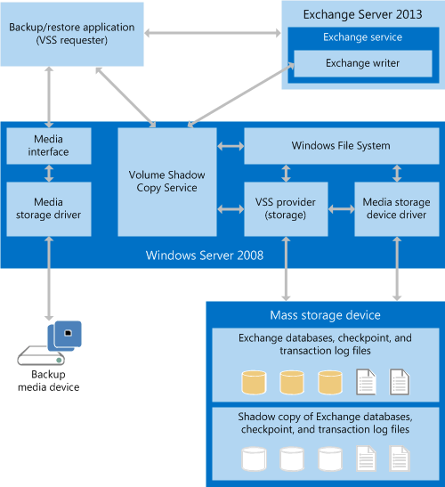

# Build backup and restore applications for Exchange 2013

Find information about the components and architecture of backup and restore applications for Exchange 2013, and the system requirements for creating a backup and restore application.
  
**Applies to:** Exchange Server 2013 
  
You can use the [Volume Shadow Copy Service (VSS)](https://msdn.microsoft.com/library/bb968832%28VS.85%29.aspx) in versions of Windows Server starting with Windows Server 2008 to create applications that back up and restore Exchange Server 2013 data. VSS provides an infrastructure that enables you to create and manage shadow copies across third-party storage management systems, business applications, and hardware. You can create solutions based on the VSS infrastructure that use shadow copies to back up and restore one or more Exchange 2013 databases. 
  
## Backup and restore application prerequisites

In order for your custom backup and restore application and VSS to back up and restore Exchange 2013 databases, your environment must include the following:
  
- A version of Windows Server starting with Windows Server 2008 
    
- Exchange 2013
    
In addition, if you are creating a backup and restore application, you should be aware of the following restrictions on the development environment:
  
- VSS is an unmanaged COM API that can be accessed from .NET Framework managed code via a COM Interop Assembly.
    
- The Exchange Management Shell is a managed application that is accessed via .NET Framework managed code.
    
- The CHKSGFILES API that is supplied with Exchange 2013 is a native-code 64-bit DLL. Use of the Exchange 2007 32-bit CHKSGFILES DLL with Exchange 2013 databases is not supported.
    
## Backup and restore application overview

VSS coordinates communication between the following components: 
  
- The VSS requester, which is your backup application
    
- The VSS writer
    
- The VSS provider, which is the system, software, or hardware components that create the shadow copies
    
To use VSS to back up Exchange 2013 data, your backup application must be an Exchange 2013-aware VSS requester. Exchange 2013 includes a VSS writer, called the Microsoft Exchange Writer, for the Windows Server backup program; however, the Exchange writer only backs up whole volumes. It does not back up individual Exchange 2013 databases. If you need more flexibility, you can use a third-party backup application that has an Exchange-aware VSS writer that can work with individual Exchange databases, or you can create a custom VSS requester.
  
Before your application calls VSS to initiate a backup, it must obtain information about the storage configuration for the Exchange 2013 system that it is backing up. That information is stored in Active Directory Domain Services (AD DS). Your backup application can get Exchange storage configuration data by using Exchange Management Shell commands. For more information, see [Exchange Server PowerShell (Exchange Management Shell)](/powershell/exchange/exchange-management-shell?view=exchange-ps). 
  
Exchange 2013 backup applications call the VSS COM APIs to create full, copy, differential and incremental backups of Exchange databases; they do not interact directly with the VSS writer. The Database Availability Group (DAG) functionality in Exchange also enables your application to create a fully consistent backup, even if the initial full backup and later incremental backups come from different servers in the DAG. After VSS creates the copy of the Exchange data, your backup application stores the data onto the intended media.
  
To restore an Exchange 2013 database, your restore application retrieves the database and log files from the backup media, and stores them on the active disk storage of an Exchange server. Individual databases are not associated with a particular Exchange server. 
  
Backup and restore applications must specify a number of Exchange 2013-specific parameters to correctly control and manage operations run by VSS against Exchange 2013 databases. For example, because Exchange 2013 supports up to 100 simultaneously active databases, the backup application must correctly specify and process the database file, transaction log files, and checkpoint file database components.
  
To reconstruct a database that had changes since the last full back, your restore application requires database and log files from different backups. For example, it might require a weekly full backup and one or more daily incremental backups. In Exchange 2013 systems that use DAGs, your restore application can rebuild a database by using backups from different database copies on different servers in the same DAG. However, the only supported way to restore a DAG database from backup is to restore all active and passive copies of the database by using the same data.
  
After all the data is in place, your restore application signals Exchange to check the integrity of the database and log files. If the database and log files have been restored correctly, the Exchange server can then replay the database log files to bring the database up to date and mount it. If the database has been recovered to a server that already has an active copy of the database mounted, the database is treated as a recover database. If the database has been recovered onto a different server, the database can either be independently mounted, or that replica can then be added into the DAG.
  
## Backup and restore system architecture

VSS communicates with the Windows Server file system and with the mass storage device driver through a third-party (or custom) provider. The hardware provider determines where the shadow copy will be created. VSS abstracts the hardware-specific shadow copy so that your backup and restore application can access the shadow copy without information about the hardware implementation details. The following figure shows how your backup and restore application interacts with Exchange 2013 and Windows Server.
  
**Figure 1. Backup and restore system architecture**

  
The backup and restore application functions as the VSS requester. The requester communicates with VSS to obtain information about Exchange 2013, to initiate the creation of shadow copies, and to gain access to the data for backup. 
  
The Exchange store is a component of Exchange 2013 and accesses Exchange 2013 databases through the Windows Server file system. Within the file system, each Exchange server can simultaneously mount up to 100 databases with their accompanying database (.edb) files, transaction log files, and a checkpoint file.
  
To support VSS, Exchange 2013 includes an Exchange writer that is built in to the Exchange store. The Exchange writer coordinates with the Exchange store (operating on behalf of the requester) to freeze and dismount the database before backing it up, and then to unfreeze and mount the database after the backup is complete. During a restore, your backup and restore application instructs the Exchange writer to coordinate with the Exchange store to dismount the database, replace the database files, mount the database, and then replay the transaction logs (as needed).
  
During a restore, the requester also communicates with VSS to prepare the system for the restore, and then to put the data back onto the mass storage device. Your backup and restore application is also responsible for working with Windows Server to read data from and write data to the backup storage media, whether a tape archive, a storage area network, or other backup medium.
  
The restored database can be mounted either as a regular, active database, or as the Exchange 2013 recovery database. Only one mounted database can be designated as a recovery database on each Exchange server.
  
Information required to successfully complete backup and restore operations among Exchange 2013, VSS, and your backup and restore application is transferred as part of the Exchange writer metadata.
  
## In this section

- [Types of backup operations for Exchange 2013](types-of-backup-operations-for-exchange-2013.md)
    
- [Restoring Exchange 2013 databases](restoring-exchange-2013-databases.md)
    
- [Validate backup integrity by using the CHKSGFILES API in Exchange 2013](how-to-validate-backup-integrity-by-using-the-chksgfiles-api-in-exchange.md)
    
- [Validate backup integrity by using the Eseutil tool in Exchange 2013](how-to-validate-backup-integrity-by-using-the-eseutil-tool-in-exchange-2013.md)
    
## See also

- [Backup and restore for Exchange](backup-and-restore-for-exchange-2013.md) 
- [CChkSGFiles class reference](cchksgfiles-class-reference.md) 
- [Volume Shadow Copy Service](https://msdn.microsoft.com/library/bb968832%28VS.85%29.aspx) 
- [Windows PowerShell](https://msdn.microsoft.com/library/dd835506%28v=vs.85%29.aspx)
