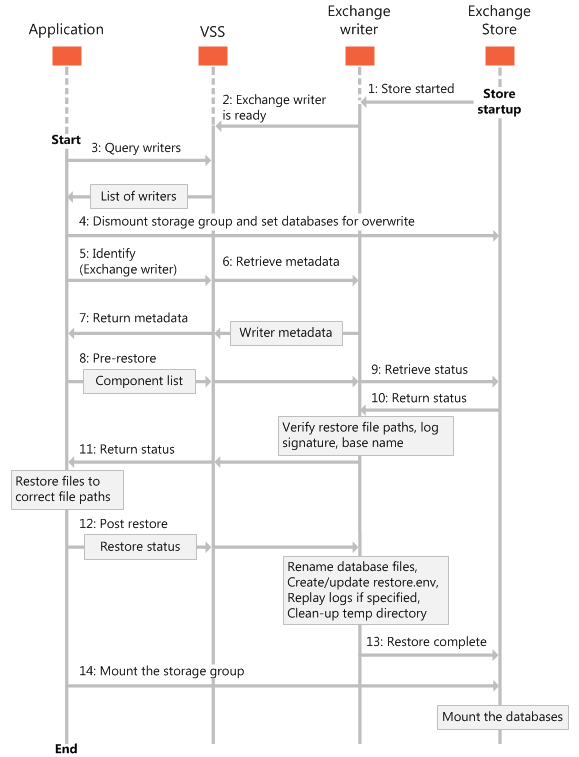

# Restoring Exchange 2013 databases

Find information about the different ways that you can restore your Exchange 2013 databases. 
  
**Applies to:** Exchange Server 2013 
  
The Exchange writer that is included in Exchange Server 2013 allows for some flexibility in how you restore your Exchange databases. By using the Exchange writer in Exchange 2013, you can restore your shadow copy backups to the following locations:
  
- The original database, regardless of whether the database or transaction log file path configuration has been modified.
    
- A recovery database.
    
- Any production database, regardless of whether the database display name matches the name in a VSS backup set.
    
When your restore application restores information to the original database, the log files must be restored to the directory path specified in Active Directory Domain Services (AD DS) for that database. If your application restores a database to a different location, the log files must be restored to a folder named **_restoredLogs** that is located inside the database log file directory. 
  
When restoring to a server or database that is different than the original database, your restore application must make sure that the database directory paths provided to VSS match those in AD DS. You can use the [get-MailboxDatabase](https://technet.microsoft.com/library/bb124924%28v=exchg.150%29.aspx)Exchange Management Shell cmdlet to get information about existing databases. For more information about the Exchange Management Shell, see [Exchange Server PowerShell (Exchange Management Shell)](/powershell/exchange/exchange-server/exchange-management-shell?view=exchange-ps). 
  
The following figure shows the sequence of events in a typical restore of an Exchange database that is managed by the Volume Shadow Copy Service (VSS).
  
**Figure 1. Sequence of events for restoring databases**

  
## Restoring Exchange databases to the original location

The Exchange writer enables applications to restore databases and transaction log files to their original locations on the Exchange server. By default, the Exchange writer replays the transaction log files after the requester confirms that the restore is complete during the [OnPostRestore](https://msdn.microsoft.com/library/windows/desktop/aa381566%28v=vs.85%29.aspx) operation. The restore application must use the VSS [SetAdditionalRestores](https://msdn.microsoft.com/library/windows/desktop/aa382829%28v=vs.85%29.aspx) method to prevent having the log files replayed. The log files can be replayed at a later time when the Exchange administrator or your application remounts the restored database. 
  
When restoring databases back to their original database objects (such that the target GUIDs in the database match those in the backup set) but to different file paths, the application must determine the current file paths and restore the backup files to the corresponding file paths specified in the database properties. The requester must call the [AddNewTarget](https://msdn.microsoft.com/library/windows/desktop/aa382648%28v=vs.85%29.aspx) method to communicate to the Exchange writer the location where the files are restored before the writer can continue with the rest of the restore process. If **AddNewTarget** is not called, the Exchange writer assumes that the backups are restored to the file paths specified in the backup metadata document. 
  
Typically, your application does not have to specify a new path for backups that are performed from a Database Availability Group (DAG) copy. Exchange administrators do not usually change database or log file paths. In a DAG configuration, however, the backup application might have to specify the active database and log paths, because DAG copy paths are always different from those paths.
  
Note that Exchange 2013 does not support restoring inactive DAG database copies. DAG copies can be restored from backup data only when the active database copy is restored. Using different backup data sets or attempting to restore a subset of the database copies can cause the database to become unmountable. Backup applications do not have to call the [SetRestoreOptions](https://msdn.microsoft.com/library/windows/desktop/aa382856%28v=vs.85%29.aspx) function in this case, because the backups are restored to the original database objects they were created from. However, if the backup application calls **SetRestoreOptions** and the XML metadata document has the correct parameters, the result is not an error. 
  
## Restoring Exchange databases to a recovery database

The Exchange writer enables you to restore data directly to a recovery database. Mounting the recovered data as a recovery database allows the Exchange administrator to restore individual mailboxes, and even individual items in a mailbox.
  
If a recovery database already exists, your application can dismount the database, restore the data onto the recovery database and log files, and then remount the database.
  
Each Exchange 2013 server allows for only one recovery database to be mounted at a time. The server can contain as many recovered databases as disk space allows, but only one can be mounted as the recovery database. The database mounted as the recovery database is counted in the maximum number of databases that can be mounted at a time. A recovered database mounted as a server's recovery database is not associated with the original mailbox in any way.
  
To recover to a recovery database, your application must call the [SetRestoreOptions](https://msdn.microsoft.com/library/windows/desktop/aa382856%28v=vs.85%29.aspx) method and provide an XML document that indicates the source and target database GUIDs. The source GUIDs must match those from the backup set, and the target GUIDs must match the destination database entries in AD DS. The backup application must also call the [AddNewTarget](https://msdn.microsoft.com/library/windows/desktop/aa382648%28v=vs.85%29.aspx) method to specify the directory path where the files are restored to. If the database files need to be renamed, the Exchange writer will rename the database during the [OnPostRestore](https://msdn.microsoft.com/library/windows/desktop/aa381566%28v=vs.85%29.aspx) operation. Exchange requires the transaction log files to be restored to a subfolder ( **_restoredLogs**) under the current transaction log file path. If the log files are restored to any other location, the Exchange writer will return an error. Because databases being mounted as the recovery database are not restored to their original location, they need to be brought into clean-shutdown state before they can be mounted. By default, the Exchange writer will bring all the restored databases into a clean-shutdown state during post-restore. If your backup application calls the [SetAdditionalRestores](https://msdn.microsoft.com/library/windows/desktop/aa382829%28v=vs.85%29.aspx) method, the Exchange writer will not replay the log files, and either the administrator or your backup application needs to bring the database into a clean-shutdown state prior to mounting the database. 
  
## Restoring Exchange databases to a recovery server

In some scenarios, you might need to recover a backup set to another server; For example, you might need to recover from a catastrophic server failure by porting the mailbox database to another Exchange 2013 server in the same Exchange organization, or restore to a dedicated server outside the production environment to recover mailbox and public folder data. 
  
In these scenarios, the file paths for the target database as well as its object GUIDs are different than those for the original database. Therefore, your application has to call the [SetRestoreOptions](https://msdn.microsoft.com/library/windows/desktop/aa382856%28v=vs.85%29.aspx) method with an XML document that indicates the source and target database information, and call the [AddNewTarget](https://msdn.microsoft.com/library/windows/desktop/aa382648%28v=vs.85%29.aspx) method to specify the directory paths to restore the backup files to. For the Exchange writer, this restore is the same as restoring to a recovery database. For more information, see [Restoring Exchange databases to a recovery database](restoring-exchange-2013-databases.md#bk_RecoveryDatabase) earlier in this article. 
  
## See also

- [Types of backup operations for Exchange 2013](types-of-backup-operations-for-exchange-2013.md)
    
- [Build backup and restore applications for Exchange 2013](build-backup-and-restore-applications-for-exchange-2013.md)
    
- [Backup and restore concepts for Exchange 2013](backup-and-restore-concepts-for-exchange-2013.md)
    
- [CChkSGFiles class reference](cchksgfiles-class-reference.md)
