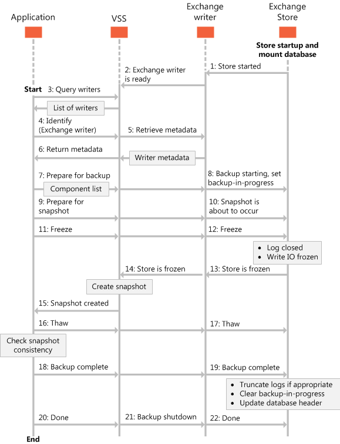

# Types of backup operations for Exchange 2013

Find information about the different types of backups you can perform on your Exchange 2013 store databases, including full, copy, incremental, and differential backups.
  
**Applies to:** Exchange Server 2013 
  
This article provides information about the different types of backups you can perform on Exchange Server 2013 databases, and how those backups affect the database files. 
  
Backup and restore applications that use the Volume Shadow Copy Service (VSS) and the Exchange writer can perform the types of backups listed in the following table.
  
**Table 1. Types of backup operations**

|**Backup type**|**Description**|
|:-----|:-----|
|[Full backups](types-of-backup-operations-for-exchange-2013.md#bk_FullBackups)   |Backs up the databases (\*.edb), transaction logs (\*.log), checkpoint files (\*.chk), and then truncates the transaction logs for a specific database.    |
|[Copy backups](types-of-backup-operations-for-exchange-2013.md#bk_CopyBackups)   |Backs up the database, transaction logs, and checkpoint files. Copy backups do not truncate the transaction logs for the database.    |
|[Incremental backups](types-of-backup-operations-for-exchange-2013.md#bk_IncrementalBackups)   |Backs up the transaction logs to record changes since the last full or incremental backup, and then truncates the transaction logs.    |
|[Differential backups](types-of-backup-operations-for-exchange-2013.md#bk_DifferentialBackups)   |Backs up the transaction logs to record changes since the last full or incremental backup, and does not truncate the transaction logs.    |
   
The components, or database files, defined by the Exchange writer represent the database files and transaction logs within Exchange 2013 databases. This allows your backup and restore application to display the names of the components within an Exchange 2013 database during backup operations. Your backup application cannot back up individual database components, however; it can only back up whole databases. 
  
The Exchange writer standardizes the database component logical paths, which are specified in the Exchange writer metadata. The Exchange writer returns the logical paths to your backup and restore application as needed.
  
The Exchange writer provides logical paths in the form: 
  
 `logicalPath = "Exchange Server\Microsoft Information Store\<Server name>"`
  
The server and database components are file group components, but they do not have any associated files. They have subcomponents that specify the individual files. A database contains only one log component, named Logs. The component names of the individual database components are the GUIDs of the databases, shown as strings. 
  
The Exchange writer only lists databases that can be backed up, based on VSS framework guidelines. Databases that are mounted as the Exchange 2013 recovery database, as well as databases that are not mounted, cannot be backed up, and therefore are not listed in the Exchange writer's metadata.
  
The following figure shows the Exchange writer backup process. 
  
**Figure 1. Sequence of events for the backup process**

  
## Full backups

A full backup of an Exchange database involves creating and storing a copy of the database file, transaction logs, and checkpoint files. An Exchange 2013 database has one set of dedicated transaction log files.
  
After the database has been backed up, the transaction log files on the disk are truncated so that only database changes that occurred after the backup was made will remain. During this process, the Exchange writer deletes all log entries up to the checkpoint, based on the assumption that the databases have now been backed up in a consistent state that contains all changes up to the most recent checkpoint. 
  
If the database being backed up is dismounted during the backup operation, Exchange 2013 will not truncate the transaction logs and the result will be the equivalent of a copy backup operation, not a full backup operation. 
  
When a full backup is completed, the headers of the active mounted database are updated with the current backup information. In replicated deployments, this information will be committed to a transaction log file and replicated to the other DAG copies of the database. Headers of the database copies are updated as this transaction log file is replayed into the database copy.
  
A full shadow copy backup is required in order to run incremental or differential shadow copy backups. The full backups can be taken from any copy as long as it is a shadow copy backup.
  
Full backups are used in the following scenarios:
  
- A database becomes corrupted or is lost, but the transaction log files on disk are intact. In this scenario, the affected database files can be restored from the full backup, and then recovered by replaying the transaction logs that are still on disk. 
    
- Transaction log files, as well as the database file on disk, are lost. In this scenario, the transaction log files that were backed up at the time of the full backup are restored together with the database.
    
In Exchange 2013, logs can be restored without having to restore the applicable database from a full backup set. This option makes it possible for a previous full backup to be restored and combined with the transaction log files from the most recent full backup to roll forward.
  
When the [VSS_BACKUP_TYPE](https://msdn.microsoft.com/library/windows/desktop/aa384679%28v=vs.85%29.aspx) enumeration in VSS is set to **VSS_BT_FULL** when the Exchange writer performs a backup, the following components are included in the backup: 
  
- A database with the logical path Exchange Server\Microsoft Information Store\\<Server Name\>\\<Database GUID\> 
    
- A log file with the logical path Exchange Server\Microsoft Information Store\\<Server Name\>\\<Database GUID\> 
    
## Copy backups

A copy backup of an Exchange database involves creating and storing the same elements that are included in a full backup. However, unlike with a full backup, the transaction log files on disk are not truncated when the backup is complete. Copy backups are not intended for data recovery purposes. Instead, copy backups provide an image of the data for use in testing, problem diagnosis, or for seeding a replica.
  
For example, an Exchange 2013 administrator who is experiencing problems with the Exchange store can make a copy backup for use in a test environment without affecting the production system. Copy backups do not affect regular backup schedules; however, because a copy backup also puts the Exchange store in a backup-in-progress state, it blocks other scheduled backups from proceeding until the copy backup is completed or aborted. 
  
When the [VSS_BACKUP_TYPE](https://msdn.microsoft.com/library/windows/desktop/aa384679%28v=vs.85%29.aspx) enumeration in VSS is set to **VSS_BT_COPY**, the following components are included in a copy backup: 
  
- A database with the logical path Exchange Server\Microsoft Information Store\\<Server Name\>\\<Database GUID\> 
    
- A log file component with the logical path Exchange Server\Microsoft Information Store\\<Server Name\>\\<Database GUID\>
    
## Incremental backups

An incremental backup of an Exchange 2013 database saves changes to the database that have occurred since the last full or incremental backup. When all the database files and log files are restored to the system, they can be recovered to the state they were in at the time of the last incremental backup. The data stored in an incremental backup includes only the transaction log files up to the current time. 
  
When the backup is complete, the Exchange server truncates the log files and marks the backup time in the database headers. Using an incremental backup to recover a database requires at least two data sets to be restored: the last full backup, and then every incremental backup taken after the last full backup. The advantage to using incremental backups is that the individual backups are much smaller than a full backup and individual incremental backups are frequently smaller than differential backups. 
  
The disadvantage to using incremental backups is that if many incremental backups were made between full backups, recovering the Exchange store may involve recovering many incremental backups. Exchange does not allow an incremental backup to occur when no previous full backup exists to establish the starting point for the incremental changes. 
  
A full backup taken from a DAG copy location can be followed by an incremental backup from the active location and vice versa. One restriction to keep in mind is that the last backup state is maintained in the active database's header, and the changes to the database header are written to transaction logs, replicated, and replayed at the copy database location just like all other transaction logs in DAG deployments. Because backups and restores interoperate, backup applications can provide the functionality to run backups exclusively on a specific DAG node, regardless of whether the node is active or passive, as well as to run backups exclusively from the passive node or exclusively from the active node.
  
When the [VSS_BACKUP_TYPE](https://msdn.microsoft.com/library/windows/desktop/aa384679%28v=vs.85%29.aspx) enumeration in VSS is set to **VSS_BT_INCREMENTAL**, the following components are included in an incremental backup: 
  
- A database with the logical path Exchange Server\Microsoft Information Store\\<Server Name\>\\<Database GUID\> 
    
- A log file with the logical path Exchange Server\Microsoft Information Store\\<Server Name\>\\<Database GUID\>
    
## Differential backups

A differential backup of an Exchange 2013 database saves changes to the database that have occurred since the last full or incremental backup. When the database files and log files are restored by the system, they can be recovered to the state they were in at the last differential backup. 
  
The data stored in a differential backup includes only the transaction log files up to the current checkpoint. Differential backups do not delete or change the log files or change the database headers. To use a differential backup to recover a database, you only need to restore two data sets: the last full backup, and then the most recent differential backup. 
  
The disadvantage to using differential backups is that the differential backups duplicate the backed up data in each backup until a full backup is performed. If many differential backups are taken between full backups, the storage space required can exceed that required by the same number of incremental backups. Exchange does not allow a differential backup to occur when there has not been a full or incremental backup to establish the starting point for differential backups.
  
A full backup taken from the copy location can be followed by a differential backup from the active location and vice versa. One restriction to keep in mind is that the last backup state is maintained in the active database's header, and the changes to the database header are written to transaction logs, replicated, and replayed at the copy database location just like all other transaction logs in DAG deployments. Because backups and restores interoperate, backup applications provide the functionality to run all backups exclusively on a specific DAG node, regardless of whether the node is active or passive, as well as to run backups exclusively from the passive node or exclusively from the active node.
  
When the [VSS_BACKUP_TYPE](https://msdn.microsoft.com/library/windows/desktop/aa384679%28v=vs.85%29.aspx) enumeration in VSS is set to **VSS_BT_DIFFERENTIAL**, the following components are included in a differential backup: 
  
- A database with the logical path Exchange Server\Microsoft Information Store\\<Server Name\>\\<Database GUID\> 
    
- A log file with the logical path Exchange Server\Microsoft Information Store\\<Server Name\>\\<Database GUID\>
    
## See also

- [Build backup and restore applications for Exchange 2013](build-backup-and-restore-applications-for-exchange-2013.md)
    
- [Backup and restore concepts for Exchange 2013](backup-and-restore-concepts-for-exchange-2013.md)
    
- [Restoring Exchange 2013 databases](restoring-exchange-2013-databases.md)
    
- [Validate backup integrity by using the CHKSGFILES API in Exchange 2013](how-to-validate-backup-integrity-by-using-the-chksgfiles-api-in-exchange.md)
    
- [Validate backup integrity by using the Eseutil tool in Exchange 2013](how-to-validate-backup-integrity-by-using-the-eseutil-tool-in-exchange-2013.md)
    

