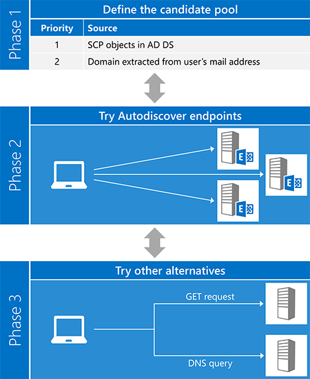
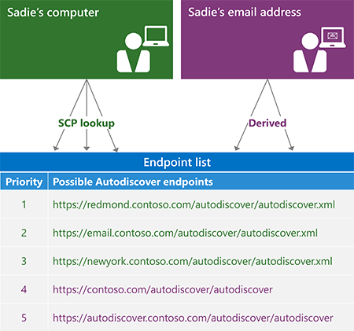
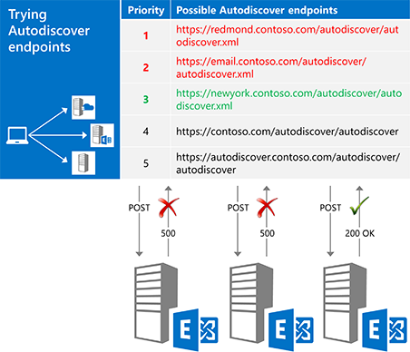
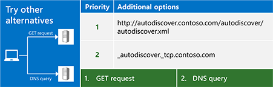

# Autodiscover for Exchange

Learn about the Autodiscover service in Exchange.
  
The Exchange Autodiscover service provides an easy way for your client application to configure itself with minimal user input. Most users know their email address and password, and with those two pieces of information, you can retrieve all the other details you need to get up and running. For Exchange Web Services (EWS) clients, Autodiscover is typically used to find the EWS endpoint URL, but Autodiscover can also provide information to configure clients that use other protocols. Autodiscover works for client applications that are inside or outside firewalls and will work in resource forest and multiple forest scenarios.
  
## Overview of the Autodiscover process

The Autodiscover process essentially has three phases. In phase one, you generate a list of potential Autodiscover servers, and in phase two, you try each server in your list until you (hopefully) get a successful response. If none of your candidates worked out, you move on to phase three, which represents a "last ditch" attempt to find an Autodiscover endpoint.
  
The [ExchangeService.AutodiscoverUrl](https://msdn.microsoft.com/library/microsoft.exchange.webservices.data.exchangeservice.autodiscoverurl%28v=exchg.80%29.aspx) method in the EWS Managed API implements all three phases of this process for you, so if you are using the EWS Managed API, you don't need to worry about implementing Autodiscover yourself. The following figure shows the three phases of the Autodiscover process. 
  
**Figure 1. Three phases of the Autodiscover process**

  
### Phase 1: Defining the candidate pool

Before you can use Autodiscover, you have to locate the right Autodiscover server for your user. Luckily, Autodiscover defines a limited number of places for you to look. In the case where multiple candidates are found, Autodiscover also defines [a way to generate and prioritize the list](how-to-generate-a-list-of-autodiscover-endpoints.md).
  
**Table 1: Autodiscover endpoint candidate sources**

|**Place to look**|**What you'll find**|
|:-----|:-----|
|Active Directory Domain Services (AD DS)    |For domain-joined clients, this is the first place to look. Exchange publishes service connection point (SCP) objects in AD DS, which allows Autodiscover requests to be routed to servers based on Active Directory sites. The results of an [SCP lookup](how-to-find-autodiscover-endpoints-by-using-scp-lookup-in-exchange.md) should be at the top of your candidate list.    **NOTE**: SCP lookup isn't available for clients that are not joined to a domain or that do not have access to Active Directory servers. In this case, you should skip SCP lookup.  |
|The user's email address domain    | Autodiscover defines two standard endpoint URL forms that are derived from the domain portion of the user's email address:   `"https://" + domain + "/autodiscover/autodiscover" +  *fileExtension*`   `"https://autodiscover." + domain + "/autodiscover/autodiscover" +  *fileExtension*`    The value of  *fileExtension*  depends on which Autodiscover access method you are using, [SOAP](https://msdn.microsoft.com/library/61c21ea9-7fea-4f56-8ada-bf80e1e6b074%28Office.15%29.aspx) or [POX](https://msdn.microsoft.com/library/877152f0-f4b1-4f63-b2ce-924f4bdf2d20%28Office.15%29.aspx). The SOAP service uses a ".svc" file extension; POX uses ".xml".    |
   
The following figure shows how to generate an Autodiscover endpoint list.
  
**Figure 2. Process for generating an Autodiscover endpoint list**

  
### Phase 2: Trying each candidate

After you generate an ordered list of potential candidates, the next step is try each one in the list by [sending a request to the URL](how-to-get-user-settings-from-exchange-by-using-autodiscover.md) and validating the results, as shown in Figure 3. When you get a successful response, you're done! 
  
**Figure 3. Trying each endpoint candidate in order**

  
Before you send a request to a candidate, make sure it is trustworthy. Remember that you're sending the user's credentials, so it's important to make sure that you're only sharing them with a server you can trust. At a minimum, you should verify:
  
- That the endpoint is an HTTPS endpoint. Client applications should not authenticate or send data to a non-SSL endpoint.
    
- That the SSL certificate presented by the server is valid and from a trusted authority.
    
> [!NOTE]
> These are just basic security suggestions. Whenever you are working with authentication, make sure that your code meets the security requirements of your organization. 
  
The type of request you send depends on how you are accessing the Autodiscover service.
  
**Table 2. Types of Autodiscover requests**

|**If you are using…**|**Send a request by using…**|
|:-----|:-----|
|The EWS Managed API    |The [GetUserSettings](https://msdn.microsoft.com/library/microsoft.exchange.webservices.autodiscover.autodiscoverservice.getusersettings%28v=exchg.80%29.aspx) method.    |
|The SOAP Autodiscover service    |The [GetUserSettings](https://msdn.microsoft.com/library/758d965c-ef63-4de4-9120-e293abf14ff8%28Office.15%29.aspx) operation.    |
|The POX Autodiscover service    |An HTTP POST with an [Autodiscover request body](https://msdn.microsoft.com/library/75671b1d-f35b-497b-8d8c-706f3f2535fd%28Office.15%29.aspx).    |
   
### Phase 3: Trying other alternatives

In some cases you might try all the endpoints in your list, only to find that all of them return an error. Before throwing in the towel, you can try a couple more things: you can send an unauthenticated GET request, or query DNS for an SRV record. If these attempts also don't yield results, you cannot contact the Autodiscover service.
  
**Figure 4. Trying other alternatives**

  
#### Sending an unauthenticated GET request

The first thing to try is to send an unauthenticated GET request to an endpoint derived from the user's email address. The format of that endpoint is "http://autodiscover." + domain + "/autodiscover/autodiscover.xml". Note that this is NOT an SSL endpoint. If the server returns a 302 redirect response, you can then attempt to [resend the Autodiscover request](handling-autodiscover-error-messages.md#bk_ResendRequest) to the endpoint URL in the Location header of the response. 
  
#### Querying DNS for an SRV record

If the unauthenticated GET request doesn't work out, the last thing to try is a DNS query for SRV records for the Autodiscover service. The record will take the form "_autodiscover._tcp." + domain. This query might return multiple records, but you should only use records that point to an SSL endpoint and that have the highest priority and weight.
  
## Options for using Autodiscover

You can access Autodiscover either by using the SOAP or the POX web service. The method you use depends on your requirements and environment; however, we recommend using the SOAP web service, if possible. The EWS Managed API is also an option. It implements the client portion of both the SOAP and POX Autodiscover services.
  
**Table 3: Options for accessing Autodiscover**

|**Option**|**Pros**|**Cons**|
|:-----|:-----|:-----|
|[EWS Managed API](get-started-with-ews-managed-api-client-applications.md)   | Implements the Autodiscover process for you.  Uses both the SOAP and POX Autodiscover services.  Works with Exchange Online, Exchange Online as part of Office 365, or a version of Exchange starting with Exchange 2007 SP1.  Easy to use.    | Limited to the user settings that are available in the [Microsoft.Exchange.WebServices.Autodiscover.UserSettingName](https://msdn.microsoft.com/library/microsoft.exchange.webservices.autodiscover.usersettingname%28v=EXCHG.80%29.aspx) enumeration.  Only available for .NET Framework applications.    |
|[SOAP Autodiscover](https://msdn.microsoft.com/library/61c21ea9-7fea-4f56-8ada-bf80e1e6b074%28Office.15%29.aspx)   | Platform independent.  Allows you to request just the settings you are interested in.    | Not available in Exchange 2007.    |
|[POX Autodiscover](https://msdn.microsoft.com/library/877152f0-f4b1-4f63-b2ce-924f4bdf2d20%28Office.15%29.aspx)   | Platform independent.  Supported in Exchange Online and all versions of Exchange starting with Exchange 2007 SP1.    | Does not allow you to request specific settings.    |
   
## In this section

- [Find Autodiscover endpoints by using SCP lookup in Exchange](how-to-find-autodiscover-endpoints-by-using-scp-lookup-in-exchange.md)
    
- [Generate a list of Autodiscover endpoints](how-to-generate-a-list-of-autodiscover-endpoints.md)
    
- [Use Autodiscover to find connection points](how-to-use-autodiscover-to-find-connection-points.md)
    
- [Get user settings from Exchange by using Autodiscover](how-to-get-user-settings-from-exchange-by-using-autodiscover.md)
    
- [Get domain settings from an Exchange server](how-to-get-domain-settings-from-an-exchange-server.md)
    
- [Refresh configuration information by using Autodiscover](how-to-refresh-configuration-information-by-using-autodiscover.md)
    
- [Handling Autodiscover error messages](handling-autodiscover-error-messages.md)
    
- [Improving performance when using Autodiscover for Exchange](improving-performance-when-using-autodiscover-for-exchange.md)
    
## See also

- [Start using web services in Exchange](start-using-web-services-in-exchange.md)
- [Develop web service clients for Exchange](develop-web-service-clients-for-exchange.md)