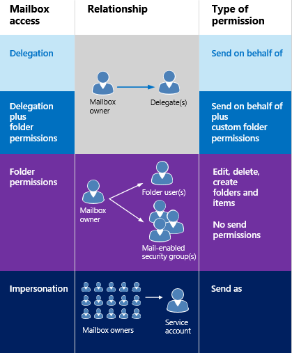
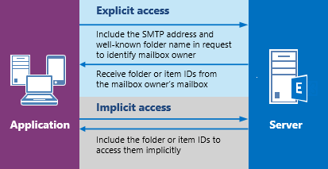

# Delegate access and EWS in Exchange

Find out how to use the EWS Managed API and EWS in Exchange to provide delegate access to users' mailboxes.
  
You can enable users to access other users' mailboxes in one of three ways: 
  
- By adding delegates and specifying permissions for each delegate.
    
- By modifying folder permissions directly.
    
- By using impersonation.
    
Delegation and folder permissions are best when you're only granting access to a few users, because you have to add permissions individually to each mailbox. Impersonation is the best choice when you're dealing with quantities of mailboxes, because you can easily enable one service account to access every mailbox in a database. Figure 1 shows some of the differences between each type of access.
  
**Figure 1. Ways to access other users' mailboxes**


  
When it comes to sending mail or scheduling meetings, delegates can be given "send on behalf of" permissions, so the recipient of an email or a meeting request that was sent by a delegate will see " *delegate*  on behalf of  *mailbox owner*  " when they receive the email or meeting request in Outlook. Including the "send on behalf of" text is a client implementation detail - and can be created by using the "from" and "sender" values. The "from" value indicates the mailbox owner, and the "sender" value indicates the delegate that sent the mail. If a service account impersonating a user sends an email or schedules a meeting for the mailbox owner, the message is "sent as" the mailbox owner. There is no way for the recipient to know the mail was sent by the service account. Users who are granted folder permissions and not delegate access are not able to "send as" or "send on behalf of" of a mailbox owner. They have access to the mailbox folders, and might be able to create items in the folders, but they cannot send the items. 
  
When is it appropriate to modify folder permissions directly? Generally, when you want to provide a user access to a folder, but do not want to grant the user "send on behalf of" permissions, when your permissions requirements do not map to the [DelegateFolderPermissionLevel](https://msdn.microsoft.com/library/microsoft.exchange.webservices.data.delegatefolderpermissionlevel%28v=exchg.80%29.aspx) EWS Managed API enumeration values or the [PermissionLevel](https://msdn.microsoft.com/library/87978600-3523-451e-a725-ef092c543e2a%28Office.15%29.aspx) EWS element values, or when you want to provide a user access to a single custom folder. 
  
If you only need to modify folder permissions to achieve your goal, and do not need to add a delegate (that is, you don't need "send on behalf of" permissions), see [Set folder permissions for another user by using EWS in Exchange](how-to-set-folder-permissions-for-another-user-by-using-ews-in-exchange.md). 

Note that you can also use [Outlook](https://office.microsoft.com/outlook-help/allow-someone-else-to-manage-your-mail-and-calendar-HA102749417.aspx) or the [Exchange Server PowerShell (Exchange Management Shell)](/powershell/exchange/exchange-server/exchange-management-shell?view=exchange-ps) to set up delegate access. 

  
## How does delegate access work?

Delegate access enables users to access some or all of the mailbox owner's folders and act on behalf of the mailbox owner. The mailbox owner can be a user, or a resource, like a conference room. For example, a receptionist can be granted delegate permissions to a conference room's calendar folder, to handle booking requests. You can use the EWS Managed API or EWS to enable the mailbox owner or an administrator to add a delegate, specify what folders the delegate can access, and then specify permissions for that folder. Delegates can be granted access to the following folders: 
  
- Calendar
    
- Tasks
    
- Inbox
    
- Contacts
    
- Notes
    
- Journal
    
When a user has delegate access to one or more of these folders, they can create, get, update, delete, copy, and search for items in that folder and any child folders, depending on the [permissions](#bk_delegateperms) set on the folder. The way in which the application performs these actions depends on whether [explicit](#bk_explicit) or [implicit](#bk_implicit) access is required. 
  
## Delegate permissions
<a name="bk_delegateperms"> </a>

When an administrator or mailbox owner adds a delegate to a mailbox, they can also set the permission level for one or more folders. If a permission level is not set for a folder, the permission value defaults to None. Multiple users can have the same permission level on a folder, and users can have different permission levels for different folders. If you're using the EWS Managed API, you use the [DelegateUser.Permissions](https://msdn.microsoft.com/library/microsoft.exchange.webservices.data.delegateuser.permissions%28v=exchg.80%29.aspx) property, which contains one of the [DelegateFolderPermissionLevel](https://msdn.microsoft.com/library/microsoft.exchange.webservices.data.delegatefolderpermissionlevel%28v=exchg.80%29.aspx) enumeration values for each folder, to set delegate permissions on folders. If you're using EWS, you use the [DelegatePermissions](https://msdn.microsoft.com/library/292badc7-bab3-4368-9d7c-9a8b7edb279b%28Office.15%29.aspx) element to set delegate permissions, and the [PermissionLevel](https://msdn.microsoft.com/library/87978600-3523-451e-a725-ef092c543e2a%28Office.15%29.aspx) element to define the permission level. 
  
**Table 2. Delegate permission levels**

|**Permission level**|**Description**|
|:-----|:-----|
|None  <br/> |This is the default value for all folders.  <br/> |
|Author  <br/> |A delegate can read and create items, and modify and delete items they create. For example, a delegate can create task requests and meeting requests directly in the mailbox owner's Task or Calendar folder, and then send either item on the mailbox owner's behalf.  <br/> |
|Editor  <br/> |A delegate can do everything an Author can do, and also modify and delete the items the mailbox owner created.  <br/> |
|Reviewer  <br/> |A delegate can read items; for example a delegate with Reviewer permission can read messages in another person's Inbox.  <br/> |
|Custom  <br/> |The mailbox owner has granted a custom set of permissions to the delegate.  <br/> |
   
The [DelgateUser.ViewPrivateItems](https://msdn.microsoft.com/library/microsoft.exchange.webservices.data.delegateuser.viewprivateitems%28v=exchg.80%29.aspx) EWS Managed API property and the [ViewPrivateItems](https://msdn.microsoft.com/library/80b949ac-440c-4a01-b428-ebafb5b1b802%28Office.15%29.aspx) EWS element is a global setting that affects all the mailbox owner's folders, including all Mail, Contacts, Calendar, Tasks, Notes, and Journal folders. You cannot allow access to private items in only one folder. 
  
## Explicit access
<a name="bk_explicit"> </a>

Simply put, explicit access is the entry way for delegates to perform actions on a mailbox owner's folders or items. Explicit access is granted to a delegate when they include the well-known folder name for a mailbox owner's folder along with the mailbox owner's SMTP address in a request to the server. The access is explicit because the delegate's request explicitly states that the context for the method or operation is the mailbox owner's mailbox, and not the delegate's mailbox.
  
Explicit access defines the context for all methods or operations performed on the folders or items moving forward. All item and folder IDs returned when the explicit access is set uniquely identify themselves as belonging to the mailbox owner (although not in any human readable format). This way, the application doesn't need to specify the mailbox owner's SMTP address again and again; the context is hidden in the identifiers. After an item or folder is identified, a delegate actually uses [implicit access](#bk_implicit) to modify the item. The following figure shows the process of getting explicit and implicit access. 
  
**Figure 2. Requesting explicit and implicit access to an item or folder**


  
You can set explicit access in many different scenarios. Essentially, any time you're sending a folder ID in a method or operation, you can set explicit access. This can include finding folders, finding appointments, getting items, finding conversations, and so on.
  
### Explicit access and the EWS Managed API
<a name="bk_explicitewsma"> </a>

You can initiate explicit delegate access by using any of the following overloaded methods that take a [FolderId](https://msdn.microsoft.com/library/microsoft.exchange.webservices.data.folderid%28v=exchg.80%29.aspx) input parameter to identify the target folder: 
  
- [Folder.Bind](https://msdn.microsoft.com/library/microsoft.exchange.webservices.data.folder.bind%28v=exchg.80%29.aspx)
    
- [ExchangeService.FindItems](https://msdn.microsoft.com/library/microsoft.exchange.webservices.data.exchangeservice.finditems%28v=exchg.80%29.aspx)
    
- [ExchangeService.FindAppointments](https://msdn.microsoft.com/library/microsoft.exchange.webservices.data.exchangeservice.findappointments%28v=exchg.80%29.aspx)
    
- [ExchangeService.FindFolders](https://msdn.microsoft.com/library/microsoft.exchange.webservices.data.exchangeservice.findfolders%28v=exchg.80%29.aspx)
    
- And more!
    
You can use the **FolderId** parameter in each of these methods to identify the mailbox owner's target folder, as follows. 
  
```cs
new FolderId(WellKnownFolderName.Calendar, "primary@contoso.com");
```

For example, to bind to the Calendar folder, the **FolderId** in this **Bind** method specifies the well-known folder name, and the mailbox owner's SMTP address. 
  
```cs
CalendarFolder calendar = CalendarFolder.Bind(service, new FolderId(WellKnownFolderName.Calendar, "primary@contoso.com"), new PropertySet());
```

By specifying the well-known folder name and the SMTP address, the delegate can bind to the mailbox owner's Calendar folder — thereby gaining explicit access to the folder. All subsequent requests for [implicit access](#bk_implicit) to items in the folder then rely on the context returned in the item IDs and folder IDs. Essentially, the identifiers contain the context for the implied delegate access calls. Or, to retrieve the item ID of an item that meets specific criteria, use the following. 
  
```cs
FindItemsResults<Item> results = service.FindItems(new FolderId(WellKnownFolderName.Calendar, "primary@contoso.com"), filter, view);
```

In this case the item ID is returned, and then the delegate can then use implicit access to make changes to the item by using the item ID.
  
You don't have to initiate explicit access again until you require an item ID or a folder ID that you didn't access via the existing explicit access. 
  
### Explicit access and EWS
<a name="bk_explicitewsma"> </a>

You can initiate explicit access by using the [GetFolder](https://msdn.microsoft.com/library/355bcf93-dc71-4493-b177-622afac5fdb9%28Office.15%29.aspx), [FindItem](https://msdn.microsoft.com/library/ebad6aae-16e7-44de-ae63-a95b24539729%28Office.15%29.aspx), or [FindFolder](https://msdn.microsoft.com/library/7a9855aa-06cc-45ba-ad2a-645c15b7d031%28Office.15%29.aspx) operations. These operations provide the option to use the [DistinguishedFolderId](https://msdn.microsoft.com/library/50018162-2941-4227-8a5b-d6b4686bb32f%28Office.15%29.aspx) element to identify the target folder. The **DistinguishedFolderId** element has a single optional child element, the [Mailbox](https://msdn.microsoft.com/library/befc70fd-51cb-4258-884c-80c9050f0e82%28Office.15%29.aspx) element. The **Mailbox** element, when used as a child of the **DistinguishedFolderId** element, specifies the mailbox for the delegate to access. If the calling user has permission to access the mailbox owner's folder, the response will contain a collection of identifiers to items or folders in that mailbox. The item and folder identifiers that are returned in the response can be used for implicit delegate access. 
  
## Implicit access
<a name="bk_implicit"> </a>

Implicit access is used after a delegate has retrieved the ID for an item or folder in the mailbox owner's mailbox and the delegate wants to update, delete, or copy the item. When the delegate uses that item or folder ID in a request, the changes are made to the item in the mailbox owner's mailbox. The delegate does not have to include the mailbox owner's SMTP address. 
  
For example, when a delegate has the ID of one of the mailbox owner's folders, the delegate can perform a **FindItem** operation on that folder by using the folder ID, without explicitly identifying the mailbox owner's mailbox. At that point, the delegate can perform actions on the mailbox owner's folder by using the IDs that are returned in the responses. 
  
### Implicit access and the EWS Managed API

If an item ID was retrieved by the [FindItems](https://msdn.microsoft.com/library/microsoft.exchange.webservices.data.exchangeservice.finditems%28v=exchg.80%29.aspx) method, that item ID can be used in a subsequent [Item.Bind](https://msdn.microsoft.com/library/microsoft.exchange.webservices.data.item.bind%28v=exchg.80%29.aspx) method call to bind to the item. You can then call the [Item.Update](https://msdn.microsoft.com/library/office/microsoft.exchange.webservices.data.item.update%28v=exchg.80%29.aspx), [Item.Delete](https://msdn.microsoft.com/library/office/microsoft.exchange.webservices.data.item.delete%28v=exchg.80%29.aspx), or [Item.Copy](https://msdn.microsoft.com/library/office/microsoft.exchange.webservices.data.item.copy%28v=exchg.80%29.aspx) method — or any method call that requires an item ID — as needed to complete your task. As long as the delegate has appropriate permissions to the folder that contains the item (and, if applicable, the folder the item is moving to), the delegate can make changes according to their permission levels. 
  
### Implicit access and EWS

If an item ID was retrieved by the [FindItem](https://msdn.microsoft.com/library/ebad6aae-16e7-44de-ae63-a95b24539729%28Office.15%29.aspx) operation, that item ID can be used in subsequent [GetItem](https://msdn.microsoft.com/library/e3590b8b-c2a7-4dad-a014-6360197b68e4%28Office.15%29.aspx) operations to bind to the item. You can then call the [UpdateItem](https://msdn.microsoft.com/library/5d027523-e0bc-4da2-b60b-0cb9fc1fdfe4%28Office.15%29.aspx), [DeleteItem](../web-service-reference/deleteitem-operation.md), or [CopyItem](https://msdn.microsoft.com/library/bcc68f9e-d511-4c29-bba6-ed535524624a%28Office.15%29.aspx) operation — or any operation that requires an item ID — as needed to complete your task. As long as the delegate has appropriate permissions to the folder that contains the item (and, if applicable, the folder the item is moving to), the delegate can make changes according to their permission levels. 
  
## In this section
<a name="bk_implicit"> </a>

- [Add and remove delegates by using EWS in Exchange](how-to-add-and-remove-delegates-by-using-ews-in-exchange.md)
    
- [Access a calendar as a delegate by using EWS in Exchange](how-to-access-a-calendar-as-a-delegate-by-using-ews-in-exchange.md)
    
- [Access contacts as a delegate by using EWS in Exchange](how-to-access-contacts-as-a-delegate-by-using-ews-in-exchange.md)
    
- [Access email as a delegate by using EWS in Exchange](how-to-access-email-as-a-delegate-by-using-ews-in-exchange.md)
    
- [Set folder permissions for another user by using EWS in Exchange](how-to-set-folder-permissions-for-another-user-by-using-ews-in-exchange.md)
    
- [Handling delegation-related errors in EWS in Exchange](handling-delegation-related-errors-in-ews-in-exchange.md)
    
## See also


- [Develop web service clients for Exchange](develop-web-service-clients-for-exchange.md)

- [Allow someone else to manage your mail and calendar](https://office.microsoft.com/outlook-help/allow-someone-else-to-manage-your-mail-and-calendar-HA102749417.aspx)  

- [Add- MailboxPermission](https://technet.microsoft.com/library/bb124097%28v=exchg.150%29.aspx)
