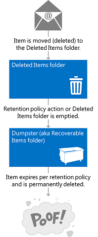
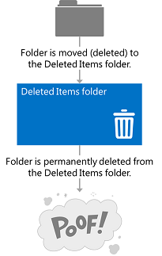
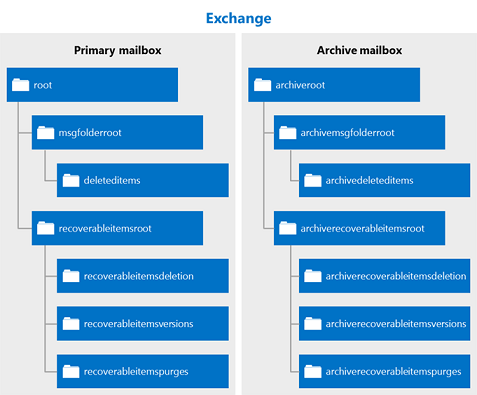

# Deleting items by using EWS in Exchange

Find out how you can use the EWS Managed API or EWS in Exchange to delete items either by moving them to the Deleted Items folder or to the dumpster.
  
Have you ever asked yourself what the difference is between moving items to the Deleted Items folder, and moving them to the dumpster? You might be curious about the different options for handling deleted items and how to implement those options in your application. Exchange Web Services (EWS) includes three options for handling deleted items. This article will hopefully clear up any confusion you might have about the differences between them.
  
## Deleting items - what are my options?

Before you can understand the overall landscape for deleting items, it's important to recognize the difference between the following:
  
- The Deleted Items folder - When you delete items in a mailbox, this is where they go.

- The dumpster (aka the Recoverable Items folder) - When you remove items from a mailbox, this is where they go.

Figures 1 and 2 show what the deletion process looks like for items and folders in a mailbox.

**Figure 1. Process for deleting items from a mailbox**

 

**Figure 2. Process for deleting folders from a mailbox**

You can delete items and folders three different ways, depending on how "permanent" you would like the deletion to be.
  
**Table 1: Options for deleting items by using EWS**

|**Option**|**What happens**|
|:-----|:-----|
|Move to the Deleted Items folder    |This is the least permanent way to delete items.  This is like putting a piece of paper in the recycle bin by your desk. You can easily grab it if you need it again.  You can use any [deletion operation](deleting-items-by-using-ews-in-exchange.md#bk_howdoIdeleteitems) that implements the move to the Deleted Items folder option to perform this action.  You can also use the [MoveItem operation](https://msdn.microsoft.com/library/dcf40fa7-7796-4a5c-bf5b-7a509a18d208%28Office.15%29.aspx) ( [Item.Move()](https://msdn.microsoft.com/library/microsoft.exchange.webservices.data.item.move%28v=exchg.80%29.aspx)) or the [MoveFolder operation](https://msdn.microsoft.com/library/c7233966-6c87-4a14-8156-b1610760176d%28Office.15%29.aspx) ( [Folder.Move()](https://msdn.microsoft.com/library/microsoft.exchange.webservices.data.folder.move%28v=exchg.80%29.aspx)) to move an item or folder to the Deleted Items folder.    |
|Soft delete    |The item is moved to the Deletions folder in the dumpster.  This is like emptying your recycle bin into your curbside container. You can still access the item if you need to, it's just a little harder.    For more about the dumpster (also called the Recoverable Items folder) and scenarios such as eDiscovery or litigation holds, see [Recoverable Items Folder](https://technet.microsoft.com/library/ee364755%28v=exchg.150%29.aspx) on TechNet.  Soft deletions aren't recommended for applications that target Exchange 2007. In Exchange 2007, soft deletions are handled by setting a bit on the item to indicate that it will be moved to the dumpster at an unspecified time.  Soft delete traversals, or searches of items that have been soft deleted via the [FindItem operation](https://msdn.microsoft.com/library/ebad6aae-16e7-44de-ae63-a95b24539729%28Office.15%29.aspx), are not supported in Exchange Online, Exchange Online as part of Office 365, and versions of Exchange starting with Exchange 2010.    **NOTE**:  Folders cannot be soft deleted.           |
|Hard delete    |The item or folder is permanently deleted.  Hard-deleted items are placed in the Purges folder of the dumpster. This is like when the recycling truck empties your curbside recycle container. The items cannot be accessed from an email client like Outlook or Outlook Web App, and, unless there is a hold set on the mailbox, the items will be permanently deleted after a set period of time.  You can read more about item retention in the article [Configure Deleted Item Retention and Recoverable Items Quotas](https://technet.microsoft.com/library/ee364752%28v=exchg.150%29.aspx).  **NOTE**:  Folders are not placed in the Purges folder when they are hard deleted. Hard-deleted folders are removed from the mailbox.  |

The move to the Deleted Items folder and the hard delete options are transactional, which means that by the time the web service call finishes, the item has been moved to the Deleted Items folder or the dumpster.
  
To help you better understand the ecosystem of folders that are used to store deleted items, the following figure shows the hierarchy of folders that can contain deleted items. The folder names are as they appear in the **DistinguishedFolderIdNameType** schema type, or the **WellKnownFolderName** enumeration in the EWS Managed API.
  
**Figure 3. Hierarchy of folders that contain deleted items**

  
**Table 2: Folders that contain deleted items**

|**Folder name**|**Introduced in**|**Description**|
|:-----|:-----|:-----|
|deleteditems    |Exchange 2007    |The default Deleted Items folder. Items remain in this folder until they are soft- or hard-deleted or until a retention period has been exceeded. Then they are moved to a folder in the dumpster. Deleted folders are placed in the Deleted Items folder, and when they are soft- or hard-deleted, they are permanently removed from the mailbox and are not recoverable.    |
|recoverableitemsroot    |Exchange 2010    |The root of the dumpster, or the Recoverable Items folder. Dumpster access was implemented in EWS in Exchange 2010. The display name for this folder is "Recoverable Items".    |
|recoverableitemsdeletions    |Exchange 2010    |The main dumpster folder for a mailbox. Soft-deleted items and items moved from the Deleted Items folder by a retention policy are placed in this folder. The display name for this folder is "Deletions".    |
|recoverableitemsversions    |Exchange 2010    |Where older versions of an item are stored. Old versions of an item are created when an item is updated. Draft item versions are not saved to this folder. The display name of this folder is "Versions".    |
|recoverableitemspurges    |Exchange 2010    |Where items that are removed from the Deletions folder are stored. All store hard-deleted items are moved to this folder. The display name for this folder is "Purges".    |
|archiveddeletedtitems    |Exchange 2010    |The default Deleted Items folder for an archive mailbox.    |
|archiverecoverablesitemsroot    |Exchange 2010    |The root dumpster folder for an archive mailbox. Archived items that are soft-deleted are moved to a subfolder in this folder.    |
|archiverecoverableitemsdeletions    |Exchange 2010    |The main dumpster folder for an archive mailbox. Archived items moved to the dumpster are placed here.    |
|archiverecoverableitemsversions    |Exchange 2010    |Where older versions of archived items are stored.    |
|archiverecoverableitemspurges    |Exchange 2010    |Where items that are hard-deleted from the archive Deletions folder in the dumpster are stored. All store hard-deleted archived items are moved to this folder.    |

## How do I delete items?

Use one of the following to indicate whether to move an item to the Deleted Items folder or perform a soft delete or a hard delete:
  
- The **DisposalType** simple type, if you use EWS to access Exchange.

- The [DeleteMode enumeration](https://msdn.microsoft.com/library/exchange/microsoft.exchange.webservices.data.deletemode%28v=exchg.80%29.aspx), if you use the EWS Managed API.

You can use a number of different EWS operations or EWS Managed API methods to delete items and folders from a mailbox.
  
**Table 3: EWS operations and EWS Managed API methods for deleting items**

|**EWS operation**|**EWS Managed API method**|**Introduced in**|**What it does**|
|:-----|:-----|:-----|:-----|
|[DeleteFolder operation](https://msdn.microsoft.com/library/b0f92682-4895-4bcf-a4a1-e4c2e8403979%28Office.15%29.aspx)   |[Folder.Delete method](https://msdn.microsoft.com/library/exchange/microsoft.exchange.webservices.data.folder.delete%28v=exchg.80%29.aspx)   |Exchange 2007    |Deletes folders from a mailbox. With EWS, you can batch delete folders. With the EWS Managed API, you can only delete a single folder per call.    |
|[DeleteItem operation](https://msdn.microsoft.com/library/3e26c416-fa12-476e-bfd2-5c1f4bb7b348%28Office.15%29.aspx)   |[Item.Delete method](https://msdn.microsoft.com/library/exchange/microsoft.exchange.webservices.data.item.delete%28v=exchg.80%29.aspx)  [ExchangeService.DeleteItems method](https://msdn.microsoft.com/library/exchange/microsoft.exchange.webservices.data.exchangeservice.deleteitems%28v=exchg.80%29.aspx)   |Exchange 2007    |Deletes items from a mailbox.    |
|[EmptyFolder operation](https://msdn.microsoft.com/library/98161486-e2f2-480f-8d5d-708ba81b208a%28Office.15%29.aspx)   |[Folder.Empty method](https://msdn.microsoft.com/library/exchange/microsoft.exchange.webservices.data.folder.empty%28v=exchg.80%29.aspx)   |Exchange 2010    |Deletes all the items in a folder, and, optionally, deletes all subfolders in a folder.    |
|[ApplyConversationAction operation](https://msdn.microsoft.com/library/73d7943d-d361-4f8b-9948-d85f886efa1a%28Office.15%29.aspx)   |[Conversation.EnableAlwaysDeleteItems method](https://msdn.microsoft.com/library/exchange/microsoft.exchange.webservices.data.conversation.enablealwaysdeleteitems%28v=exchg.80%29.aspx)  [Conversation.DeleteItems method](https://msdn.microsoft.com/library/exchange/microsoft.exchange.webservices.data.conversation.deleteitems%28v=exchg.80%29.aspx)   |Exchange 2010    |Sets a delete processing action on email messages in a conversation so that they are deleted.    |
|[DeleteUserConfiguration operation](https://msdn.microsoft.com/library/93e44690-be2d-4fdb-96a8-4ded3c193aed%28Office.15%29.aspx)   |[UserConfiguration.Delete method](https://msdn.microsoft.com/library/exchange/microsoft.exchange.webservices.data.userconfiguration.delete%28v=exchg.80%29.aspx)   |Exchange 2010    |Deletes a folder associated item and moves it to the dumpster.    |
|[CreateItem operation](https://msdn.microsoft.com/library/78a52120-f1d0-4ed7-8748-436e554f75b6%28Office.15%29.aspx)   |[Appointment.Accept method](https://msdn.microsoft.com/library/microsoft.exchange.webservices.data.appointment.accept%28v=exchg.80%29.aspx)   [Appointment.AcceptTentatively method](https://msdn.microsoft.com/library/microsoft.exchange.webservices.data.appointment.accepttentatively%28v=exchg.80%29.aspx)  [Appointment.CancelMeeting method](https://msdn.microsoft.com/library/microsoft.exchange.webservices.data.appointment.cancelmeeting%28v=exchg.80%29.aspx)  [Appointment.Decline](https://msdn.microsoft.com/library/microsoft.exchange.webservices.data.appointment.decline%28v=exchg.80%29.aspx)  [MeetingRequest.Accept method](https://msdn.microsoft.com/library/microsoft.exchange.webservices.data.meetingrequest.accept%28v=exchg.80%29.aspx)  [MeetingRequest.AcceptTentatively method](https://msdn.microsoft.com/library/microsoft.exchange.webservices.data.meetingrequest.accepttentatively%28v=exchg.80%29.aspx)  [MeetingRequest.Decline method](https://msdn.microsoft.com/library/microsoft.exchange.webservices.data.meetingrequest.decline%28v=exchg.80%29.aspx)   |Exchange 2007    |Indirectly moves an item to the Deleted Items folder whenever a response to a meeting request is sent or the response is set on the appointment.  The deletion type is not set on this operation. The meeting messages are moved to the Deleted Items folder when a response object is successfully processed by the service.    |

You can also move items to the Deleted Items folder by using Inbox rules. For example, you can [create rules](inbox-management-and-ews-in-exchange.md) that have a delete action.
  
Some points to note about deleting items:
  
- Deleting an occurrence of a recurring item does not trigger a move to the Deleted Items folder or the dumpster. This results in an update to the recurring master item of the recurring series.

- You cannot delete default folders from the mailbox.

- Avoid deleting meetings or meeting messages, such as meeting requests and or meeting updates. Instead, respond to these items by using response objects. This way, the associated calendar items are updated to reflect the responder's or organizer's actions.

- An item's change key is not updated when the item is moved to the Deleted Items or Deletions folder.

- If you perform a hard delete on an item and then call a [SyncFolderHierarchy operation](https://msdn.microsoft.com/library/b31916b1-bc6c-4451-a475-b7c5417f752d%28Office.15%29.aspx) or [SyncFolderHierarchy](https://msdn.microsoft.com/library/microsoft.exchange.webservices.data.exchangeservice.syncfolderhierarchy%28v=exchg.80%29.aspx) EWS Managed API method, or a [SyncFolderItems operation](https://msdn.microsoft.com/library/7f0de089-8876-47ec-a871-df118ceae75d%28Office.15%29.aspx) or [SyncFolderItems](https://msdn.microsoft.com/library/microsoft.exchange.webservices.data.exchangeservice.syncfolderitems%28v=exchg.80%29.aspx) method, a **Delete** change entry will be returned. If you move an item to the Deleted Items folder, an **Update** change entry is returned. This is because the item or folder will have a new [ParentFolderId](https://msdn.microsoft.com/library/258f4b1f-367e-4c7d-9c29-eb775a2398c7%28Office.15%29.aspx) property value. [Read more about synchronization](mailbox-synchronization-and-ews-in-exchange.md) if synchronizing deleted items is part of your scenario.

## Find out more about deleting items

- [Pull notifications for EWS deletion-related mailbox events in Exchange](pull-notifications-for-ews-deletion-related-mailbox-events-in-exchange.md)

- [Handling deletion-related errors in EWS in Exchange](handling-deletion-related-errors-in-ews-in-exchange.md)

## See also

- [Folders and items in EWS in Exchange](folders-and-items-in-ews-in-exchange.md)
- [Develop web service clients for Exchange](develop-web-service-clients-for-exchange.md)
- [Recoverable Items Folder](https://technet.microsoft.com/library/ee364755.aspx)
- [Single Item Recovery in Exchange Server 2010](https://blogs.technet.com/b/exchange/archive/2009/09/25/3408389.aspx#_Single_Item_Recovery)
- [Exchange 2013: Delete a recurring series programmatically from Exchange servers](https://code.msdn.microsoft.com/exchange/Exchange-2013-Delete-a-e1c7b89d)
- [Exchange 2013: Delete tasks from an account on Exchange servers programmatically](https://code.msdn.microsoft.com/exchange/Exchange-2013-Delete-tasks-13824637)
- [Exchange 2013: Empty folders on Exchange servers programmatically](https://code.msdn.microsoft.com/exchange/Exchange-2013-Empty-6487df37)
- [Exchange 2013: Delete folders programmatically from Exchange servers](https://code.msdn.microsoft.com/exchange/Exchange-2013-Delete-aa1a5823)
- [Exchange 2013: Delete many items programmatically from Exchange servers](https://code.msdn.microsoft.com/exchange/Exchange-2013-Delete-many-064f8760)
- [Exchange 2013: Delete contacts programmatically from Exchange servers](https://code.msdn.microsoft.com/exchange/Exchange-2013-Delete-3b8b0640)
- [Delete appointments and cancel meetings by using EWS in Exchange](how-to-delete-appointments-and-cancel-meetings-by-using-ews-in-exchange.md)
- [Manage persistent application settings by using EWS in Exchange](how-to-manage-persistent-application-settings-by-using-ews-in-exchange.md)
