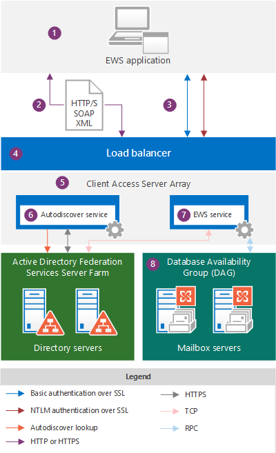
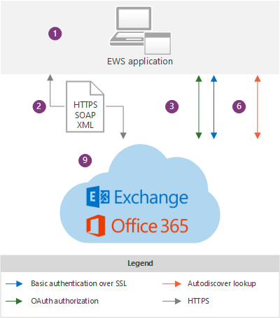

# EWS applications and the Exchange architecture

Learn about how EWS works within the Exchange architecture, and find out which protocols EWS relies on.
  
Exchange Web Services (EWS) is a cross-platform API that enables applications to access mailbox items such as email messages, meetings, and contacts from Exchange Online, Exchange Online as part of Office 365, or on-premises versions of Exchange starting with Exchange Server 2007. [EWS applications](ews-application-types.md) can access mailbox items locally or remotely by sending a request in a SOAP-based XML message. The SOAP message is embedded in an HTTP message when sent between the application and the server, which means that as long as your application can post XML through HTTP, it can use EWS to access Exchange. 
  
## Exchange architecture overview

The following diagrams show the authentication methods and communication paths used by EWS applications when communicating with Exchange 2013 and Exchange Online. From the EWS application perspective, the communication paths are identical and the authentication methods only vary slightly; the main difference is the visibility you have into the Exchange backend.
  
**Figure 1. EWS application and the Exchange on-premises architecture**

  
Figure 2 shows the same communication paths shown in Figure 1, as used by EWS applications when communicating with Exchange Online.
  
**Figure 2. EWS application and the Exchange Online architecture**

  
The following are the components that are shown in the diagrams:
  
1. EWS application — This can be a [client, portal, or service application](ews-application-types.md) and it can be installed on a client or on an Exchange on-premises Client Access server. If you use the EWS Managed API to develop the EWS application, the EWS Managed API assemblies have to be installed on the client and [redistributed by your application](redistribution-requirements-for-the-ews-managed-api.md).
    
2. The SOAP XML message — An XML message, in a SOAP envelope, embedded in an HTTP/S message that conforms to the Services.wsdl file on the Client Access server. HTTPS is recommended for Exchange on-premises and is required for Exchange Online. 
    
3. Authentication methods — EWS messages include basic, NTLM (Windows Integrated authentication), or OAuth authentication information as part of the HTTP payload. 
    
4. Load balancer — The load balancer distributes the message to a Client Access server in the Client Access server array. This component is only visible in the Exchange on-premises architecture.
    
5. Client Access server array — Client Access servers are organized into a load-balanced group called a Client Access server array. Individual Client Access servers provide authentication, limited redirection, and proxy services. The Client Access servers themselves don't do any data rendering, and no data is queued or stored on a Client Access server - it is thin and stateless; it simply authenticates the request, performs an Autodiscover lookup, and then proxies the request to the Mailbox server. The Client Access server does maintain a 1:1 relationship with the Mailbox server that hosts the user's data. The HTTP protocol (secured via SSL using a self-signed certificate) is used between the Client Access server and Mailbox server. This component is only visible in the Exchange on-premises architecture.
    
6. Autodiscover service — The Autodiscover service performs a service discovery by accessing Active Directory Domain Services (AD DS) to retrieve the mailbox version and the location of the Mailbox server that is hosting the active copy of the user's data.
    
7. EWS service —The EWS service is described by three files: Services.wsdl, Messages.xsd, and Types.xsd, as well as the EWS Managed API assemblies. Services.wsdl describes the contract between the client and server, Messages.xsd defines the request and response SOAP messages, and Types.xsd defines the elements used in the SOAP messages. Messages.xsd and Types.xsd always contain the latest versions of the schema, although earlier versions of the schema exist. Note that Services.wsdl, Messages.xsd, and Types.xsd are made available on the Client Access server, but are not actually used for schema validation — they are provided for reference only. The EWS Managed API assemblies are provided for server-side EWS client applications and are deployed on all Exchange Server roles, not just the Client Access servers. This component is only visible in the Exchange on-premises architecture.
    
    Feature availability is based on the EWS schema version that your application targets. Because EWS schemas are backward- and forward-compatible, if you create an application that targets an earlier schema version, such as Exchange 2007 SP1, your application will also work against a later schema version, such as the Exchange 2010 SP2 service, as well as Exchange Online. Because features and feature updates are driven by the schema, we recommend that you use the earliest common code base that targets the EWS features that you want to implement in your client application. Many applications can target the Exchange2007_SP1 version, because the Exchange 2007 SP1 schema contains almost all the core Exchange functionality for working with items and folders in the Exchange store. For more information, see [EWS client features](ews-client-design-overview-for-exchange.md#EWSFeatures).
    
8. Database Availability Group (DAG) — Mailbox servers are organized into a highly available DAG, which can be deployed in one or more datacenters. The Mailbox server contains the mailbox database and handles all activity for the active mailboxes on that server. All components that process, render, and store data are on the Mailbox server. Clients do not connect directly to the Mailbox server; all connections are handled by the Client Access server. This component is only visible in the Exchange on-premises architecture.
    
9. Exchange Online and Exchange Online as part of Office 365 — The hosted messaging solution that delivers Exchange features as a cloud-based service.
    
When an EWS application requests information from the Exchange store, an XML request message that complies with the SOAP standard is created and sent to the Exchange server. When the Exchange server receives the request, it verifies the credentials that are provided by the client and automatically parses the XML for the requested data. The server then builds a SOAP response that contains XML data that represents the requested strongly typed objects and their properties. The XML data is sent back to the application in an HTTP response. The application then deserializes the XML and uses the data to reform the strongly typed objects.
  
## Protocols and standards that EWS applications must support

To communicate with an Exchange server, EWS applications must support the following protocols and standards.
  
**Table 1. Protocols**

|**Protocol**|**How it's used**|
|:-----|:-----|
|HTTP/S    |Enables EWS applications to access Exchange database data over the network, regardless of whether the client is on the Internet or intranet.    |
|SOAP 1.0    |Forms an envelope around the messaging payload. EWS implements the SOAP protocol by using different parts of the SOAP envelope to enable different functionality. The SOAP header is used for impersonation and to provide versioning data. The SOAP body provides information about the operation to run and the data that is submitted to the operation. SOAP relies on WSDL to describe the operations to call.    |
|WSDL 1.0    |Describes the bindings, the operations, and the properties that are used to call EWS operations, in the Services.wsdl file. This file, along with the referenced schema files, comprises the contract between an EWS application and the Exchange server, and is often used along with vendor-specific tools to create platform-specific applications. The WSDL file is located in the EWS virtual directory, which is at the root of the website.    |
|Transport Layer Security (TLS)/SSL    |Provides secure web communications on the Internet or on intranet. TLS enables applications to authenticate servers or, optionally, servers to authenticate EWS applications. It also provides a security channel by encrypting communications. TLS is the latest version of the Secure Sockets Layer (SSL) protocol.    |
|XML/XSD    |Provides a universal message format for the exchange of information between the Exchange server and the client. XML provides complex Exchange database data to client applications, but in a defined structure. The beauty of XML is that it allows for the exchange of data even when an EWS application and server do not share a common platform.    |
   
In addition, EWS applications must support the following authentication standards:
  
- Basic authentication over SSL, for applications that target Exchange Online or Exchange on-premises.
    
- NTLM authentication over SSL, for applications that support Exchange on-premises.
    
- OAuth 2.0 token authentication, for trusted partner applications and interoperability with Lync Server 2013 and SharePoint Server 2013.
    
## See also

- [Start using web services in Exchange](start-using-web-services-in-exchange.md)
    
- [EWS application types](ews-application-types.md)
    
- [EWS client design overview for Exchange](ews-client-design-overview-for-exchange.md)
    

