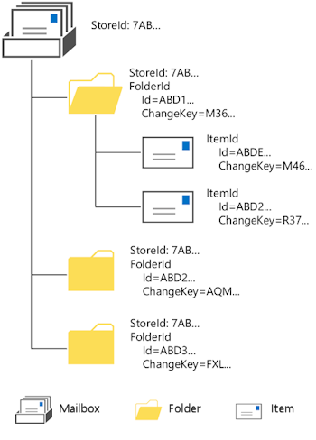

# EWS Identifiers in Exchange

Find out about identifiers in Exchange and how you can use them in your EWS Managed API and EWS applications.
  
Every object in the Exchange store has a unique identifier. You can use an object's identifier to reference the object and to distinguish it from other objects. The two most common identifiers that you might work with are folder and item identifiers. 
  
In order to understand identifiers and how they're important to your application, it's helpful to understand the relationship between objects in Exchange. When your EWS Managed API or EWS application communicates with Exchange, you work with an object hierarchy that includes mailbox, folder, and item objects. A store can be any one of these object types. Most commonly, it is a mailbox on the Exchange server, but it can also be a public folder on the Exchange server. (Keep in mind that in Exchange Online, Exchange Online as part of Office 365, and versions of Exchange starting with Exchange 2013, public folders are just another type of mailbox and not a different kind of store.) The store contains folders and the folders contain items, and each of these folders and items has an identifier, as shown in the following figure. 
  
**Figure 1. Mailbox, folder, and item hierarchy**

  
## EWS identifiers

Identifiers that EWS uses for folders and items are called EWS identifiers, or EwsIds. EwsIds can be found in many different objects within EWS, but are called something different for different objects. Because you might use these objects in your application, you'll want to understand how the identifiers for these objects relate to the EwsId. 
  
The identifiers in EWS are applicable to the EWS Managed API as well. In the EWS Managed API, the identifiers are properties of the objects and are internally managed to map to the EWS elements.
  
**Table 1. Object identifiers in EWS**

|**Object**|**Identifier**|**How does it relate to EwsId?**|
|:-----|:-----|:-----|
|[CalendarItem](https://msdn.microsoft.com/library/b0c1fd27-b6da-46e5-88b8-88f00c71ba80%28Office.15%29.aspx)   |The [ItemId](https://msdn.microsoft.com/library/3350b597-57a0-4961-8f44-8624946719b4%28Office.15%29.aspx) child element contains the unique identifier of the calendar item.    |The [ItemId](https://msdn.microsoft.com/library/3350b597-57a0-4961-8f44-8624946719b4%28Office.15%29.aspx) child element is the same as the EwsId for this item.    |
|[ConversationId](https://msdn.microsoft.com/library/d5f1ddb3-9af3-4677-a6ba-111b304a951e%28Office.15%29.aspx)   |The **Id** attribute contains the identifier for the conversation that this item is part of.    |The **Id** attribute is the same as the EwsId for this item.    |
|[AttachmentId](https://msdn.microsoft.com/library/55a5fd77-60d1-40fa-8144-770600cedc6a%28Office.15%29.aspx)   |Provides the unique identifier of the attachment. The [RootItemId](https://msdn.microsoft.com/library/f613c705-17ce-48ce-aa64-4dc2cea25e31%28Office.15%29.aspx) attribute contains the unique identifier of the root store item to which the attachment is attached.    |Attachments can be other items in the Exchange store, in which case the [AttachmentId](https://msdn.microsoft.com/library/55a5fd77-60d1-40fa-8144-770600cedc6a%28Office.15%29.aspx) is the same as the EwsId. In all cases, the [RootItemId](https://msdn.microsoft.com/library/f613c705-17ce-48ce-aa64-4dc2cea25e31%28Office.15%29.aspx) is an EwsId because it references an item in the store.    |
|[PersonaId](https://msdn.microsoft.com/library/eec3a468-afd5-4d72-a61e-cd1964fb686c%28Office.15%29.aspx)   |The **Id** attribute returns a string that contains the identifier of the persona.    |The **Id** attribute is the same as the EwsId for the persona.    |
|[ContactId](https://msdn.microsoft.com/library/86f66275-1e39-48ed-bd89-ac3bffc465a7%28Office.15%29.aspx)   |The **Id** attribute returns a string that contains the identifier of the contact.    |The **Id** attribute is the same as the EwsId for the contact.    |
|[GroupId](https://msdn.microsoft.com/library/656d9b9a-8a65-4a75-8466-5b0d96512dab%28Office.15%29.aspx)   |The **Id** attribute returns a string that contains the identifier of the group.    |The **Id** attribute is the same as the EwsId for the group.    |
|[AssociatedCalendarItemId](https://msdn.microsoft.com/library/5b29898c-ea59-4e6a-914c-c011ec754032%28Office.15%29.aspx)   |The **Id** attribute identifies the calendar item that is associated with a [MeetingMessage](https://msdn.microsoft.com/library/c95956a8-7505-44b4-bea4-11d1f5182796%28Office.15%29.aspx), [MeetingRequest](https://msdn.microsoft.com/library/c44f8804-a355-473d-a837-48cc91617251%28Office.15%29.aspx), [MeetingResponse](https://msdn.microsoft.com/library/9f798e79-dafd-4d4d-9967-95fd8e5c0502%28Office.15%29.aspx), or [MeetingCancellation](https://msdn.microsoft.com/library/a9c61f7f-2ecd-4b21-9dce-24d9f61aeeea%28Office.15%29.aspx).    |The **Id** attribute is the same as the EwsId for the calendar item.    |
|[UserConfigurationProperties](https://msdn.microsoft.com/library/c143a6ec-62ad-4d48-b844-b1ad88054bc1%28Office.15%29.aspx)   |The **Id** value for this element specifies the identifier property.    |This identifier does not directly map to the EwsId since it an property identifier and not an item.    |
|[OccurrenceItemId](https://msdn.microsoft.com/library/4a15bbc3-5b93-4193-b9ec-da32f0a9a552%28Office.15%29.aspx)   |The **RecurringMasterId** attribute identifies the master of a recurring item.    |The **OccurrenceItemId** value does not map directly to the EwsId, but the **RecurringMasterId** does because it references the top-level object of the recurring item.    |
|[StoreEntryId](https://msdn.microsoft.com/library/f536e264-8c4d-4cc5-bab8-22a4fa38de39%28Office.15%29.aspx)   |Contains the Exchange store identifier of an item.    |The **StoreEntryId** value does not map to the EwsId, but it does give the identifier of the store where the items are kept.    |
   
## Working with identifiers

The Exchange server handles identifiers in a lot of different ways. Consider the following when you develop your EWS Managed API or EWS application:
  
- The **ItemID** element value for folders and items is case-sensitive. If you look at the item ID for a folder or item that is returned by the [FindItem operation](https://msdn.microsoft.com/library/ebad6aae-16e7-44de-ae63-a95b24539729%28Office.15%29.aspx) (or the [FindItems ](https://msdn.microsoft.com/library/microsoft.exchange.webservices.data.exchangeservice.finditems%28v=exchg.80%29.aspx) EWS Managed API method), you might think that it is a duplicate of another item ID; however, one or more characters in the item IDs for the two items will have a different case. 
    
- If you are going to store the item ID in a database to retrieve later, we recommend that the field size be 512 bytes, so that it's large enough to hold the GUID.
    
- Don't assume that your item ID will always be valid if you need to retrieve the item at a later time. If an item is moved in the store, the ID can change because of the way a move is handled. An item is actually copied, and a new ID is generated, and then [the original item is deleted](deleting-items-by-using-ews-in-exchange.md). Note that folder IDs are immutable, and won't change when moved in the store.
    
- Identifiers in Exchange are opaque. For example, the EwsId is created from several pieces of information that are not important to you as the developer, but are important to Exchange.
    
- When you work with items in Exchange, another value to keep in mind is the **ChangeKey** attribute. This value, in addition to the item ID, is used to keep track of the state of an item. Any time an item is changed, a new change key is generated. When you perform an [UpdateItem operation](https://msdn.microsoft.com/library/5d027523-e0bc-4da2-b60b-0cb9fc1fdfe4%28Office.15%29.aspx), for example, you can use the **ChangeKey** attribute to let the server know that your update is being applied to the most current version of the item. If another application made a change to the item you're updating, the change keys won't match and you will not be able to perform the update. 
    
## Distinguished folder IDs

Exchange includes a number of predefined mailbox folders, each of which is assigned an identifier, known as the distinguished folder ID. These are defined by the [WellKnownFolderName](https://msdn.microsoft.com/library/office/microsoft.exchange.webservices.data.wellknownfoldername%28v=exchg.80%29.aspx) EWS Managed API enumeration and the [DistinguishedFolderId](https://msdn.microsoft.com/library/50018162-2941-4227-8a5b-d6b4686bb32f%28Office.15%29.aspx) EWS element. You can use these distinguished folder IDs to more easily reference one of the predefined folders. For example, for the Inbox folder, you can simply use "inbox" for the identifier, rather than determining the folder identifier. 
  
Other folders that you create to organize email items also have an ID that is unique to that folder. That ID does not change even if you change other properties on the folder.
  
You can use distinguished folder IDs as an entry point for delegate access. When you initiate delegate access, you search for items or folders and provide the distinguished folder ID to specify where to search. When a delegate user accesses the server, a [Mailbox](https://msdn.microsoft.com/library/befc70fd-51cb-4258-884c-80c9050f0e82%28Office.15%29.aspx) element that is a child of the **DistinguishedFolderId** element is used to explicitly specify the mailbox for the delegate to access. 
  
## Handling errors

Every program is bound to get an error every now and then, and EWS-based applications are no exception (pun intended). You might receive some identifier-related errors in the [ResponseCode](https://msdn.microsoft.com/library/4b84d670-74c9-4d6d-84e7-f0a9f76f0d93%28Office.15%29.aspx) EWS element or as part of the of the [ServiceError](https://msdn.microsoft.com/library/office/microsoft.exchange.webservices.data.serviceerror%28v=exchg.80%29.aspx) EWS Managed API enumeration. 
  
The following errors can occur in your EWS Managed API or EWS application. If you're working with an EWS Managed API application, the errors are typically issues with property values; for EWS applications, the errors are associated with XML element values or operations.
  
**Table 2. Identifier-related errors**

|**Error**|**Occurs when…**|**Description**|
|:-----|:-----|:-----|
|ErrorCalendarCannotUseIdForOccurrenceId    |The value of the **OccurenceID** does not correspond to a valid recurring calendar item.    |The value of the **OccurenceId** that was specified in the request might be valid in structure, but the request could not match it to an existing recurring master. The recurring item might be removed from the calendar. Verify that the item still exists and that you are using the correct identifier.    |
|ErrorCalendarCannotUseIdForRecurringMasterId    |The **RecurringMasterId** attribute does not correspond to a valid occurrence of the **OccurrenceId** element.    |The value of the **RecurringMasterId** that was specified in the request might be valid in structure, but the request could not match it to an existing occurrence of the item. The occurrence of the item might be removed from the calendar. Verify that the item still exists and that you are using the correct identifier.    |
|ErrorCannotUseFolderIdForItemId    |The **ID** that was passed represents a folder instead of an item.    |The identifier might be valid in format, but not what the server was expecting for the operation. Verify that you are referencing the correct identifier for the operation.    |
|ErrorCannotUseItemIdForFolderId    |The **ID** that was passed in represents an item instead of a folder.    |The identifier might be valid in format, but not what the server was expecting for the operation. Verify that you are referencing the correct **ID** for the operation.    |
|ErrorChangeKeyRequiredForWriteOperations    |A valid change key must be provided when you are performing certain update operations.    |Either you omitted a **ChangeKey** value when you requested an update, or the change key was incorrect. Verify that you have the correct change key when you perform update operations.    |
|ErrorInvalidAttachmentId    |The attachment was not found within the attachments collection for the item.    |You might receive this response code if you have an attachment **ID** and then the attachment is deleted and you try to call the [GetAttachment operation](https://msdn.microsoft.com/library/24d10a15-b942-415e-9024-a6375708f326%28Office.15%29.aspx) on the attachment ID. Verify that the attachment exists in the attachment collection.    |
|ErrorInvalidChangeKey    |An invalid change key was passed in.    |Note that many operations and methods do not require a change key to be passed. However, if you do provide a change key, it must be valid, although it does not necessarily have to be up-to-date.    |
|ErrorInvalidFolderId    |The folder **ID** is corrupted.    |Make sure you have a properly formatted and valid identifier.    |
|ErrorInvalidId    |The structure of the **ID** and/or change key is internally inconsistent.    |Exchange encountered a problem with the **ID** after it was parsed. There might have been an error in the conversion. This can occur, for example, if you have an **IdFormatType.HexEntryId** for an item in Outlook, but you convert it to an EwsId thinking it was an **IdFormatType.EntryId** format. Make sure you use the correct conversion type.    |
|ErrorInvalidIdEmpty    |The application specified an **ID** that is empty.    |Your application passed in an empty string for the identifier. Make sure you have a properly formatted and valid identifier.    |
|ErrorInvalidIdMalformed    |The structure of the **ID** is internally inconsistent.    |Exchange encountered a problem with the **ID** after it was parsed. The ID might not have been converted correctly. Make sure you use the correct conversion type.    |
|ErrorInvalidIdMalformedEwsLegacyIdFormat    |A folder or item **ID** that is using the Exchange 2007 format was specified for a request with a version of Exchange 2007 SP1 or later.    |You cannot use Exchange 2007 IDs in Exchange 2007 SP1 or later requests. You must use the [ConvertId](https://msdn.microsoft.com/library/47d96cf6-9e2f-4fc0-9682-7258d3fbf918%28Office.15%29.aspx) EWS operation or the [ConvertId](https://msdn.microsoft.com/library/microsoft.exchange.webservices.data.exchangeservice.convertid%28v=exchg.80%29.aspx) EWS Managed API method to convert them first.    |
|ErrorInvalidIdNotAnItemAttachmentId    |The **AttachmentId** property does not refer to an item attachment.    |The identifier might be valid in format, but not what the server was expecting for the operation. Verify that you are referencing the correct identifier for the operation.    |
|ErrorInvalidIdReturnedByResolveNames    |A contact in your mailbox is corrupt.    |The [ResolveNames](https://msdn.microsoft.com/library/6b4eb4b3-9ad6-4804-a09f-7e20cfea4dbb%28Office.15%29.aspx) EWS operation or the [ResolveName](https://msdn.microsoft.com/library/microsoft.exchange.webservices.data.exchangeservice.resolvename%28v=exchg.80%29.aspx) EWS Managed API method returned one or more identifiers, but they are not valid. You might need to recreate the contact.    |
|ErrorInvalidIdStoreObjectIdTooLong    |The structure of the **ID** is internally inconsistent.    |Exchange encountered a problem with the **ID** after it was parsed. The **ID** might not have been converted correctly. Make sure you use the correct conversion type.    |
|ErrorInvalidIdTooManyAttachmentLevels    |The attachment hierarchies exceed the maximum of 255 levels deep.    |The value of the **AttachmentId** property that was specified in the request might be valid in structure, but the requested attachment is too deep in the hierarchy. Your code might have tried to attach an item beyond the limit of 255 levels.    |
|ErrorInvalidImContactId    |This error can be returned when the contact cannot be found in the IM group when you use the [RemoveImContactFromGroup operation](https://msdn.microsoft.com/library/a190bbec-c71b-4e6a-880b-55854c724d8c%28Office.15%29.aspx). This error applies to clients that target Exchange Online and versions of Exchange starting with Exchange 2013.    |The value of the **ContactId** property that was specified in the request might be valid in structure, but no contacts in the mailbox match this structure. The contact might have been removed already.    |
|ErrorInvalidImGroupId    |This error can be returned when the group cannot be found in the mailbox when you use the [RemoveImGroup operation](https://msdn.microsoft.com/library/5e788016-68e0-4a3f-9243-03f6b6c6b389%28Office.15%29.aspx). This error applies to clients that target Exchange Online and versions of Exchange starting with Exchange 2013.    |The value of the **GroupId** property that was specified in the request might be valid in structure, but no groups in the mailbox match this structure. The group might have been removed already.    |
|ErrorInvalidReferenceItem    |The referenced item identifier is not a **MessageType** or **ExchangeWebServices.CalendarItemTypeType**, or one of their descendants. The reference item identifier is for a **CalendarItemType** object and the organizer is trying to Reply or ReplyAll.    |The identifier might be valid in format, but not what the server was expecting for the operation. Verify that you are referencing the correct identifier for the operation.    |
|ErrorMissingManagedFolderId    |The policy IDs property, property tag 0x6732, for the folder is missing.    |The folder is corrupted. Consider recreating it.    |
   
## Converting identifiers

You might need to convert an identifier from one format to another. For example, you might need to convert an identifier from outside EWS, such as an identifier that comes from a MAPI connection, to a format that your application can use. To do this, you can use the [ConvertId](https://msdn.microsoft.com/library/47d96cf6-9e2f-4fc0-9682-7258d3fbf918%28Office.15%29.aspx) EWS operation, or the [ConvertId](https://msdn.microsoft.com/library/microsoft.exchange.webservices.data.exchangeservice.convertid%28v=exchg.80%29.aspx) EWS Managed API method. 
  
For example, an EntryID is a unique identifier generated by the MAPI message store that is assigned by the store when the item is saved. To use an EntryID in your application, you first need to convert it to an EwsId. 
  
Outlook Web App uses its own version of identifiers, called OwaId, in URLs to access folders and items. If your application needs to access items in Outlook Web App, you need to convert the OwaId into an EwsId.
  
You can use the **ConvertId** operation or method to convert several different identifier formats. 
  
**Table 3. Convertible identifier formats in Exchange**

|**Format**|**Description**|
|:-----|:-----|
|EwsLegacyId    |The EwsId that applies to Exchange 2007.    |
|EwsId    |The EwsId that applies to Exchange Online and versions of Exchange starting with Exchange 2007 SP1.    |
|StoreId    |The Exchange store identifier where the folders and items are stored.    |
|OwaId    |The Outlook Web App identifier used with Outlook Web App in Exchange 2007 and Exchange 2010.   **NOTE**: Exchange Online and versions of Exchange starting with Exchange 2013 use the EwsId for Outlook Web App.           |
|EntryId    |A MAPI identifier that is commonly known as the **PR_ENTRYID** property of a MAPI message.    |
|HexEntryId    |A hexadecimal-encoded representation of the **PR_ENTRYID** property that is used for the availability calendar event identifier. This is also the identifier format that Outlook uses.    |
   
## See also

- [Develop web service clients for Exchange](develop-web-service-clients-for-exchange.md)  
- [ConvertId operation](https://msdn.microsoft.com/library/47d96cf6-9e2f-4fc0-9682-7258d3fbf918%28Office.15%29.aspx)  
- [ServiceError enumeration](https://msdn.microsoft.com/library/office/microsoft.exchange.webservices.data.serviceerror%28v=exchg.80%29.aspx) 
- [Deleting items by using EWS in Exchange](deleting-items-by-using-ews-in-exchange.md)
    

