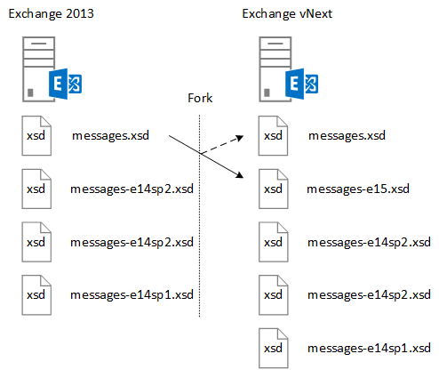

# EWS schema versions in Exchange

Learn about the EWS schema and how to design your application to work with it, as well as the features that are available with each schema version, and how the schema relates to the Exchange service version.
  
The EWS schema defines the data structures that can be sent to and returned by Exchange. Each new version of Exchange that contains a significant change to EWS functionality will contain a new schema. EWS and the EWS schema are both backward, and in some cases, forward compatible - applications designed against earlier versions of EWS will work, in most cases, with later versions of EWS, and applications that target later versions of EWS will work if the same functionality was included in an earlier version. This article will help you understand the role of the EWS schema, how schema versioning works, the relationship between the schema version and the service version, and how to design your application to work with the EWS schema. 
  
## Role of the EWS schema

The EWS schema does the following:
  
- Defines the feature set that is available to a client. A client can get the list of the supported schema versions by using the SOAP [Autodiscover service](autodiscover-for-exchange.md). The client can then determine which features it can access, because each schema version represents an [EWS feature set](ews-schema-versions-in-exchange.md#bk_features). Each new schema released for EWS contains of the schema entities from the previous version plus the schema definitions for any new functionality. This way, EWS supports applications that target an earlier version of EWS.
    
- Provides a general description of the API contract. You can use this contract to determine the data structures that can be sent to and received from Exchange.
    
- Provides a versioning mechanism for sending requests. The Exchange server contains all the supported EWS schema versions in its virtual directory. 
    
## Designing your application with schema version in mind

Keep the following points in mind as you design your application to work with different versions of the EWS schema:
  
- Turn on/off functionality based on the schema version. You'll want to map client functionality to the schema version and, in some cases, to the version of the service. The following example will return a [PropertySet](https://msdn.microsoft.com/library/office/microsoft.exchange.webservices.data.propertyset%28v=exchg.80%29.aspx) based on the version of the schema and service. 
    
  ```cs
  private static PropertySet InitPropertySetByVersion(ExchangeService service)
  {
      PropertySet props;
      // The schema version to target to access the NormalizedBody property 
      // is Exchange2013 or later. The server version to target to access the 
      // NormalizedBody property on an email is 15 or later, which 
      // equates to Exchange 2013.
      if (service.RequestedServerVersion >= ExchangeVersion.Exchange2013 &amp;&amp;
          service.ServerInfo.MajorVersion >= 15)
      {
          props = new PropertySet(EmailMessageSchema.NormalizedBody);
      }
      else
      {
          props = new PropertySet(EmailMessageSchema.Body);
      }
      return props;
  }
  ```

- Version your requests with the earliest version of the EWS schema that supports the functionality you want to use. This will make your client applicable to a larger number of potential Exchange servers. This is less important if you're developing a line-of-business application to target your organization's servers only, but is very important if you're building an application for a wider Exchange audience.
    
## Features by schema version
<a name="bk_features"> </a>

The schema versions that are available to a client are identified in the **ExchangeVersionType** simple type located in the types.xsd schema. The **ExchangeVersionType** is implemented by the [RequestServerVersion](https://msdn.microsoft.com/library/af4032d5-42b3-463e-9d0a-8236d78e5b75%28Office.15%29.aspx) element. The **RequestServerVersion** element is sent in all EWS requests to indicate to the server which version of the schema the client targets. This in turn identifies the feature set that is available to the client. 
  
**Table 1: EWS features by product and schema version**

|**Product version**|**Associated schema version**|**Features**|
|:-----|:-----|:-----|
|Exchange Online  |The latest schema version.  |Includes all the features in the current version of Exchange in addition to any new features that are added for online clients. |
|Exchange 2013 SP1 |Exchange2013_SP1 | Includes all the features in Exchange 2013.<br/><br/>The following features were introduced in Exchange 2013 SP1: <ul><li>[Mailbox hold policy](https://msdn.microsoft.com/library/office/microsoft.exchange.webservices.data.exchangeservice.setholdonmailboxes%28v=exchg.80%29.aspx) </li><li> [Propose new time](how-to-propose-a-new-meeting-time-by-using-ews-in-exchange.md) </li><li>  Read receipt updates for [updating](https://msdn.microsoft.com/library/office/dn600559%28v=exchg.80%29.aspx) and [deleting](https://msdn.microsoft.com/library/office/dn600557%28v=exchg.80%29.aspx) items  </li><li> [IRM information](https://msdn.microsoft.com/library/office/microsoft.exchange.webservices.data.conversation.hasirm%28v=exchg.80%29.aspx) update for conversations  </li></ul> |
|Exchange 2013   |Exchange2013   | Includes all features introduced in Exchange 2007 and Exchange 2010. <br/><br/>The following features were introduced in Exchange 2013:<ul><li>Archiving  </li><li>  eDiscovery  </li><li>  Personas  </li><li>  Retention policies  </li><li>  Unified Contact Store  </li><li>  User photos  </li></ul> |
|Exchange 2010 SP2   |Exchange2010_SP2 | Includes all the features introduced in Exchange 2010 SP1. <br/><br/>The following features were introduced in Exchange 2010 SP2:<ul><li>Get Password Expiration  </li><li>  DateTime precision  </li><li>  Updated property identifiers for contacts  </li><li>  New impersonation scenarios  </li></ul> |
|Exchange 2010 SP1  |Exchange2010_SP1   | Includes all the features introduced in Exchange 2010. <br/><br/>The following features were introduced in Exchange 2010 SP1:<ul><li>Create, retrieve and modify Inbox rules  </li><li>  Programmatic access to Archive Mailbox  </li><li>  Conversations actions  </li><li>  Firewall traversing notifications  </li><li>  Improved administration features  </li><li>  Improved mixed version support  </li><li>  Throttling protection support  </li><li>  Control of application access to EWS  </li><li>  Client certificate authentication support  </li></ul> |
|Exchange 2010  |Exchange2010   | Includes all features introduced in Exchange 2007 SP1. <br/><br/>The following features were introduced in the initial release version of Exchange 2010:<ul><li>Full Private Distribution List  </li><li>  User Configuration Objects  </li><li>  Folder Associated Items  </li><li>  Message tracking  </li><li>  Unified Messaging  </li><li>  SOAP Autodiscover  </li><li>  Enhanced Time Zone support  </li><li>  Room resource availability information  </li><li>  Indexed search  </li><li>  Dumpster access  </li><li>  MailTips information  </li></ul> |
|Exchange 2007 SP1   |Exchange2007_SP1  | Includes all the features introduced in Exchange 2007. <br/><br/>The following features were introduced in Exchange 2007 SP1:<ul><li>Delegate management  </li><li>  Folder permissions  </li><li>  Public folders  </li><li>  Post items  </li><li>  ID conversion  </li></ul>|
|Exchange 2007  |Exchange2007 | The following features were introduced in the initial release version of Exchange 2007:<ul><li>Full access to items, folders, and attachments (Create, Get, Update, Delete)  </li><li>  Availability  </li><li>  Out of Office settings  </li><li>  Notifications  </li><li>  Synchronization  </li><li>  Name resolution  </li><li>  Distribution list (DL) expansion  </li><li>  Search  </li></ul> |
   
## Relationship between the EWS schema and the service version
<a name="bk_features"> </a>

The EWS schema version is related to the version of the EWS service that the server is running. The naming pattern for the EWS schema is related to the on-premises versions of Exchange. For example, the initial release of Exchange 2013 has a service version of 15.00.0516.032 and the schema name **Exchange2013**. Because the schema was updated for Exchange 2013, both Exchange 2013 and Exchange Online with a service version of 15.00.0516.032 and later have the same version name for the latest schema. In earlier versions of Exchange, the EWS schema was not updated with cumulative updates (formerly called rollups). But because Exchange is updated more frequently to support Exchange Online, cumulative updates now contain schema updates for EWS. The schema file names, and the associated schema version name, are only updated with service packs or major releases of Exchange on-premises.
  
While the EWS schema defines the contract, in some scenarios, the service version is the only way for a client to determine how it is supposed to interact with the service. Service behavior changes that aren't reflected in the schema can only be determined by the service version returned in all EWS responses. For example, when [public folders](public-folder-access-with-ews-in-exchange.md) were redesigned in Exchange 2013, the operations that are used to move and copy public folders changed. If you designed a client to copy public folders in Exchange 2010, you would need to update it to use different operations to get the same result in Exchange 2013. 
  
## How the EWS schema is updated
<a name="bk_features"> </a>

Exchange servers running versions of Exchange starting with Exchange 2007 include the EWS schema in the virtual directory that hosts the EWS service. The current schema version is always represented by the types.xsd and messages.xsd files. Figure 1 shows how the messages.xsd schema is forked when a new version of the schema is developed. Before new functionality is added, a copy of the original messages.xsd schema is included and renamed to represent the previous version of the schema. The messages.xsd file is then updated with the service description for the new version.
  
**Figure 1. How the EWS schema is updated**


  
Before the EWS schema is updated for a new version, the current version of the schema is forked and renamed using the following convention:
  
`<schemaname>-<majorserverversion><servicepack>.xsd`
  
The original file name then represents the latest schema. All new features are added to the latest schema, with the exception of updates and fixes to the earlier versions of the schema. 
  
## See also

- [EWS schema versions in Exchange](ews-schema-versions-in-exchange.md) 
- [Autodiscover for Exchange](autodiscover-for-exchange.md) 
- [Develop web service clients for Exchange](develop-web-service-clients-for-exchange.md)
    

