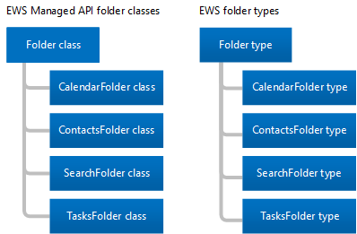
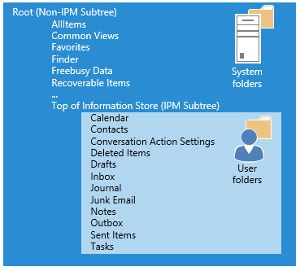

# Folders and items in EWS in Exchange

Learn about folders and mailbox items and how your EWS Managed API or EWS client represents them.
  
Folders are the organizing element of an Exchange mailbox. Folders can contain mailbox items, such as email messages, contacts, appointments, meetings, and tasks, or they can contain other folders. Exchange includes different types of folders, but the folder types are similar to each other. The main difference between them is the type of item they contain.
  
Items, however, have unique types. Each item type has a different set of properties or schema to define it. In this article, we'll discuss the types of folders and items that are available and the differences between them.

## Folders

Folders all derive from the same base class or base type, the [Folder](https://msdn.microsoft.com/library/microsoft.exchange.webservices.data.folder%28v=EXCHG.80%29.aspx) class in the EWS Managed API, or the [Folder](https://msdn.microsoft.com/library/812948d8-c7db-45ce-bb3a-77233a53a974%28Office.15%29.aspx) type in EWS. The following figure shows the EWS Managed API classes and EWS types. 
  
**Figure 1. EWS Managed API folder classes and EWS folder types**

  
The primary difference between each of the folder classes and folder types is that you can only create a certain type of item in each type of folder. One other difference is in how the client displays information in a folder. For example, Exchange allows you to create appointments in the Calendar folder. You can move other types of items into the Calendar folder after you create them, but Outlook won't display them. Outlook only displays calendar items such as appointments and meetings in the Calendar folder, [even if another type of item exists in the folder](folders-and-items-in-ews-in-exchange.md#bk_item). 
  
**Table 1. EWS Managed API folder classes and EWS folder types**

|**EWS Managed API class**|**EWS type**|**FolderClass value**|**Contains**|**Notes**|
|:-----|:-----|:-----|:-----|:-----|
|[Folder](https://msdn.microsoft.com/library/microsoft.exchange.webservices.data.folder%28v=exchg.80%29.aspx)   |[Folder](https://msdn.microsoft.com/library/812948d8-c7db-45ce-bb3a-77233a53a974%28Office.15%29.aspx)   |IPF.Note    |Email messages or folders.    | This is the generic folder class or type for the following EWS Managed API [WellKnownFolderName](https://msdn.microsoft.com/library/microsoft.exchange.webservices.data.wellknownfoldername%28v=exchg.80%29.aspx) folders and EWS [DistinguishedFolderId](https://msdn.microsoft.com/library/50018162-2941-4227-8a5b-d6b4686bb32f%28Office.15%29.aspx) folders: <ul><li>  Root (IPM subtree)</li><li>NonIpmSubtree</li><li>Inbox</li><li>Deleted Items</li><li>Drafts</li><li>Journal</li><li>Notes  </li><li>Outbox</li><li>Sent Items</li><li>Message Folder</li><li>Junk Email</li><li>Voice Mail</li></ul> |
|[CalendarFolder](https://msdn.microsoft.com/library/microsoft.exchange.webservices.data.calendarfolder%28v=exchg.80%29.aspx)   |[CalendarFolder](https://msdn.microsoft.com/library/48687a78-e757-4c04-9641-bf4302c6b565%28Office.15%29.aspx)   |IPF.Appointment    |Appointments and meetings.    |When a user responds to a meeting request, the appointment is added to the EWS Managed API [WellKnownFolderName.Calendar](https://msdn.microsoft.com/library/microsoft.exchange.webservices.data.wellknownfoldername%28v=exchg.80%29.aspx) or the EWS [DistinguishedFolderId.CalendarFolder](https://msdn.microsoft.com/library/50018162-2941-4227-8a5b-d6b4686bb32f%28Office.15%29.aspx) only. These are the only folders that support automatic interaction with meeting requests and responses.    This folder class or folder type supports the use of calendar views to return appointments and meetings based on a start date and an end date by using the EWS Managed API [Folder.FindItem](https://msdn.microsoft.com/library/microsoft.exchange.webservices.data.folder.finditems%28v=EXCHG.80%29.aspx) method and the [CalendarView](https://msdn.microsoft.com/library/microsoft.exchange.webservices.data.calendarview%28v=exchg.80%29.aspx) class, or the EWS [FindItem](https://msdn.microsoft.com/library/ebad6aae-16e7-44de-ae63-a95b24539729%28Office.15%29.aspx) operation and the [CalendarView](https://msdn.microsoft.com/library/a4a953b8-0710-416c-95ef-59e51eba9982%28Office.15%29.aspx) element.    |
|[ContactsFolder](https://msdn.microsoft.com/library/microsoft.exchange.webservices.data.contactsfolder%28v=exchg.80%29.aspx)   |[ContactsFolder](https://msdn.microsoft.com/library/6c299de8-2087-4aeb-8e66-2bc7586509a6%28Office.15%29.aspx)   |IPF.Contact    |Contacts and distribution lists.    |None.    |
|[SearchFolder](https://msdn.microsoft.com/library/microsoft.exchange.webservices.data.searchfolder%28v=exchg.80%29.aspx)   |[SearchFolder](https://msdn.microsoft.com/library/1a7d408b-2e98-4391-8834-085ed6d5757c%28Office.15%29.aspx)   |IPF.Note    |Contents are determined by a restriction or filter. Search folders do not have subfolders.    |The items that meet the search criteria are not actually contained in the search folder; instead, they are located elsewhere in the mailbox.    To ensure that Search folders are available in Outlook, create them in the Finder folder.    |
|[TasksFolder](https://msdn.microsoft.com/library/microsoft.exchange.webservices.data.tasksfolder%28v=exchg.80%29.aspx)   |[TasksFolder](https://msdn.microsoft.com/library/5a9a4612-8064-4986-b467-c44f268c64df%28Office.15%29.aspx)   |IPF.Task    |Contains work items to complete.    |None.    |
   
### Folder structure

Folders provide a mailbox structure. This includes the IPM Subtree, known as the Top of Information Store in EWS, where most users interact with their mailbox, as well as system folders that most users never see, which are in the Non-IPM Subtree or Root in EWS. The following figure shows the folder structure for a user and indicates which folders are for the user's items and which are system folders.
  
**Figure 2. Item and system folders in a mailbox**

  
### Well-known folders

Of the folders in a mailbox, some are special folders. These equate to well-known folders in the EWS Managed API, or distinguished folders in EWS. Some of these folders have restrictions on the folder name, where they are located in the folder structure, and whether they can be deleted. Other "generic" (non-special) folders do not have the same restrictions. It is important for you to be familiar with the following well-known or distinguished folders because they are the root system, user, and search folders, and are applicable to most implementations. 
  
**Table 2. Primary well-known and distinguished folders**

|**Friendly name**|**EWS Managed API **WellKnownFolderName** values**|**EWS **DistinguishedFolderId** values**|**Description**|
|:-----|:-----|:-----|:-----|
|Root (Non-IPM Subtree)    |WellKnownFolderName.Root    |DistinguishedFolderId.root    |Contains the root folder of a mailbox, also known as the Non-IPM Subtree. This folder has no parent, and you cannot move, copy, rename, or delete it. Each message store contains only one root folder.    |
|Top of Information Store (IPM Subtree)    |WellKnownFolderName.MsgFolderRoot    |DistinguishedFolderId.msgfolderroot    |Contains the Inbox and other user folders.    |
|Finder (Search folders)    |WellKnownFolderName.SearchFolders    |DistinguishedFolderId.searchfolders.    |Contains search folders that are visible in Outlook.    |
   
For a complete list of the EWS Managed API [WellKnownFolderName](https://msdn.microsoft.com/library/microsoft.exchange.webservices.data.folder.wellknownfoldername%28v=exchg.80%29.aspx) property values, see the [WellKnownFolderName](https://msdn.microsoft.com/library/microsoft.exchange.webservices.data.wellknownfoldername%28v=EXCHG.80%29.aspx) enumeration. For a complete list of the EWS **DistinguishedFolderId** values, see [DistinguishedFolderId](https://msdn.microsoft.com/library/50018162-2941-4227-8a5b-d6b4686bb32f%28Office.15%29.aspx).
  
### Folder properties

In the EWS Managed API, the [folder properties](https://msdn.microsoft.com/library/microsoft.exchange.webservices.data.folder_properties%28v=exchg.80%29.aspx) are all derived from the base [Folder](https://msdn.microsoft.com/library/microsoft.exchange.webservices.data.folder%28v=EXCHG.80%29.aspx) class. And in EWS, all folders use the folder elements that are available on the [Folder](https://msdn.microsoft.com/library/812948d8-c7db-45ce-bb3a-77233a53a974%28Office.15%29.aspx) type. Most of the folder-related properties and elements are straightforward (parent folder ID, display name, and so on), but a few require a little more explanation. 
  
The following caveats apply to the EWS Managed API [Folder.FolderClass](https://msdn.microsoft.com/library/microsoft.exchange.webservices.data.folder.folderclass%28v=EXCHG.80%29.aspx) property or the EWS [FolderClass](https://msdn.microsoft.com/library/0041d135-2869-4612-89a5-d1aa86aa1093%28Office.15%29.aspx) element: 
  
- If set, the value of the property or element must agree with the derived class or type of the folder. For example, the **FolderClass** property or element can't indicate that the folder is a Contacts folder while the class or type of the folder indicates the folder is a Calendar folder. 
    
- You can either [create folders](how-to-work-with-folders-by-using-ews-in-exchange.md#bk_createfolderewsma) of a specific type without setting the **FolderClass** property or element, or you can create a folder with the generic folder type and specify the **FolderClass** property or element. Both options create the same result. 
    
- After you set the **FolderClass** value by creating a specific type of folder or by setting the **FolderClass** property or element itself, you cannot change it. For example, you cannot change an IPF.Note folder to an IPF.Contact folder. You can, however, change it to an IPF.Note.Contoso folder. 
    
- Any **FolderClass** value that does not use one of the predefined prefixes is treated as an IPF.Note folder. For example, a **FolderClass** value of IAmAFolderClass is treated as an IPF.Note folder. 
    
The folder class value is extensible. This means that the default **FolderClass** values listed in Table 1 are treated as prefixes and you can add custom values. For example, you can create a folder with a **FolderClass** value of IPF.Contact.Contoso, and it is treated as a Contacts folder. 
  
You can determine what permissions the client has on the folders, such as delete, read, and modify, by using the EWS Managed API [Folder.EffectiveRights](https://msdn.microsoft.com/library/microsoft.exchange.webservices.data.folder.effectiverights%28v=EXCHG.80%29.aspx) property or the EWS [EffectiveRights](https://msdn.microsoft.com/library/bf5278eb-3a1a-4d27-9d16-b8be043bb023%28Office.15%29.aspx) element. 
  
### Public folders

Public folders are designed for shared access and provide an easy and effective way to collect, organize, and share information with other people in your workgroup or organization. You can also use public folders to archive distribution group content. For in-depth information about public folders, see [Public folder access with EWS in Exchange](public-folder-access-with-ews-in-exchange.md).

### Hidden folders

All the folders that Exchange creates at the root of the mailbox are hidden, and you can use the EWS Managed API or EWS to hide additional folders under the Top of Information Store. For more information about hidden folders, see [Work with hidden folders by using EWS in Exchange](how-to-work-with-hidden-folders-by-using-ews-in-exchange.md). 

### Search folders

Search folders are just like regular folders, except that they have a property or element that defines the search filter. You can create search folders in any folder in an Exchange mailbox, and you create them in the same way that you create any other folder. However, for a search folder to appear in Outlook, Outlook Web App, or Outlook Live, [SearchFolder](https://msdn.microsoft.com/library/microsoft.exchange.webservices.data.searchfolder%28v=exchg.80%29.aspx) objects that you create by using the EWS Managed API must be located in the [WellKnownFolderName.SearchFolders](https://msdn.microsoft.com/library/microsoft.exchange.webservices.data.wellknownfoldername%28v=exchg.80%29.aspx) folder, and [SearchFolder](https://msdn.microsoft.com/library/1a7d408b-2e98-4391-8834-085ed6d5757c%28Office.15%29.aspx) types that you create by using EWS must be located in the [DistinguishedFolderId.SearchFolders](https://msdn.microsoft.com/library/50018162-2941-4227-8a5b-d6b4686bb32f%28Office.15%29.aspx) folder. If the search folder is created in a different location, it is still available and you can view it in custom client applications. 

## Items

EWS in Exchange uses **Items** to represent individual email messages, appointments, meetings, contacts, distribution lists, tasks, posts, and other items, in a mailbox. Items are either strongly typed, which means that they have a specific associated class or schema, or not strongly typed, also known as generic items. Generic items are [Item](https://msdn.microsoft.com/library/microsoft.exchange.webservices.data.item%28v=exchg.80%29.aspx) objects in the EWS Managed API and [Item](https://msdn.microsoft.com/library/4dfe8f48-e7b4-444d-bdf9-a34e180f598b%28Office.15%29.aspx) types in EWS. Common items like email messages, contacts, distribution lists, posts, and tasks are strongly typed, and you can set specific schematized properties or elements on them. 
  
**Table 3. Strongly typed items**

|**EWS Managed API item type**|**EWS item element**|
|:-----|:-----|
|[Appointment](https://msdn.microsoft.com/library/microsoft.exchange.webservices.data.appointment%28v=exchg.80%29.aspx)   |[CalendarItem](https://msdn.microsoft.com/library/b0c1fd27-b6da-46e5-88b8-88f00c71ba80%28Office.15%29.aspx)   |
|[Contact](https://msdn.microsoft.com/library/microsoft.exchange.webservices.data.contact%28v=exchg.80%29.aspx)   |[Contact](https://msdn.microsoft.com/library/66bfff50-7a91-4d81-b6a0-610b9962f677%28Office.15%29.aspx)   |
|[ContactGroup](https://msdn.microsoft.com/library/microsoft.exchange.webservices.data.contactgroup%28v=exchg.80%29.aspx)   |[DistributionList](https://msdn.microsoft.com/library/f65aea01-e870-44a2-8571-fa6c001341cc%28Office.15%29.aspx)   |
|[EmailMessage](https://msdn.microsoft.com/library/microsoft.exchange.webservices.data.emailmessage%28v=exchg.80%29.aspx)   |[Message](https://msdn.microsoft.com/library/2400b33c-43b2-4fc2-b6fb-275a99e0e810%28Office.15%29.aspx)   |
|[PostItem](https://msdn.microsoft.com/library/microsoft.exchange.webservices.data.postitem%28v=exchg.80%29.aspx)   |[PostItem](https://msdn.microsoft.com/library/7727ed84-9591-4a1c-bb04-12129926499b%28Office.15%29.aspx)   |
|[Task](https://msdn.microsoft.com/library/microsoft.exchange.webservices.data.task%28v=exchg.80%29.aspx)   |[Task](https://msdn.microsoft.com/library/7c84927e-db28-4c5d-b0b5-cbcc2b88d869%28Office.15%29.aspx)   |
   
EWS Managed API strongly typed items derive from the base [Item](https://msdn.microsoft.com/library/microsoft.exchange.webservices.data.item%28v=EXCHG.80%29.aspx) class. However, you usually work with one of the derived types listed in Table 3, and not with the **Item** class directly. When you work with the [ItemCollection](https://msdn.microsoft.com/library/dd634001%28v=EXCHG.80%29.aspx) class, however, you might work directly with instances of the **Item** class. In that case, you should implement logic that determines the type of item in the store that the instance of the **Item** class represents. To work with that item, you should bind to the item by using an instance of the class that represents the item. 
  
### Items in folders

Some folders have restrictions about the types of items that they can contain. These are restrictions that the Exchange mailbox database applies to folders, not client view limitations. 
  
**Table 4. Item restrictions for folders**

|**EWS Managed API Folder class**|**EWS Folder type**|**Restriction**|
|:-----|:-----|:-----|
|[Base Folder class](https://msdn.microsoft.com/library/microsoft.exchange.webservices.data.folder%28v=exchg.80%29.aspx)   |[Folder](https://msdn.microsoft.com/library/812948d8-c7db-45ce-bb3a-77233a53a974%28Office.15%29.aspx)   |You can only create new EWS Managed API [EmailMessage](https://msdn.microsoft.com/library/microsoft.exchange.webservices.data.emailmessage%28v=exchg.80%29.aspx) objects and [PostItem](https://msdn.microsoft.com/library/microsoft.exchange.webservices.data.postitem%28v=exchg.80%29.aspx) objects, or EWS [Message](https://msdn.microsoft.com/library/2400b33c-43b2-4fc2-b6fb-275a99e0e810%28Office.15%29.aspx) types or **PostItem** types, in the generic folders. You can move other item types into generic folders, but the client might not display them.    |
|[CalendarFolder](https://msdn.microsoft.com/library/microsoft.exchange.webservices.data.calendarfolder%28v=exchg.80%29.aspx)   |[CalendarFolder](https://msdn.microsoft.com/library/48687a78-e757-4c04-9641-bf4302c6b565%28Office.15%29.aspx)   |You can only create new EWS Managed API [Appointment](https://msdn.microsoft.com/library/microsoft.exchange.webservices.data.appointment%28v=exchg.80%29.aspx) objects and EWS [CalendarItem](https://msdn.microsoft.com/library/b0c1fd27-b6da-46e5-88b8-88f00c71ba80%28Office.15%29.aspx) types in the Calendar folder. You can move other item types into the Calendar folder, but the client might not display them.    |
|[ContactsFolder](https://msdn.microsoft.com/library/microsoft.exchange.webservices.data.contactsfolder%28v=exchg.80%29.aspx)   |[ContactsFolder](https://msdn.microsoft.com/library/6c299de8-2087-4aeb-8e66-2bc7586509a6%28Office.15%29.aspx)   |You can only create new EWS Managed API [Contact](https://msdn.microsoft.com/library/microsoft.exchange.webservices.data.contact%28v=exchg.80%29.aspx) and [ContactGroup](https://msdn.microsoft.com/library/microsoft.exchange.webservices.data.contactgroup%28v=exchg.80%29.aspx) objects, or EWS [Contact](https://msdn.microsoft.com/library/66bfff50-7a91-4d81-b6a0-610b9962f677%28Office.15%29.aspx) types or [DistributionList](https://msdn.microsoft.com/library/f65aea01-e870-44a2-8571-fa6c001341cc%28Office.15%29.aspx) types in the Contacts folder. You can move other item types into the Contacts folder, but the client might not display them    |
|[SearchFolder](https://msdn.microsoft.com/library/microsoft.exchange.webservices.data.searchfolder%28v=exchg.80%29.aspx)   |[SearchFolder](https://msdn.microsoft.com/library/1a7d408b-2e98-4391-8834-085ed6d5757c%28Office.15%29.aspx)   |No restrictions. Items are not actually located in the Search folder; they are located elsewhere in the mailbox.    |
|[TasksFolder](https://msdn.microsoft.com/library/microsoft.exchange.webservices.data.tasksfolder%28v=exchg.80%29.aspx)   |[TasksFolder](https://msdn.microsoft.com/library/5a9a4612-8064-4986-b467-c44f268c64df%28Office.15%29.aspx)   |You can only create new EWS Managed API [Task](https://msdn.microsoft.com/library/microsoft.exchange.webservices.data.task%28v=exchg.80%29.aspx) objects or EWS [Task](https://msdn.microsoft.com/library/7c84927e-db28-4c5d-b0b5-cbcc2b88d869%28Office.15%29.aspx) types in the Tasks folder. You can move other item types into the Tasks folder, but the client might not display them    |

## Upgrading from earlier product versions

Folders have for the most part remained unchanged in earlier and current product versions. Note, however, that earlier versions of Exchange use managed folders to perform messaging records management (MRM). Exchange Online, Exchange Online as part of Office 365, and versions of Exchange starting with Exchange 2013 use retention policies for MRM. You can [upgrade managed folders to use retention policies](https://technet.microsoft.com/library/dd298032%28v=exchg.150%29.aspx). 
  
Items have not changed in earlier and current product versions.

## In this section

- [Work with folders by using EWS in Exchange](how-to-work-with-folders-by-using-ews-in-exchange.md)
    
- [Work with hidden folders by using EWS in Exchange](how-to-work-with-hidden-folders-by-using-ews-in-exchange.md)
    
- [Work with Exchange mailbox items by using EWS in Exchange](how-to-work-with-exchange-mailbox-items-by-using-ews-in-exchange.md)
    
- [Delete items by using EWS in Exchange](deleting-items-by-using-ews-in-exchange.md)
    
- [Export and import items by using EWS in Exchange](exporting-and-importing-items-by-using-ews-in-exchange.md)
    
## See also

- [Develop web service clients for Exchange](develop-web-service-clients-for-exchange.md)   
- [Start using web services in Exchange](start-using-web-services-in-exchange.md)   
- [EWS client design overview for Exchange](ews-client-design-overview-for-exchange.md)
    

