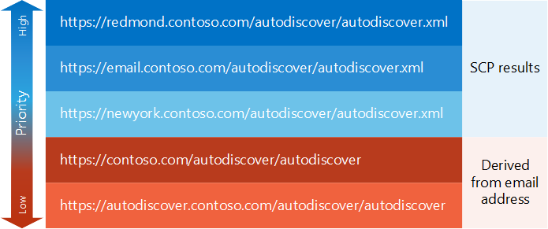

# Generate a list of Autodiscover endpoints

Find out how to generate a prioritized list of Autodiscover endpoints.
  
The first task in the [Autodiscover process](autodiscover-for-exchange.md) is to generate a list of Autodiscover endpoints for your application to try. These Autodiscover endpoints can come from an [SCP lookup](how-to-find-autodiscover-endpoints-by-using-scp-lookup-in-exchange.md) or can be derived from the user's email address. In the end, you can end up with a large number of endpoints. Let's take a look at how you can organize them by priority. 
  
## Start with SCP lookup

Autodiscover endpoints that come from an [SCP lookup](how-to-find-autodiscover-endpoints-by-using-scp-lookup-in-exchange.md) should have top priority in your list. Administrators can configure SCP objects to route your client to the closest or most efficient Autodiscover endpoint, so it is a good idea to start with these endpoints. Because the SCP lookup process has its own prioritization scheme, the results of an SCP lookup are already prioritized, as follows: 
  
1. Autodiscover endpoints from SCP objects scoped to the Active Directory site that the client computer belongs to.
    
2. Autodiscover endpoints from SCP objects not scoped to any Active Directory site.
    
3. Autodiscover endpoints from SCP objects scoped to a different Active Directory site than the site that the client computer belongs to.
    
After you have the results of the SCP lookup process, you can add endpoints that derive from the user's email address. These can serve as a default set of endpoints and a fallback in case there are no SCP results or the endpoints returned from the SCP lookup are not sufficient.
  
## Add endpoints derived from the user's email address

When SCP lookup doesn't work, or the endpoints returned by the SCP lookup don't return a successful response, you can derive a set of default Autodiscover endpoints from the user's email address. These endpoints should be a lower priority than any that come from an SCP lookup, but you might need them if the SCP lookup was not successful.
  
### To derive Autodiscover endpoints

1. Extract the domain name from the user's email address. For example, if the user's email address is Sadie.Daniels@contoso.com, the domain name would be contoso.com.
    
2. Construct endpoint URLs without file extensions in the following formats:
    
  - "https://" + domain + "/autodiscover/autodiscover"
    
  - "https://autodiscover." + domain + "/autodiscover/autodiscover"
    
After you compile the list of endpoint URLs that derive from both SCP lookup and the user's email address, you might need to revise file name extensions in those URLs, depending on whether you're using the [SOAP Autodiscover web service](https://msdn.microsoft.com/library/61c21ea9-7fea-4f56-8ada-bf80e1e6b074%28Office.15%29.aspx) or the [POX Autodiscover web service](https://msdn.microsoft.com/library/877152f0-f4b1-4f63-b2ce-924f4bdf2d20%28Office.15%29.aspx).
  
## Add or replace file name extensions in endpoint URLs

You can access the Autodiscover service by using either the SOAP Autodiscover web service or the POX Autodiscover web service. Each service uses similar endpoint URLs, with the only difference being the file name extension. The SOAP Autodiscover web service uses the ".svc" file name extension, and the POX Autodiscover web service uses the ".xml" file name extension.
  
By default, the Autodiscover endpoint URLs returned from an SCP lookup are POX URLs. However, if you are using SOAP Autodiscover, you can simply change the file name extension from ".xml" to ".svc" and try a SOAP request.
  
For the derived Autodiscover endpoint URLs, the file extension is omitted. Add the appropriate file extension for the Autodiscover web service you are using prior to trying the URL.
  
## Example: Generating a list of Autodiscover endpoints

Let's take a look at an example. Sadie Daniels (Sadie.Daniels@contoso.com) is using an Exchange Web Services (EWS) application for the first time. The application uses Autodiscover to configure itself. Sadie's computer is joined to the contoso.com domain and is in the Redmond Active Directory site. The application generates the list of Autodiscover endpoints shown in Figure 1.
  
**Figure 1: Sample list of Autodiscover endpoints**

  
The EWS application in this example prefers the SOAP Autodiscover web service, so it changes the file name extension for the SCP results to ".svc" before sending SOAP requests to them.
  
## Next steps

After you generate a list of Autodiscover endpoints, try them by [sending requests to those endpoints](how-to-get-user-settings-from-exchange-by-using-autodiscover.md).
  
## See also

- [Autodiscover for Exchange](autodiscover-for-exchange.md)
    
- [Find Autodiscover endpoints by using SCP lookup in Exchange](how-to-find-autodiscover-endpoints-by-using-scp-lookup-in-exchange.md)
    
- [Handling Autodiscover error messages](handling-autodiscover-error-messages.md)
    

