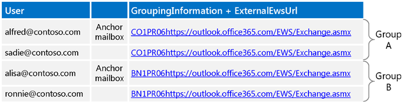
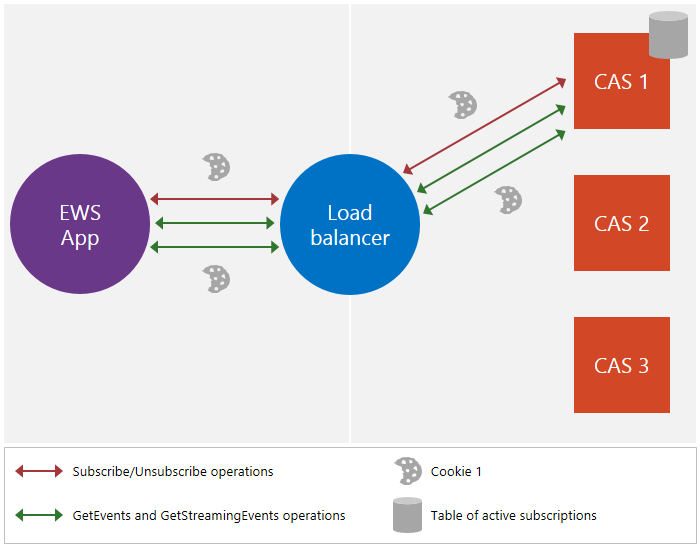
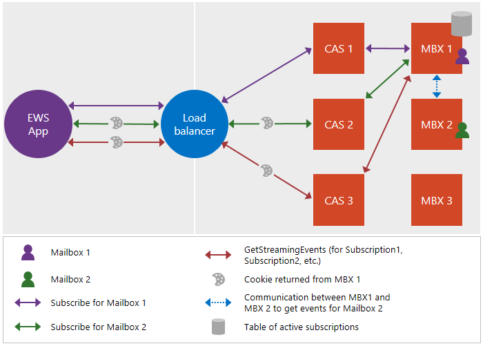

# Maintain affinity between a group of subscriptions and the Mailbox server in Exchange

Find out about maintaining the affinity between a group of subscriptions and the Mailbox server.
  
Affinity is the association of a sequence of request and response messages with a particular Mailbox server. For most functionality in Exchange, affinity is handled by the server. Notifications, however, are an exception. The client is responsible for maintaining the affinity with the Mailbox server for notification subscriptions. This affinity enables the load balancer and Client Access servers between the client and the server to route notification subscriptions and related requests to the Mailbox server that maintains the subscription. Without affinity, the request might get routed to a different Mailbox server that does not include the client's subscriptions, which can cause an [ErrorSubscriptionNotFound](https://msdn.microsoft.com/library/4b84d670-74c9-4d6d-84e7-f0a9f76f0d93%28Office.15%29.aspx) error to be returned. 
  
## How is affinity maintained?
<a name="bk_howmaintained"> </a>

Affinity in Exchange is cookie based. The client triggers the creation of the cookie by including specific headers in the subscription request, and then the subscription response contains the cookie. The client then sends that cookie in subsequent requests to ensure that the request is routed to the right Mailbox server.
  
More specifically, affinity in Exchange is handled by the following: 
  
- X-AnchorMailbox — An HTTP header that is included in the initial subscription request. It identifies the first mailbox in a group of mailboxes that share affinity with the same Mailbox server.
    
- X-PreferServerAffinity — An HTTP header that is included in the initial subscription request with the X-AnchorMailbox header and is set to true to indicate that the client is requesting that affinity be maintained with the Mailbox server.
    
- X-BackEndOverrideCookie — A cookie that is included in the initial subscription response and contains a cookie that the load balancer and Client Access server use to route subsequent requests to the same Mailbox server.
    
## How do I maintain affinity by using the EWS Managed API or EWS?
<a name="bk_howdoimaintain"> </a>

You can use the same steps to maintain affinity for multiple mailbox subscriptions and their Mailbox servers, regardless of whether you are using streaming, pull, or push notifications, and regardless of whether you're targeting an Exchange on-premises server or Exchange Online.
  
1. For each mailbox, [call Autodiscover](how-to-get-user-settings-from-exchange-by-using-autodiscover.md) and get the GroupingInformation and ExternalEwsUrl user settings. For SOAP Autodiscover, you use the [Setting](https://msdn.microsoft.com/library/43db26e1-f7be-49fd-b26b-fc1b10bd3458%28Office.15%29.aspx) element, and for POX Autodiscover, you use the [GroupingInformation](https://msdn.microsoft.com/library/2d8a007f-d79c-43c8-90e3-2c6d883f3a7c%28Office.15%29.aspx) element. 
    
2. Using the GroupingInformation and ExternalEwsUrl settings from the Autodiscover responses, place mailboxes with the same ExternalEwsUrl and GroupingInformation concatenated value in the same group. If any groups have more than 200 mailboxes, break the groups down further so that each group has no more than 200 mailboxes.
    
3. Create and use one [ExchangeService](https://msdn.microsoft.com/library/microsoft.exchange.webservices.data.exchangeservice%28v=EXCHG.80%29.aspx) object for the rest of the procedure. When you use the same **ExchangeService** object, cookies and headers (when they are set) are automatically maintained. Note that if you do not intend to group streaming subscriptions into a single connection, you are free to create a different **ExchangeService** object for each impersonated user. 
    
4. [Send a subscription](notification-subscriptions-mailbox-events-and-ews-in-exchange.md) request for the user whose user name appears first when all users in the group are sorted alphabetically (we'll refer to this user as the anchor mailbox user). Do the following: 
    
  - Include the X-AnchorMailbox header with a value set to the SMTP address of the anchor mailbox user.
    
  - Include the X-PreferServerAffinity header with a value set to true.
    
  - Use the [ApplicationImpersonation](https://technet.microsoft.com/library/dd776119%28v=exchg.150%29.aspx) role (the [ExchangeImpersonation](https://msdn.microsoft.com/library/d8cbac49-47d0-4745-a2a7-545d33f8da93%28Office.15%29.aspx) type). 
    
5. In the subscription response, get the X-BackEndOverrideCookie value. Include this value in each of the subsequent subscription requests for users in this group.
    
6. For each additional user in the group, send a subscription request and do the following:
    
  - Include the X-AnchorMailbox header with a value set to the SMTP address of the anchor mailbox user for the group.
    
  - Include the X-PreferServerAffinity header with a value set to true.
    
  - Include the X-BackEndOverrideCookie that was returned in the anchor mailbox user's subscription response.
    
  - Use the [ApplicationImpersonation](https://technet.microsoft.com/library/dd776119%28v=exchg.150%29.aspx) role (the [ExchangeImpersonation](https://msdn.microsoft.com/library/d8cbac49-47d0-4745-a2a7-545d33f8da93%28Office.15%29.aspx) type). 
    
    Note that the server uses the X-PreferServerAffinity and X-BackendOverrideCookie values together to perform the routing to the mailbox server. The X-AnchorMailbox header is also required, but is ignored by the server if the other two values are valid. If X-AnchorMailbox and X-PreferServerAffinity are in a request and X-BackendOverrideCookie is not included, the X-AnchorMailbox value is used to route the requests.
    
    Because the X-PreferServerAffinity and X-BackendOverrideCookie values perform the routing, if the anchor mailbox ever moves to another group or server, the logic does not change because the X-BackendOverrideCookie will route the request to the correct server for the group.
    
7. Send a single [GetStreamingEvents](https://msdn.microsoft.com/library/dbe83857-c4f8-4d98-813f-e03c289697a1%28Office.15%29.aspx) or [GetEvents](https://msdn.microsoft.com/library/22d4da6b-d8a8-484f-82c4-3e4b8f5431cd%28Office.15%29.aspx) requests for the group, and do the following: 
    
  - Include the [SubscriptionId](https://msdn.microsoft.com/library/3f86c178-2311-4844-82db-c2a0e469d116%28Office.15%29.aspx) values returned in each of the individual subscription responses for mailboxes in the group. 
    
  - If more than 200 subscriptions exist for the group, create multiple requests. The maximum number of [SubscriptionId](https://msdn.microsoft.com/library/3f86c178-2311-4844-82db-c2a0e469d116%28Office.15%29.aspx) values to include in a request is 200. 
    
  - If you need more connections than are available to the target mailbox, use the service account to impersonate the anchor mailbox for the group; otherwise, do not use impersonation. Ideally, you want to impersonate a unique mailbox per [GetStreamingEvents](https://msdn.microsoft.com/library/dbe83857-c4f8-4d98-813f-e03c289697a1%28Office.15%29.aspx) or [GetEvents](https://msdn.microsoft.com/library/22d4da6b-d8a8-484f-82c4-3e4b8f5431cd%28Office.15%29.aspx) request so that you never encounter throttling limits. 
    
  - Use ApplicationImpersonation if you need [more connections than are available to the target mailbox](how-to-maintain-affinity-between-group-of-subscriptions-and-mailbox-server.md#bk_throttling); otherwise, do not use ApplicationImpersonation.
    
  - Include the X-PreferServerAffinity header and set it to true. This value is automatically included if you are using the **ExchangeService** object that you created in step 2. 
    
  - Include the X-BackEndOverrideCookie for the group (the X-BackEndOverrideCookie that was returned in the anchor mailbox user's subscription response). This value is automatically included if you are using the **ExchangeService** object that you created in step 2. 
    
8. Pass the returned events to a separate thread for processing.
    
## What throttling values do I need to take into consideration?
<a name="bk_throttling"> </a>

As you plan your notification implementation, you'll want to take two values into consideration: the number of connections, and the number of subscriptions. The following table lists the default values for each [throttling](ews-throttling-in-exchange.md) setting and how the settings are used. For each value, the budget is allocated to the target mailbox. For this reason, using impersonation to gain additional connections is a required step in many scenarios. 
  
**Table 1. Default throttling values**

|**Area of consideration**|**Throttling setting**|**Default value**|**Description**|
|:-----|:-----|:-----|:-----|
|Streaming connections  <br/> |Default hanging connection limit  <br/> |10 for Exchange Online  <br/> 3 for Exchange 2013  <br/> |The maximum number of concurrent streaming connections that an account can have open on the server at one time. To work within this limit, use a service account with the ApplicationImpersonation role assigned for the target mailboxes, and impersonate the first user in each subscription ID group when getting streamed events.  <br/> |
|Pull or push connections  <br/> |EWSMaxConcurrency  <br/> |27  <br/> |The maximum number of concurrent pull or push connections (requests that have been received but not yet responded to) that an account can have open on the server at one time.  <br/> |
|Subscriptions  <br/> |EWSMaxSubscriptions  <br/> |20 for Exchange Online  <br/> 5000 for Exchange 2013  <br/> |The maximum number of nonexpired subscriptions that an account can have at one time. This value is decremented when the subscription is created on the server.  <br/> |
   
The following example shows how budgets are handled between any target mailbox and the service account that has the [ApplicationImpersonation](https://technet.microsoft.com/library/dd776119%28v=exchg.150%29.aspx) role assigned for the target mailboxes. 
  
- ServiceAccount1 (sa1) impersonates many users (m1, m2, m3, and so on) and creates subscriptions for each mailbox. Note that when the subscriptions are created, the subscription owner is sa1, so when sa1 opens a connection with the subscriptions, EWS enforces that the subscriptions are owned by sa1.
    
- Sa1 can open the connection in the following ways:
    
1. Without impersonation, so the connection is charged against sa1.
    
2. By impersonating any of the users — m1 for example — so that the connection is charged against a copy of m1's budget. (M1 itself can open ten connections by using Exchange Online, and all service accounts impersonating m1 can open ten connections by using the copied budget.)
    
- If the connection limit is hit, the following workarounds are available:
    
  - If option 1 is used, the administrator can create multiple service accounts to impersonate additional users.
    
  - If option 2 is used, the code can impersonate another user — m2 for example.
    
## Example: Maintaining affinity between a group of subscriptions and the Mailbox server
<a name="bk_ce"> </a>

Okay, let's see it in action. The following code example shows you how to group users and use the X-AnchorMailbox and X-PreferServerAffinity headers and the X-BackendOverrideCookie cookie to maintain affinity with the Mailbox server. Because the headers and the cookie are of primary importance in the affinity story, this example focuses on the EWS XML requests and responses. To use the EWS Managed API to create the body of the subscription requests and responses, see [Stream notifications about mailbox events by using EWS in Exchange](how-to-stream-notifications-about-mailbox-events-by-using-ews-in-exchange.md) and [Pull notifications about mailbox events by using EWS in Exchange](how-to-pull-notifications-about-mailbox-events-by-using-ews-in-exchange.md). This section includes additional steps particular to maintaining affinity and adding the headers to your requests.
  
This example has four users: alfred@contoso.com, alisa@contoso.com, ronnie@contoso.com, and sadie@contoso.com. The following figure shows the GroupingInformation and ExternalEwsUrl [Autodiscover settings](how-to-get-user-settings-from-exchange-by-using-autodiscover.md) for the users. 
  
**Figure 1. Autodiscover settings used to group mailboxes**


  
Using the settings from the Autodiscover responses, the mailboxes are grouped by the concatenated value of the GroupingInformation and ExternalEwsUrl settings. In this example, Alfred and Sadie have the same values, so they are in one group, and Alisa and Ronnie share the same values, so they are in another group.
  
**Figure 2. Creating mailbox groups**


  
For the purpose of this example, we'll focus on Group A. We would use the same steps for group B, but use a different X-AnchorMailbox value for that group.
  
Using [ApplicationImpersonation](https://technet.microsoft.com/library/dd776119%28v=exchg.150%29.aspx), create the subscription request for the anchor mailbox (alfred@contoso.com), with the X-AnchorMailbox header set to the their email address and an X-PreferServerAffinity header value of true. Setting these two header values will trigger the server to create an X-BackEndOverrideCookie for the response.
  
If you're using the EWS Managed API, use the [HttpHeaders](https://msdn.microsoft.com/library/microsoft.exchange.webservices.data.exchangeservice_members%28v=exchg.80%29.aspx)[Add](https://msdn.microsoft.com/library/cy7xta5e) method to add the two headers to your subscription request, as shown. 
  
```cs
service.HttpHeaders.Add("X-AnchorMailbox", Mailbox.SMTPAddress);
service.HttpHeaders.Add("X-PreferServerAffinity", "true");
```

So Alfred's subscription request looks like this.
  
```XML
POST https://outlook.office365.com/EWS/Exchange.asmx HTTP/1.1
Content-Type: text/xml; charset=utf-8
Accept: text/xml
User-Agent: ExchangeServicesClient/15.00.0516.014
X-AnchorMailbox: alfred@contoso.com
X-PreferServerAffinity: true
Host: outlook.office365.com
<?xml version="1.0" encoding="utf-8"?>
<soap:Envelope xmlns:xsi="http://www.w3.org/2001/XMLSchema-instance" xmlns:m="https://schemas.microsoft.com/exchange/services/2006/messages" xmlns:t="https://schemas.microsoft.com/exchange/services/2006/types" xmlns:soap="https://schemas.xmlsoap.org/soap/envelope/">
  <soap:Header>
    <t:RequestServerVersion Version="Exchange2013" />
    <t:ExchangeImpersonation>
      <t:ConnectingSID>
        <t:SmtpAddress>alfred@contoso.com</t:SmtpAddress>
      </t:ConnectingSID>
    </t:ExchangeImpersonation>
  </soap:Header>
  <soap:Body>
    <m:Subscribe>
      <m:StreamingSubscriptionRequest>
        <t:FolderIds>
          <t:DistinguishedFolderId Id="inbox" />
        </t:FolderIds>
        <t:EventTypes>
          <t:EventType>NewMailEvent</t:EventType>
        </t:EventTypes>
      </m:StreamingSubscriptionRequest>
    </m:Subscribe>
  </soap:Body>
</soap:Envelope>
```

The following XML message is the response to Alfred's subscription request, and it includes the X-BackEndOverrideCookie. Resend this cookie for all subsequent requests for users in this group. Notice that the response also contains additional cookies, such as the exchangecookie cookie used by Exchange 2010. Exchange Online, Exchange Online as part of Office 365, and versions of Exchange starting with Exchange 2013, ignore exchangecookie if it is included in subsequent subscription requests.
  
```XML
HTTP/1.1 200 OK
Content-Type: text/xml; charset=utf-8
Set-Cookie: exchangecookie=ddb8c383aef34c7694132aa679744feb; expires=Thu, 25-Sep-2014 18:42:45 GMT; path=/;
    HttpOnly
Set-Cookie: X-BackEndOverrideCookie=CO1PR06MB222.namprd06.prod.outlook.com~1941996295; path=/; secure; HttpOnly
Set-Cookie: X-BackEndCookie=alfred@contoso.com=Ox8XKzcXLxg==; 
    expires=Wed, 25-Sep-2013 18:52:49 GMT; path=/EWS; secure; HttpOnly
<?xml version="1.0" encoding="utf-8"?>
<s:Envelope xmlns:s="https://schemas.xmlsoap.org/soap/envelope/">
  <s:Header>
    <h:ServerVersionInfo MajorVersion="15"
                         MinorVersion="0"
                         MajorBuildNumber="775"
                         MinorBuildNumber="7"
                         Version="V2_4"
                         xmlns:h="https://schemas.microsoft.com/exchange/services/2006/types"
                         xmlns="https://schemas.microsoft.com/exchange/services/2006/types"
                         xmlns:xsd="http://www.w3.org/2001/XMLSchema"
                         xmlns:xsi="http://www.w3.org/2001/XMLSchema-instance"/>
  </s:Header>
  <s:Body xmlns:xsi="http://www.w3.org/2001/XMLSchema-instance"
          xmlns:xsd="http://www.w3.org/2001/XMLSchema">
    <m:SubscribeResponse xmlns:m="https://schemas.microsoft.com/exchange/services/2006/messages"
                         xmlns:t="https://schemas.microsoft.com/exchange/services/2006/types">
      <m:ResponseMessages>
        <m:SubscribeResponseMessage ResponseClass="Success">
          <m:ResponseCode>NoError</m:ResponseCode>
          <m:SubscriptionId>JgBjbzFwcjA2bWIyMjIubmFtcHJkMDYucHJvZC5vdXRsb29rLmNvbRAAAAAUeGk+7JFdSaFM8/NI/gQQpVdgZX6H0Ag=</m:SubscriptionId>
        </m:SubscribeResponseMessage>
      </m:ResponseMessages>
    </m:SubscribeResponse>
  </s:Body>
</s:Envelope>
```

Using the X-BackEndOverrideCookie from Alfred's response and the X-AnchorMailbox header, the subscription request is created for Sadie, the other member of Group A. Sadie's subscription request looks like this.
  
```XML
POST https://outlook.office365.com/EWS/Exchange.asmx HTTP/1.1
Content-Type: text/xml; charset=utf-8
Accept: text/xml
User-Agent: ExchangeServicesClient/15.00.0516.014
X-AnchorMailbox: alfred@contoso.com
X-PreferServerAffinity: true
Host: outlook.office365.com
Cookie: X-BackEndOverrideCookie=CO1PR06MB222.namprd06.prod.outlook.com~1941996295
<?xml version="1.0" encoding="utf-8"?>
<soap:Envelope xmlns:xsi="http://www.w3.org/2001/XMLSchema-instance" xmlns:m="https://schemas.microsoft.com/exchange/services/2006/messages" xmlns:t="https://schemas.microsoft.com/exchange/services/2006/types" xmlns:soap="https://schemas.xmlsoap.org/soap/envelope/">
  <soap:Header>
    <t:RequestServerVersion Version="Exchange2013" />
    <t:ExchangeImpersonation>
      <t:ConnectingSID>
        <t:SmtpAddress>sadie@contoso.com </t:SmtpAddress>
      </t:ConnectingSID>
    </t:ExchangeImpersonation>
  </soap:Header>
  <soap:Body>
    <m:Subscribe>
      <m:StreamingSubscriptionRequest>
        <t:FolderIds>
          <t:DistinguishedFolderId Id="inbox" />
        </t:FolderIds>
        <t:EventTypes>
          <t:EventType>NewMailEvent</t:EventType>
        </t:EventTypes>
      </m:StreamingSubscriptionRequest>
    </m:Subscribe>
  </soap:Body>
</soap:Envelope>

```

Sadie's subscription response looks like this. Note that it does not include the X-BackEndOverrideCookie. The client is responsible for caching that value for future requests.
  
```XML
HTTP/1.1 200 OK
Content-Type: text/xml; charset=utf-8
Set-Cookie: exchangecookie=640ea858f69d47ff8cce8b44c337f6d9; path=/
Set-Cookie: X-BackEndCookie=alfred@contoso.com=Ox8XKzcXLxg==; 
   expires= Wed, 25-Sep-2013 18:53:06 GMT; path=/EWS; secure; HttpOnly
<?xml version="1.0" encoding="utf-8"?>
<s:Envelope xmlns:s="https://schemas.xmlsoap.org/soap/envelope/">
  <s:Header>
    <h:ServerVersionInfo MajorVersion="15"
                         MinorVersion="0"
                         MajorBuildNumber="775"
                         MinorBuildNumber="7"
                         Version="V2_4"
                         xmlns:h="https://schemas.microsoft.com/exchange/services/2006/types"
                         xmlns="https://schemas.microsoft.com/exchange/services/2006/types"
                         xmlns:xsd="http://www.w3.org/2001/XMLSchema"
                         xmlns:xsi="http://www.w3.org/2001/XMLSchema-instance"/>
  </s:Header>
  <s:Body xmlns:xsi="http://www.w3.org/2001/XMLSchema-instance"
          xmlns:xsd="http://www.w3.org/2001/XMLSchema">
    <m:SubscribeResponse xmlns:m="https://schemas.microsoft.com/exchange/services/2006/messages"
                         xmlns:t="https://schemas.microsoft.com/exchange/services/2006/types">
      <m:ResponseMessages>
        <m:SubscribeResponseMessage ResponseClass="Success">
          <m:ResponseCode>NoError</m:ResponseCode>
          <m:SubscriptionId>JgBjbzFwcjA2bWIyMjIubmFtcHJkMDYucHJvZC5vdXRsb29rLmNvbRAAAAB4EQOy2pfrQJfM3hzs/nZJIZssan6H0Ag=</m:SubscriptionId>
        </m:SubscribeResponseMessage>
      </m:ResponseMessages>
    </m:SubscribeResponse>
  </s:Body>
</s:Envelope>
```

Using the [SubscriptionId](https://msdn.microsoft.com/library/3f86c178-2311-4844-82db-c2a0e469d116%28Office.15%29.aspx) values from the subscription responses, a [GetStreamingEvents](https://msdn.microsoft.com/library/dbe83857-c4f8-4d98-813f-e03c289697a1%28Office.15%29.aspx) operation request was created for all the subscriptions in the group. Because there are less than 200 subscriptions in this group, they are all sent in one request. The X-PreferServerAffinity header is set to true and the X-BackEndOverrideCookie is included. 
  
```XML
POST https://outlook.office365.com/EWS/Exchange.asmx HTTP/1.1
Content-Type: text/xml; charset=utf-8
Accept: text/xml
User-Agent: ExchangeServicesClient/15.00.0516.014
X-AnchorMailbox: alfred@contoso.com
X-PreferServerAffinity: true
Host: outlook.office365.com
Cookie: X-BackEndOverrideCookie=CO1PR06MB222.namprd06.prod.outlook.com~1941996295
<?xml version="1.0" encoding="utf-8"?>
<soap:Envelope xmlns:xsi="http://www.w3.org/2001/XMLSchema-instance" xmlns:m="https://schemas.microsoft.com/exchange/services/2006/messages" xmlns:t="https://schemas.microsoft.com/exchange/services/2006/types" xmlns:soap="https://schemas.xmlsoap.org/soap/envelope/">
  <soap:Header>
    <t:RequestServerVersion Version="Exchange2013" />
    <t:ExchangeImpersonation>
      <t:ConnectingSID>
        <t:SmtpAddress>sadie@contoso.com</t:SmtpAddress>
      </t:ConnectingSID>
    </t:ExchangeImpersonation>
  </soap:Header>
  <soap:Body>
    <m:GetStreamingEvents>
      <m:SubscriptionIds>
        <t:SubscriptionId>JgBjbzFwcjA2bWIyMjIubmFtcHJkMDYucHJvZC5vdXRsb29rLmNvbRAAAAB4EQOy2pfrQJfM3hzs/nZJIZssan6H0Ag=</t:SubscriptionId>
        <t:SubscriptionId>JgBjbzFwcjA2bWIyMjIubmFtcHJkMDYucHJvZC5vdXRsb29rLmNvbRAAAAAUeGk+7JFdSaFM8/NI/gQQpVdgZX6H0Ag=</t:SubscriptionId>
      </m:SubscriptionIds>
      <m:ConnectionTimeout>10</m:ConnectionTimeout>
    </m:GetStreamingEvents>
  </soap:Body>
</soap:Envelope>
```

The returned events are then passed to a separate thread for processing.
  
## How has affinity changed?
<a name="bk_howchanged"> </a>

In Exchange 2010, subscriptions are maintained on the Client Access server, as shown in Figure 3. In versions of Exchange later than Exchange 2010, subscriptions are maintained on the Mailbox server, as shown in Figure 4.
  
**Figure 3. Process for maintaining affinity in Exchange 2010**


  
**Figure 4. Process for maintaining affinity in Exchange Online and Exchange 2013**


  
In Exchange 2010, the client only knows the address of the load balancer, and the exchangecookie that is returned by the server ensures that the request is routed to the right Client Access server. However, in later versions, the load balancer and the Client Access server roles both have to route the requests appropriately before they get to the Mailbox server. To do that, additional information is required, which is why the new headers and cookie were introduced. The article [Notification subscriptions, mailbox events, and EWS in Exchange](notification-subscriptions-mailbox-events-and-ews-in-exchange.md) explains how subscriptions are maintained in Exchange 2013. 
  
You might notice that the exchangecookie that Exchange 2010 uses is still returned by later versions. There's no harm in including this cookie in requests, but later versions of Exchange ignore it.
  
## See also

- [Notification subscriptions, mailbox events, and EWS in Exchange](notification-subscriptions-mailbox-events-and-ews-in-exchange.md)
- [Stream notifications about mailbox events by using EWS in Exchange](how-to-stream-notifications-about-mailbox-events-by-using-ews-in-exchange.md)
- [Pull notifications about mailbox events by using EWS in Exchange](how-to-pull-notifications-about-mailbox-events-by-using-ews-in-exchange.md)
- [Handling notification-related errors in EWS in Exchange](handling-notification-related-errors-in-ews-in-exchange.md)
- [Changes in Managing Affinity for EWS Subscriptions…](https://blogs.msdn.com/b/mstehle/archive/2013/04/17/changes-in-managing-affinity-for-ews-subscriptions.aspx)
- [EWS throttling in Exchange](ews-throttling-in-exchange.md)
    

