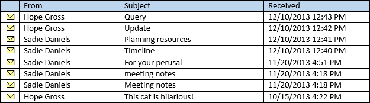
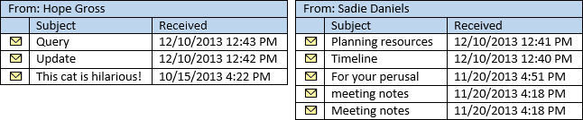
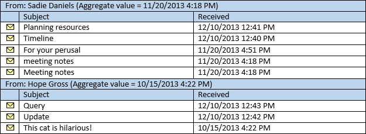

# Perform grouped searches by using EWS in Exchange

Find out how to perform grouped searches in your EWS Managed API or EWS application that targets Exchange.
  
Grouped searches are useful in that they gives you control over how search results are organized. Organized search results can make it easier for your application to process results or display them to an end user in a manageable way.
  
Grouping works by putting all items within the result set that have the same value of a specific field into a group. For example, you can group your results by the sender, and all items from the same person will be in a separate group, and the items within each group will be sorted according to the order you specify on the view. The groups themselves are sorted by an aggregate value based on a field you choose.
  
**Table 1. EWS Managed API methods and EWS operations for organizing search results**

|**If you want to…**|**In the EWS Managed API, use…**|**In EWS, use…**|
|:-----|:-----|:-----|
|Organize items with the same value in a specific property in your results into groups  <br/> |[Grouping.GroupOn](https://msdn.microsoft.com/library/microsoft.exchange.webservices.data.grouping.groupon%28v=exchg.80%29.aspx) <br/> |[FieldURI](https://msdn.microsoft.com/library/24af8e3b-3074-4c8c-8d0a-52446508d044%28Office.15%29.aspx) element as a child of the [GroupBy](https://msdn.microsoft.com/library/9728619b-4674-4b9d-9f6c-e75c6165966c%28Office.15%29.aspx) element  <br/> |
|Sort items within each group by the value in a specific property  <br/> |[ItemView.OrderBy](https://msdn.microsoft.com/library/microsoft.exchange.webservices.data.itemview.orderby%28v=exchg.80%29.aspx) <br/> |[SortOrder](https://msdn.microsoft.com/library/c2413f0b-8c03-46ae-9990-13338b3c53a6%28Office.15%29.aspx) element  <br/> |
|Sort the groups  <br/> |[Grouping.AggregateOn](https://msdn.microsoft.com/library/microsoft.exchange.webservices.data.grouping.aggregateon%28v=exchg.80%29.aspx) <br/><br/> [Grouping.AggregateType](https://msdn.microsoft.com/library/microsoft.exchange.webservices.data.grouping.aggregatetype%28v=exchg.80%29.aspx) <br/><br/> [Grouping.SortDirection](https://msdn.microsoft.com/library/microsoft.exchange.webservices.data.grouping.sortdirection%28v=exchg.80%29.aspx) <br/> |**FieldURI** element as a child of the [AggregateOn](https://msdn.microsoft.com/library/9b0a03f2-3282-46e1-b1a0-cbb9a0fbe9bb%28Office.15%29.aspx) element<br/><br/> **Aggregate** attribute on the **AggregateOn** element<br/><br/>**Order** attribute on the **GroupBy** element  <br/> |
   
Let's take it step by step.
  
## Group results by a specific property
<a name="bk_GroupResults"> </a>

The first step to using grouping is to select a property, or attribute on the items in the Exchange store, to group by. The EWS Managed API exposes these as class properties on the corresponding classes, while EWS exposes them as XML elements. You can choose any property, including custom or extended properties, but it is helpful to understand how items are grouped based on the value of the property you choose. 

All items that have the same value in the property you choose to group by will be grouped together. This might seem obvious, but it is an important detail. Consider what happens if you group by a date/time property, such as [Item.DateTimeReceived](https://msdn.microsoft.com/library/microsoft.exchange.webservices.data.item.datetimereceived%28v=exchg.80%29.aspx) in the EWS Managed API, or the [DateTimeReceived](https://msdn.microsoft.com/library/8f489bd4-2434-4d0a-91fe-1b5ba7eb5765%28Office.15%29.aspx) element in EWS. The intent might be to organize the results into groups, with each group containing items from the same day. However, grouping looks at the entire value, which includes the time. 

The end result is that the items will be grouped so that items received at the same time, down to the second, are in their own groups. The results will most likely be sorted into a large number of groups with a small number of items in each group. 
  
To get a results set with a smaller number of groups and a larger number of items in each group, choose a property that is likely to have a smaller number of values, such as [EmailMessage.From](https://msdn.microsoft.com/library/microsoft.exchange.webservices.data.emailmessage.from%28v=exchg.80%29.aspx) or [Item.Categories](https://msdn.microsoft.com/library/microsoft.exchange.webservices.data.item.categories%28v=exchg.80%29.aspx) in the EWS Managed API, or [From](https://msdn.microsoft.com/library/5a52d644-3677-4049-874c-12bd5c3080dc%28Office.15%29.aspx) or [Categories](https://msdn.microsoft.com/library/d84d4927-b524-4e62-bf3d-1f12fec8c21a%28Office.15%29.aspx) in EWS. The following figure shows a list of emails that appear in an Inbox. 
  
**Figure 1. Messages in an Inbox**


  
If you group the items in Figure 1 by the **EmailMessage.From** property, the result will be two groups, one for messages sent by Hope Gross, and one for messages sent by Sadie Daniels. 
  
**Figure 2. Messages separated into groups based on the From property**


  
## Sort the items within groups
<a name="bk_SortItems"> </a>

You can control how items are sorted within each group by using the [ItemView.OrderBy](https://msdn.microsoft.com/library/microsoft.exchange.webservices.data.itemview.orderby%28v=exchg.80%29.aspx) property in the EWS Managed API, or the [SortOrder](https://msdn.microsoft.com/library/c2413f0b-8c03-46ae-9990-13338b3c53a6%28Office.15%29.aspx) element in EWS. The same ordering applies to each group. For example, if you sort the items from Figure 1 by the **Item.DateTimeReceived** property, in descending order, the item most recently received from Hope Gross will be first in the Hope Gross group, and the item most recently received from Sadie Daniels will be first in the Sadie Daniels group. Conveniently, the groups in Figure 2 are already sorted this way. 
  
## Sort the groups
<a name="bk_SortGroups"> </a>

Now that you have your groups settled, the final step is sorting the groups themselves. Because the groups themselves have no specific values, the grouping process has to assign a sort value to each group. This is done by aggregation of the values of a specific property within each group, specified by the [Grouping.AggregateOn](https://msdn.microsoft.com/library/microsoft.exchange.webservices.data.grouping.aggregateon%28v=exchg.80%29.aspx) property in the EWS Managed API, or the [FieldURI](https://msdn.microsoft.com/library/24af8e3b-3074-4c8c-8d0a-52446508d044%28Office.15%29.aspx) element as a child of the [AggregateOn](https://msdn.microsoft.com/library/9b0a03f2-3282-46e1-b1a0-cbb9a0fbe9bb%28Office.15%29.aspx) element in EWS. The [Grouping.AggregateType](https://msdn.microsoft.com/library/microsoft.exchange.webservices.data.grouping.aggregatetype%28v=exchg.80%29.aspx) property in the EWS Managed API (or the **Aggregate** attribute on the **AggregateOn** element in EWS) specifies which value from the items within each group is assigned to the sort value for the group — either the largest value or the smallest value. Finally, the sort order (descending or ascending) is specified by the [Grouping.SortDirection](https://msdn.microsoft.com/library/microsoft.exchange.webservices.data.grouping.sortdirection%28v=exchg.80%29.aspx) property in the EWS Managed API, or the **Order** attribute on the [GroupBy](https://msdn.microsoft.com/library/9728619b-4674-4b9d-9f6c-e75c6165966c%28Office.15%29.aspx) element in EWS. 
  
For example, if the groups from Figure 2 are sorted by aggregating on the **Item.DateTimeReceived** property, using the smallest value, and sorting in descending order, the items are returned in the order in shown Figure 3. 
  
**Figure 3. Grouped search results with the groups sorted by the DateTimeReceived property**


  
The next sections show you how you might pull grouping and sorting together in code.
  
## Example: Perform a grouped search by using the EWS Managed API
<a name="bk_GroupSearchEWSMA"> </a>

The following EWS Managed API methods can use grouping:
  
- [ExchangeService.FindItems](https://msdn.microsoft.com/library/microsoft.exchange.webservices.data.exchangeservice.finditems%28v=exchg.80%29.aspx)
    
- [Folder.FindItems](https://msdn.microsoft.com/library/microsoft.exchange.webservices.data.folder.finditems%28v=exchg.80%29.aspx)
    
The following example uses the **ExchangeService.FindItems** method; however, the same rules and concepts apply to the **Folder.FindItems** method. In this example, a method called **GroupItemsByFrom** is defined. It takes an [ExchangeService](https://msdn.microsoft.com/library/microsoft.exchange.webservices.data.exchangeservice%28v=exchg.80%29.aspx) object and a [WellKnownFolderName](https://msdn.microsoft.com/library/microsoft.exchange.webservices.data.wellknownfoldername%28v=exchg.80%29.aspx) object as parameters. It requests the first 50 items in the folder, grouped by the **EmailMessage.From** property, sorted by the **Item.DateTimeReceived** property in descending order. The groups themselves are sorted by the smallest **Item.DateTimeReceived** property value on their items, in descending order. 
  
This example assumes that the **ExchangeService** object has been initialized with valid values in the [Credentials](https://msdn.microsoft.com/library/microsoft.exchange.webservices.data.exchangeservicebase.credentials%28v=exchg.80%29.aspx) and [Url](https://msdn.microsoft.com/library/microsoft.exchange.webservices.data.exchangeservice.url%28v=exchg.80%29.aspx) properties. 
  
```cs
static void GroupItemsByFrom(ExchangeService service, WellKnownFolderName folder)
{
    // Limit the result set to 50 items.
    ItemView view = new ItemView(50);
    view.PropertySet = new PropertySet(ItemSchema.Subject,
                                       ItemSchema.DateTimeReceived,
                                       EmailMessageSchema.From,
                                       ItemSchema.Categories);
    // Item searches do not support Deep traversal.
    view.Traversal = ItemTraversal.Shallow;
    // Specify the sorting done within the groups.
    view.OrderBy.Add(ItemSchema.DateTimeReceived, SortDirection.Descending);
    // Configure grouping.
    Grouping groupByFrom = new Grouping();
    groupByFrom.GroupOn = EmailMessageSchema.From;
    groupByFrom.AggregateOn = ItemSchema.DateTimeReceived;
    groupByFrom.AggregateType = AggregateType.Minimum;
    groupByFrom.SortDirection = SortDirection.Descending;
    try
    {
        GroupedFindItemsResults<Item> results = service.FindItems(folder,
            view, groupByFrom);
        foreach (ItemGroup<Item> group in results.ItemGroups)
        {
            Console.WriteLine("Group: {0}", group.GroupIndex);
            foreach (Item item in group.Items)
            {
                if (item is EmailMessage)
                {
                    EmailMessage message = item as EmailMessage;
                    Console.WriteLine("From: {0}", message.From);
                    Console.WriteLine("Subject: {0}", message.Subject);
                    Console.WriteLine("Id: {0}\n", message.Id.ToString());
                }
            }
        }
    }
    catch (Exception ex)
    {
        Console.WriteLine("Exception while enumerating results: {0}", ex.Message);
    }
}
```

## Example: Perform a grouped search by using EWS
<a name="bk_GroupSearchEWS"> </a>

The following request example shows a [FindItem operation](https://msdn.microsoft.com/library/ebad6aae-16e7-44de-ae63-a95b24539729%28Office.15%29.aspx) request for the first 50 items in the folder, grouped by the **From** element, sorted by the **DateTimeReceived** element in descending order. The groups themselves are sorted by the smallest **DateTimeReceived** element value on their items, in descending order. 
  
```XML
<?xml version="1.0" encoding="utf-8"?>
<soap:Envelope xmlns:xsi="http://www.w3.org/2001/XMLSchema-instance" 
    xmlns:m="https://schemas.microsoft.com/exchange/services/2006/messages" 
    xmlns:t="https://schemas.microsoft.com/exchange/services/2006/types" 
    xmlns:soap="https://schemas.xmlsoap.org/soap/envelope/">
  <soap:Header>
    <t:RequestServerVersion Version="Exchange2007_SP1" />
    <t:TimeZoneContext>
      <t:TimeZoneDefinition Id="Eastern Standard Time" />
    </t:TimeZoneContext>
  </soap:Header>
  <soap:Body>
    <m:FindItem Traversal="Shallow">
      <m:ItemShape>
        <t:BaseShape>IdOnly</t:BaseShape>
        <t:AdditionalProperties>
          <t:FieldURI FieldURI="item:Subject" />
          <t:FieldURI FieldURI="item:DateTimeReceived" />
          <t:FieldURI FieldURI="message:From" />
          <t:FieldURI FieldURI="item:Categories" />
        </t:AdditionalProperties>
      </m:ItemShape>
      <m:IndexedPageItemView MaxEntriesReturned="50" Offset="0" BasePoint="Beginning" />
      <m:GroupBy Order="Descending">
        <t:FieldURI FieldURI="message:From" />
        <t:AggregateOn Aggregate="Minimum">
          <t:FieldURI FieldURI="item:DateTimeReceived" />
        </t:AggregateOn>
      </m:GroupBy>
      <m:SortOrder>
        <t:FieldOrder Order="Descending">
          <t:FieldURI FieldURI="item:DateTimeReceived" />
        </t:FieldOrder>
      </m:SortOrder>
      <m:ParentFolderIds>
        <t:DistinguishedFolderId Id="inbox" />
      </m:ParentFolderIds>
    </m:FindItem>
  </soap:Body>
</soap:Envelope>
```

The server returns the following response.
  
```XML
<?xml version="1.0" encoding="utf-8"?>
<s:Envelope xmlns:s="https://schemas.xmlsoap.org/soap/envelope/">
  <s:Header>
    <h:ServerVersionInfo MajorVersion="15" MinorVersion="0" MajorBuildNumber="712" MinorBuildNumber="22" Version="V2_3" 
        xmlns:h="https://schemas.microsoft.com/exchange/services/2006/types" 
        xmlns="https://schemas.microsoft.com/exchange/services/2006/types" 
        xmlns:xsd="http://www.w3.org/2001/XMLSchema" 
        xmlns:xsi="http://www.w3.org/2001/XMLSchema-instance" />
  </s:Header>
  <s:Body xmlns:xsi="http://www.w3.org/2001/XMLSchema-instance" xmlns:xsd="http://www.w3.org/2001/XMLSchema">
    <m:FindItemResponse xmlns:m="https://schemas.microsoft.com/exchange/services/2006/messages" 
      xmlns:t="https://schemas.microsoft.com/exchange/services/2006/types">
      <m:ResponseMessages>
        <m:FindItemResponseMessage ResponseClass="Success">
          <m:ResponseCode>NoError</m:ResponseCode>
          <m:RootFolder IndexedPagingOffset="10" TotalItemsInView="8" IncludesLastItemInRange="true">
            <t:Groups>
              <t:GroupedItems>
                <t:GroupIndex>0</t:GroupIndex>
                <t:Items>
                  <t:Message>
                    <t:ItemId Id="AAMkAGM2..." ChangeKey="CQAAABYA..." />
                    <t:Subject>Planning resources</t:Subject>
                    <t:DateTimeReceived>2013-12-10T17:41:05Z</t:DateTimeReceived>
                    <t:From>
                      <t:Mailbox>
                        <t:Name>Sadie Daniels</t:Name>
                        <t:EmailAddress>/O=FIRST ORGANIZATION/OU=EXCHANGE ADMINISTRATIVE GROUP (FYDIBOHF23SPDLT)/CN=RECIPIENTS/CN=8D84A3F4CBB34D48838A3AECF99795C0-SADIE</t:EmailAddress>
                        <t:RoutingType>EX</t:RoutingType>
                      </t:Mailbox>
                    </t:From>
                  </t:Message>
                  <t:Message>
                    <t:ItemId Id="AAMkAGM2..." ChangeKey="CQAAABYA..." />
                    <t:Subject>Timeline</t:Subject>
                    <t:DateTimeReceived>2013-12-10T17:40:37Z</t:DateTimeReceived>
                    <t:Categories>
                      <t:String>Project</t:String>
                    </t:Categories>
                    <t:From>
                      <t:Mailbox>
                        <t:Name>Sadie Daniels</t:Name>
                        <t:EmailAddress>/O=FIRST ORGANIZATION/OU=EXCHANGE ADMINISTRATIVE GROUP (FYDIBOHF23SPDLT)/CN=RECIPIENTS/CN=8D84A3F4CBB34D48838A3AECF99795C0-SADIE</t:EmailAddress>
                        <t:RoutingType>EX</t:RoutingType>
                      </t:Mailbox>
                    </t:From>
                  </t:Message>
                  <t:Message>
                    <t:ItemId Id="AAMkAGM2..." ChangeKey="CQAAABYA..." />
                    <t:Subject>For your perusal</t:Subject>
                    <t:DateTimeReceived>2013-11-20T21:51:16Z</t:DateTimeReceived>
                    <t:From>
                      <t:Mailbox>
                        <t:Name>Sadie Daniels</t:Name>
                        <t:EmailAddress>/O=FIRST ORGANIZATION/OU=EXCHANGE ADMINISTRATIVE GROUP (FYDIBOHF23SPDLT)/CN=RECIPIENTS/CN=8D84A3F4CBB34D48838A3AECF99795C0-SADIE</t:EmailAddress>
                        <t:RoutingType>EX</t:RoutingType>
                      </t:Mailbox>
                    </t:From>
                  </t:Message>
                  <t:Message>
                    <t:ItemId Id="AAMkAGM2..." ChangeKey="CQAAABYA..." />
                    <t:Subject>meeting notes</t:Subject>
                    <t:DateTimeReceived>2013-11-20T21:18:51Z</t:DateTimeReceived>
                    <t:Categories>
                      <t:String>Blue category</t:String>
                    </t:Categories>
                    <t:From>
                      <t:Mailbox>
                        <t:Name>Sadie Daniels</t:Name>
                        <t:EmailAddress>/O=FIRST ORGANIZATION/OU=EXCHANGE ADMINISTRATIVE GROUP (FYDIBOHF23SPDLT)/CN=RECIPIENTS/CN=8D84A3F4CBB34D48838A3AECF99795C0-SADIE</t:EmailAddress>
                        <t:RoutingType>EX</t:RoutingType>
                      </t:Mailbox>
                    </t:From>
                  </t:Message>
                  <t:Message>
                    <t:ItemId Id="AAMkAGM2..." ChangeKey="CQAAABYA..." />
                    <t:Subject>Meeting notes</t:Subject>
                    <t:DateTimeReceived>2013-11-20T21:18:51Z</t:DateTimeReceived>
                    <t:From>
                      <t:Mailbox>
                        <t:Name>Sadie Daniels</t:Name>
                        <t:EmailAddress>/O=FIRST ORGANIZATION/OU=EXCHANGE ADMINISTRATIVE GROUP (FYDIBOHF23SPDLT)/CN=RECIPIENTS/CN=8D84A3F4CBB34D48838A3AECF99795C0-SADIE</t:EmailAddress>
                        <t:RoutingType>EX</t:RoutingType>
                      </t:Mailbox>
                    </t:From>
                  </t:Message>
                </t:Items>
              </t:GroupedItems>
              <t:GroupedItems>
                <t:GroupIndex>1</t:GroupIndex>
                <t:Items>
                  <t:Message>
                    <t:ItemId Id="AAMkAGM2..." ChangeKey="CQAAABYA..." />
                    <t:Subject>Query</t:Subject>
                    <t:DateTimeReceived>2013-12-10T17:43:15Z</t:DateTimeReceived>
                    <t:From>
                      <t:Mailbox>
                        <t:Name>Hope Gross</t:Name>
                        <t:EmailAddress>/O=FIRST ORGANIZATION/OU=EXCHANGE ADMINISTRATIVE GROUP (FYDIBOHF23SPDLT)/CN=RECIPIENTS/CN=9B55E4100C064D9D8C5F72FF36802ED3-HOPE</t:EmailAddress>
                        <t:RoutingType>EX</t:RoutingType>
                      </t:Mailbox>
                    </t:From>
                  </t:Message>
                  <t:Message>
                    <t:ItemId Id="AAMkAGM2..." ChangeKey="CQAAABYA..." />
                    <t:Subject>Update</t:Subject>
                    <t:DateTimeReceived>2013-12-10T17:42:33Z</t:DateTimeReceived>
                    <t:Categories>
                      <t:String>Project</t:String>
                      <t:String>Blue category</t:String>
                    </t:Categories>
                    <t:From>
                      <t:Mailbox>
                        <t:Name>Hope Gross</t:Name>
                        <t:EmailAddress>/O=FIRST ORGANIZATION/OU=EXCHANGE ADMINISTRATIVE GROUP (FYDIBOHF23SPDLT)/CN=RECIPIENTS/CN=9B55E4100C064D9D8C5F72FF36802ED3-HOPE</t:EmailAddress>
                        <t:RoutingType>EX</t:RoutingType>
                      </t:Mailbox>
                    </t:From>
                  </t:Message>
                  <t:Message>
                    <t:ItemId Id="AAMkAGM2..." ChangeKey="CQAAABYA..." />
                    <t:Subject>This cat is hilarious!</t:Subject>
                    <t:DateTimeReceived>2013-10-15T20:22:12Z</t:DateTimeReceived>
                    <t:From>
                      <t:Mailbox>
                        <t:Name>Hope Gross</t:Name>
                        <t:EmailAddress>/O=FIRST ORGANIZATION/OU=EXCHANGE ADMINISTRATIVE GROUP (FYDIBOHF23SPDLT)/CN=RECIPIENTS/CN=9B55E4100C064D9D8C5F72FF36802ED3-HOPE</t:EmailAddress>
                        <t:RoutingType>EX</t:RoutingType>
                      </t:Mailbox>
                    </t:From>
                  </t:Message>
                </t:Items>
              </t:GroupedItems>
            </t:Groups>
          </m:RootFolder>
        </m:FindItemResponseMessage>
      </m:ResponseMessages>
    </m:FindItemResponse>
  </s:Body>
</s:Envelope>
```

## Version differences
<a name="bk_VersionDiffs"> </a>

Versions of Exchange starting with major version 15 and ending with build 15.0.775.38 return **Group** elements (of type **GroupedItemsType**) in place of [GroupedItems](https://msdn.microsoft.com/library/53170df4-4272-4b37-b23f-cd8e2d4a7396%28Office.15%29.aspx) elements in the SOAP response. If you are using the EWS Managed API, this will cause the [GroupedFindItemsResults.ItemGroups](https://msdn.microsoft.com/library/office/dd633961%28v=exchg.80%29.aspx) collection to contain 0 objects. If you are using EWS, **Group** elements should be handled as **GroupedItems** elements. 
  
Versions of Exchange starting with major version 15 return extra **Group** or **GroupedItems** elements with the **xsi:nil** attribute set to **true** in the SOAP response. If you are using the EWS Managed API, these extra elements will cause a [ServiceXmlDeserializationException](https://msdn.microsoft.com/library/microsoft.exchange.webservices.data.servicexmldeserializationexception%28v=exchg.80%29.aspx) to be thrown. If you are using EWS, these extra elements should be ignored. 
  
## See also

- [Search and EWS in Exchange](search-and-ews-in-exchange.md)    
- [ExchangeService.FindItems](https://msdn.microsoft.com/library/microsoft.exchange.webservices.data.exchangeservice.finditems%28v=exchg.80%29.aspx)    
- [Folder.FindItems](https://msdn.microsoft.com/library/microsoft.exchange.webservices.data.folder.finditems%28v=exchg.80%29.aspx)   
- [Grouping class](https://msdn.microsoft.com/library/microsoft.exchange.webservices.data.grouping%28v=exchg.80%29.aspx)    
- [FindItem operation](https://msdn.microsoft.com/library/ebad6aae-16e7-44de-ae63-a95b24539729%28Office.15%29.aspx)
    

