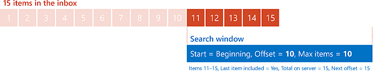
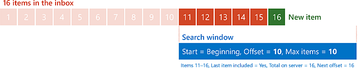
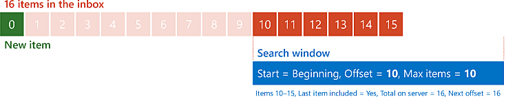

# Perform paged searches by using EWS in Exchange

Find out how to perform paged searches in your EWS Managed API or EWS application that targets Exchange.
  
Paging is a feature in EWS that enables you to control the size of the results of a search. Rather than retrieve the entire result set in one EWS response, you can retrieve smaller sets in multiple EWS responses. For example, consider a user with 10,000 email messages in their Inbox. Hypothetically, you could retrieve all 10,000 emails in one very large response, but you might want to break that up into more manageable chunks for bandwidth or performance reasons. Paging gives you the tools to do just that.
  
> [!NOTE]
> While you can hypothetically retrieve 10,000 items in one request, in reality, this is unlikely due to EWS throttling. To find out more, see [EWS throttling in Exchange](ews-throttling-in-exchange.md). 
  
**Table 1. Paging parameters in the EWS Managed API and EWS**

|**To configure or retrieve the…**|**In the EWS Managed API, use…**|**In EWS, use…**|
|:-----|:-----|:-----|
|Maximum number of items or folders in a response  <br/> |The **pageSize** parameter to the [ItemView constructor](https://msdn.microsoft.com/library/microsoft.exchange.webservices.data.itemview.itemview%28v=exchg.80%29.aspx) or the [FolderView constructor](https://msdn.microsoft.com/library/microsoft.exchange.webservices.data.folderview.folderview%28v=exchg.80%29.aspx) <br/> Or  <br/> The [PagedView.PageSize](https://msdn.microsoft.com/library/microsoft.exchange.webservices.data.pagedview.pagesize%28v=exchg.80%29.aspx) property  <br/> |The **MaxEntriesReturned** attribute on the [IndexedPageItemView](https://msdn.microsoft.com/library/6d1b0b04-cc35-4a57-bd7a-824136d14fda%28Office.15%29.aspx) element or the [IndexedPageFolderView](https://msdn.microsoft.com/library/c6dac232-244b-4db0-9a15-5e01b8aa7a7d%28Office.15%29.aspx) element  <br/> |
|Starting point in the list of items or folders  <br/> |The **offsetBasePoint** parameter to the **ItemView** constructor or the **FolderView** constructor  <br/> Or  <br/> The [PagedView.OffsetBasePoint](https://msdn.microsoft.com/library/microsoft.exchange.webservices.data.pagedview.offsetbasepoint%28v=exchg.80%29.aspx) property  <br/> |The **BasePoint** attribute on the **IndexedPageItemView** element or the **IndexedPageFolderView** element  <br/> |
|Offset from the starting point  <br/> |The **offset** parameter to the **ItemView** constructor or the **FolderView** constructor  <br/> Or  <br/> The [PagedView.Offset](https://msdn.microsoft.com/library/microsoft.exchange.webservices.data.pagedview.offset%28v=exchg.80%29.aspx) property  <br/> |The **Offset** attribute on the **IndexedPageItemView** element or the **IndexedPageFolderView** element  <br/> |
|Total number of results on the server  <br/> |The [FindItemsResults.TotalCount](https://msdn.microsoft.com/library/dd635348%28v=exchg.80%29.aspx) property or the [FindFoldersResults.TotalCount](https://msdn.microsoft.com/library/microsoft.exchange.webservices.data.findfoldersresults.totalcount%28v=exchg.80%29.aspx) property  <br/> |The **TotalItemsInView** attribute on the [RootFolder (FindItemResponseMessage)](https://msdn.microsoft.com/library/187e009f-efaa-42a8-8962-329a645213ab%28Office.15%29.aspx) element or the [RootFolder (FindFolderResponseMessage)](https://msdn.microsoft.com/library/5089c815-663f-46be-bc59-aed9ee20f94a%28Office.15%29.aspx) element  <br/> |
|Offset of first item or folder not included in current response  <br/> |The [FindItemsResults.NextPageOffset](https://msdn.microsoft.com/library/ee693014%28v=exchg.80%29.aspx) property or the [FindFoldersResults.NextPageOffset](https://msdn.microsoft.com/library/microsoft.exchange.webservices.data.findfoldersresults.nextpageoffset%28v=exchg.80%29.aspx) property  <br/> |The **IndexedPagingOffset** attribute on the **RootFolder** element  <br/> |
|Indicator that response includes the last item or folder in the list  <br/> |The [FindItemsResults.MoreAvailable](https://msdn.microsoft.com/library/dd635477%28v=exchg.80%29.aspx) property or the [FindFoldersResults.MoreAvailable](https://msdn.microsoft.com/library/microsoft.exchange.webservices.data.findfoldersresults.moreavailable%28v=exchg.80%29.aspx) property  <br/> |The **IncludesLastItemInRange** attribute on the **RootFolder** element  <br/> |
   
## How paging works
<a name="bk_HowPagingWorks"> </a>

To understand how paging works, it's helpful to visualize the messages in a folder as billboards lined up side by side in a field outside your house. You can see some of these billboards through a magical window. You have the ability to change the size of the window (to see more or fewer billboards at once) and to move the window (to control which billboards you can see). This manipulation of the window is paging. 
  
When you send your request to the Exchange server, you specify the size of your window in terms of how many items to return. You set the position of the window by specifying a starting point (either the beginning of the line or the end of the line) and an offset from that starting point, expressed in a number of items. The beginning of the window is the number of items specified by the offset from the starting point.
  
Where paging gets a bit more interesting is in the server's response, and how your application can use that response to shape its next request. The server gives you three pieces of information that you can use to determine how to configure your "window" for your next request: 
  
- Whether the results in the response include the last item in the overall result set on the server.
    
- The total number of items in the result set on the server.
    
- What the next offset value should be, if you want to advance your window to the next item in the result set that isn't included in the current response.
    
Let's look at a simple example. Imagine an Inbox with 15 messages in it. Your application sends an initial request to retrieve a maximum of 10 items, starting at the beginning of the list of messages (so the offset is zero). The server responds with the first 10 messages, and indicates that the response does not include the last item, that there are a total of 15 items, and that the next offset should be 10.
  
**Figure 1. Requesting 10 items at offset 0 from the beginning of a list of 15 items**


  
Your application then resends the same request to the server, with the only change being that the offset is now 10. The server returns the last five items, and indicates that the response does include the last item, that there are a total of 15 items, and that the next offset should be 15 (though of course, you've reached the end, so there won't be a next offset.)
  
**Figure 2. Requesting 10 items at offset 10 from the beginning of a list of 15 items**


  
## Design considerations for paging
<a name="bk_DesignConsiderations"> </a>

Making the most out of paging in your application does require some consideration. For example, how large do you make your "window"? What do you do if the results on the server change while you're moving your "window"?
  
### Determine the size of your window

There is no "one-size-fits-all" maximum number of entries that all applications should use. Determining the number that's right for your application depends on several different factors. However, it's helpful to keep the following guidelines in mind:
  
- By default, Exchange limits the maximum number of items that can be returned in a single request to 1000.
    
- Setting the maximum number of entries to a larger number results in having to send fewer requests to get all items, at the cost of having to wait longer for responses.
    
- Setting the maximum number of entries to a smaller number results in quicker response times, at the cost of having to send more requests to get all items.
    
### Handling changes to the result set

In the simple example earlier in this article, the number of items in the user's Inbox remained constant. However, in reality, the number of items in an Inbox can change frequently. New messages can arrive and items can be deleted or moved at any time. But how does this impact paging? Let's modify the earlier example scenario to find out.
  
We'll start again with the 15 items in the user's Inbox, and send the same initial request. As before, the server responds with the first 10 messages, and indicates that the response does not include the last item, that there are a total of 15 items, and that the next offset should be 10, as shown in Figure 1.
  
Now, while your application is processing those 10 items, a new message arrives in the Inbox and is added to the result set on the server. Your application resends the same request to the server (only with the offset set to 10). This time the server gets back six items, and indicates that there are a total of 16 items in the result set.
  
At this point you might be wondering if this is even a problem. After all, you got 16 items back over the two responses, so why all the fuss? The answer depends on where in the list the new item is placed. If the list is sorted so that the oldest items (by received date/time) are first, there's no cause for concern in this scenario. The new item will be placed at the end of the list, and will be included in the second response.
  
**Figure 3. Requesting 10 items at offset 10 from the beginning of a list of 16 items, with the 16th item in the list being new**


  
If the list is sorted so that the newest items are first, it's a different story. In this case, the first item in the second request would be the last item from the previous request plus the remaining five items from the original 15. To put it in terms of our imaginary magical window, you shifted your window's position by 10, but the billboards themselves also shifted by 1.
  
**Figure 4. Requesting 10 items at offset 10 from the beginning of a list of 16 items, with the first item in the list being new**


  
One way to detect a change to the results on the server is to use the concept of an anchor item. An anchor item is an additional item in your response that is not processed along with the rest of the results, but is used to compare with the next results to see if the items themselves have shifted. Building again on our simple example, if your application is using a "window" size of 10, you actually set the maximum number of items to return to 11. Your application processes the first 10 items in the response as usual. For the last item, you save the item's identifier as an anchor, then issue the next request with an offset of 10. If the data has not changed, the first item in the second response should have an item identifier that matches the anchor. If the item identifiers don't match, you know that the data has been removed or inserted in the parts of the list you have already "paged" over.
  
Even when you know that the data has changed, you still need to decide how to react. There isn't a one-size-fits-all answer for this question either. Your actions will depend on the nature of your application and how critical it is to capture all items. You might ignore it altogether, restart the process from the beginning, or back track and try to detect where the change happened.
  
## Example: Perform a paged search by using the EWS Managed API
<a name="bk_PagedSearchEWSMA"> </a>

Paging is supported by the following EWS Managed API methods:
  
- [ExchangeService.FindFolders](https://msdn.microsoft.com/library/microsoft.exchange.webservices.data.exchangeservice.findfolders%28v=exchg.80%29.aspx)
    
- [ExchangeService.FindItems](https://msdn.microsoft.com/library/microsoft.exchange.webservices.data.exchangeservice.finditems%28v=exchg.80%29.aspx)
    
- [Folder.FindFolders](https://msdn.microsoft.com/library/microsoft.exchange.webservices.data.folder.findfolders%28v=exchg.80%29.aspx)
    
- [Folder.FindFolders](https://msdn.microsoft.com/library/microsoft.exchange.webservices.data.folder.finditems%28v=exchg.80%29.aspx)
    
If you are using the EWS Managed API, your application configures paging with the [ItemView](https://msdn.microsoft.com/library/microsoft.exchange.webservices.data.itemview%28v=exchg.80%29.aspx) or [FolderView](https://msdn.microsoft.com/library/microsoft.exchange.webservices.data.folderview%28v=exchg.80%29.aspx) class and receives information from the server regarding paging from the [FindItemsResults](https://msdn.microsoft.com/library/dd635381%28v=exchg.80%29.aspx) or [FindFoldersResults](https://msdn.microsoft.com/library/microsoft.exchange.webservices.data.findfoldersresults%28v=exchg.80%29.aspx) class. 
  
The following example retrieves all the items in a folder using a paged search that returns five items in each response. It also retrieves an additional item to serve as an anchor to detect changes to the results on the server. 
  
This example assumes that the **ExchangeService** object has been initialized with valid values in the [Credentials](https://msdn.microsoft.com/library/microsoft.exchange.webservices.data.exchangeservicebase.credentials%28v=exchg.80%29.aspx) and [Url](https://msdn.microsoft.com/library/microsoft.exchange.webservices.data.exchangeservice.url%28v=exchg.80%29.aspx) properties. 
  
```cs
using Microsoft.Exchange.WebServices.Data;
static void PageSearchItems(ExchangeService service, WellKnownFolderName folder)
{
    int pageSize = 5;
    int offset = 0;
    // Request one more item than your actual pageSize.
    // This will be used to detect a change to the result
    // set while paging.
    ItemView view = new ItemView(pageSize + 1, offset);
    view.PropertySet = new PropertySet(ItemSchema.Subject);
    view.OrderBy.Add(ItemSchema.DateTimeReceived, SortDirection.Descending);
    view.Traversal = ItemTraversal.Shallow;
    bool moreItems = true;
    ItemId anchorId = null;
    while (moreItems)
    {
        try
        {
            FindItemsResults<Item> results = service.FindItems(folder, view);
            moreItems = results.MoreAvailable;
            if (moreItems && anchorId != null)
            {
                // Check the first result to make sure it matches
                // the last result (anchor) from the previous page.
                // If it doesn't, that means that something was added
                // or deleted since you started the search.
                if (results.Items.First<Item>().Id != anchorId)
                {
                    Console.WriteLine("The collection has changed while paging. Some results may be missed.");
                }
            }
            if (moreItems)
                view.Offset += pageSize;
                
            anchorId = results.Items.Last<Item>().Id;
            
            // Because you're including an additional item on the end of your results
            // as an anchor, you don't want to display it.
            // Set the number to loop as the smaller value between
            // the number of items in the collection and the page size.
            int displayCount = 0;
            if ((results.MoreAvailable == false && results.Items.Count > pageSize) || (results.Items.Count < pageSize))
            {
                displayCount = results.Items.Count;
            }
            else
            {
                displayCount = pageSize;
            }
            
            for (int i = 0; i < displayCount; i++)
            {
                Item item = results.Items[i];
                Console.WriteLine("Subject: {0}", item.Subject);
                Console.WriteLine("Id: {0}\n", item.Id.ToString());
            }
        }
        catch (Exception ex)
        {
            Console.WriteLine("Exception while paging results: {0}", ex.Message);
        }
    }
}
```

## Example: Perform a paged search by using EWS
<a name="bk_PagedSearchEWS"> </a>

Paging is supported by the following EWS operations:
  
- [FindFolder](https://msdn.microsoft.com/library/7a9855aa-06cc-45ba-ad2a-645c15b7d031%28Office.15%29.aspx)
    
- [FindItem](https://msdn.microsoft.com/library/ebad6aae-16e7-44de-ae63-a95b24539729%28Office.15%29.aspx)
    
If you're using EWS, your application configures paging with the [IndexedPageItemView](https://msdn.microsoft.com/library/6d1b0b04-cc35-4a57-bd7a-824136d14fda%28Office.15%29.aspx) element or the [IndexedPageFolderView](https://msdn.microsoft.com/library/c6dac232-244b-4db0-9a15-5e01b8aa7a7d%28Office.15%29.aspx) element and receives information from the server regarding paging from the [RootFolder (FindItemResponseMessage)](https://msdn.microsoft.com/library/187e009f-efaa-42a8-8962-329a645213ab%28Office.15%29.aspx) element or the [RootFolder (FindFolderResponseMessage)](https://msdn.microsoft.com/library/5089c815-663f-46be-bc59-aed9ee20f94a%28Office.15%29.aspx) element. 
  
In this request example, a **FindItem** request is sent for a maximum of six items, starting at an offset of zero from the beginning of the list of items in the user's Inbox. 
  
```XML
<?xml version="1.0" encoding="utf-8"?>
<soap:Envelope xmlns:xsi="http://www.w3.org/2001/XMLSchema-instance" 
    xmlns:m="https://schemas.microsoft.com/exchange/services/2006/messages" 
    xmlns:t="https://schemas.microsoft.com/exchange/services/2006/types" 
    xmlns:soap="https://schemas.xmlsoap.org/soap/envelope/">
  <soap:Header>
    <t:RequestServerVersion Version="Exchange2007_SP1" />
    <t:TimeZoneContext>
      <t:TimeZoneDefinition Id="Eastern Standard Time" />
    </t:TimeZoneContext>
  </soap:Header>
  <soap:Body>
    <m:FindItem Traversal="Shallow">
      <m:ItemShape>
        <t:BaseShape>IdOnly</t:BaseShape>
        <t:AdditionalProperties>
          <t:FieldURI FieldURI="item:Subject" />
        </t:AdditionalProperties>
      </m:ItemShape>
      <m:IndexedPageItemView MaxEntriesReturned="6" Offset="0" BasePoint="Beginning" />
      <m:ParentFolderIds>
        <t:DistinguishedFolderId Id="inbox" />
      </m:ParentFolderIds>
    </m:FindItem>
  </soap:Body>
</soap:Envelope>
```

The server returns the following response, which contains six items. The response also indicates that there are a total of eight items in the results on the server, and that the last item in the results list is not present in this response.
  
```XML
<?xml version="1.0" encoding="utf-8"?>
<s:Envelope xmlns:s="https://schemas.xmlsoap.org/soap/envelope/">
  <s:Header>
    <h:ServerVersionInfo MajorVersion="15" MinorVersion="0" MajorBuildNumber="775" MinorBuildNumber="35" Version="V2_4" 
        xmlns:h="https://schemas.microsoft.com/exchange/services/2006/types" 
        xmlns="https://schemas.microsoft.com/exchange/services/2006/types" 
        xmlns:xsd="http://www.w3.org/2001/XMLSchema" 
        xmlns:xsi="http://www.w3.org/2001/XMLSchema-instance" />
  </s:Header>
  <s:Body xmlns:xsi="http://www.w3.org/2001/XMLSchema-instance" xmlns:xsd="http://www.w3.org/2001/XMLSchema">
    <m:FindItemResponse xmlns:m="https://schemas.microsoft.com/exchange/services/2006/messages" 
        xmlns:t="https://schemas.microsoft.com/exchange/services/2006/types">
      <m:ResponseMessages>
        <m:FindItemResponseMessage ResponseClass="Success">
          <m:ResponseCode>NoError</m:ResponseCode>
          <m:RootFolder IndexedPagingOffset="6" TotalItemsInView="8" IncludesLastItemInRange="false">
            <t:Items>
              <t:Message>
                <t:ItemId Id="AAMkAGM2..." ChangeKey="CQAAABYA..." />
                <t:Subject>Query</t:Subject>
              </t:Message>
              <t:Message>
                <t:ItemId Id="AAMkAGM2..." ChangeKey="CQAAABYA..." />
                <t:Subject>Update</t:Subject>
              </t:Message>
              <t:Message>
                <t:ItemId Id="AAMkAGM2..." ChangeKey="CQAAABYA..." />
                <t:Subject>Planning resources</t:Subject>
              </t:Message>
              <t:Message>
                <t:ItemId Id="AAMkAGM2..." ChangeKey="CQAAABYA..." />
                <t:Subject>Timeline</t:Subject>
              </t:Message>
              <t:Message>
                <t:ItemId Id="AAMkAGM2..." ChangeKey="CQAAABYA..." />
                <t:Subject>For your perusal</t:Subject>
              </t:Message>
              <t:Message>
                <t:ItemId Id="AAMkAGM2..." ChangeKey="CQAAABYA..." />
                <t:Subject>meeting notes</t:Subject>
              </t:Message>
            </t:Items>
          </m:RootFolder>
        </m:FindItemResponseMessage>
      </m:ResponseMessages>
    </m:FindItemResponse>
  </s:Body>
</s:Envelope>
```

In this example, the same request is sent, but this time, the **Offset** attribute is changed to five, which indicates that the server should return at most six items starting at offset five from the beginning. 
  
```XML
<?xml version="1.0" encoding="utf-8"?>
<soap:Envelope xmlns:xsi="http://www.w3.org/2001/XMLSchema-instance" 
    xmlns:m="https://schemas.microsoft.com/exchange/services/2006/messages" 
    xmlns:t="https://schemas.microsoft.com/exchange/services/2006/types" 
    xmlns:soap="https://schemas.xmlsoap.org/soap/envelope/">
  <soap:Header>
    <t:RequestServerVersion Version="Exchange2007_SP1" />
    <t:TimeZoneContext>
      <t:TimeZoneDefinition Id="Eastern Standard Time" />
    </t:TimeZoneContext>
  </soap:Header>
  <soap:Body>
    <m:FindItem Traversal="Shallow">
      <m:ItemShape>
        <t:BaseShape>IdOnly</t:BaseShape>
        <t:AdditionalProperties>
          <t:FieldURI FieldURI="item:Subject" />
        </t:AdditionalProperties>
      </m:ItemShape>
      <m:IndexedPageItemView MaxEntriesReturned="6" Offset="5" BasePoint="Beginning" />
      <m:ParentFolderIds>
        <t:DistinguishedFolderId Id="inbox" />
      </m:ParentFolderIds>
    </m:FindItem>
  </soap:Body>
</soap:Envelope>
```

The server sends the following response, which contains three items. The response also indicates that the total number of items in the results on the server is still eight, and that the last item in the results list is included in this response.
  
```XML
<?xml version="1.0" encoding="utf-8"?>
<s:Envelope xmlns:s="https://schemas.xmlsoap.org/soap/envelope/">
  <s:Header>
    <h:ServerVersionInfo MajorVersion="15" MinorVersion="0" MajorBuildNumber="775" MinorBuildNumber="35" Version="V2_4" 
        xmlns:h="https://schemas.microsoft.com/exchange/services/2006/types" 
        xmlns="https://schemas.microsoft.com/exchange/services/2006/types" 
        xmlns:xsd="http://www.w3.org/2001/XMLSchema" 
        xmlns:xsi="http://www.w3.org/2001/XMLSchema-instance" />
  </s:Header>
  <s:Body xmlns:xsi="http://www.w3.org/2001/XMLSchema-instance" xmlns:xsd="http://www.w3.org/2001/XMLSchema">
    <m:FindItemResponse xmlns:m="https://schemas.microsoft.com/exchange/services/2006/messages" 
    xmlns:t="https://schemas.microsoft.com/exchange/services/2006/types">
      <m:ResponseMessages>
        <m:FindItemResponseMessage ResponseClass="Success">
          <m:ResponseCode>NoError</m:ResponseCode>
          <m:RootFolder IndexedPagingOffset="8" TotalItemsInView="8" IncludesLastItemInRange="true">
            <t:Items>
              <t:Message>
                <t:ItemId Id="AAMkAGM2..." ChangeKey="CQAAABYA..." />
                <t:Subject>meeting notes</t:Subject>
              </t:Message>
              <t:Message>
                <t:ItemId Id="AAMkAGM2..." ChangeKey="CQAAABYA..." />
                <t:Subject>Meeting notes</t:Subject>
              </t:Message>
              <t:Message>
                <t:ItemId Id="AAMkAGM2..." ChangeKey="CQAAABYA..." />
                <t:Subject>This cat is hilarious!</t:Subject>
              </t:Message>
            </t:Items>
          </m:RootFolder>
        </m:FindItemResponseMessage>
      </m:ResponseMessages>
    </m:FindItemResponse>
  </s:Body>
</s:Envelope>
```

## See also


- [Search and EWS in Exchange](search-and-ews-in-exchange.md)
    
- [ExchangeService.FindFolders method](https://msdn.microsoft.com/library/microsoft.exchange.webservices.data.exchangeservice.findfolders%28v=exchg.80%29.aspx)
    
- [ExchangeService.FindItems method](https://msdn.microsoft.com/library/microsoft.exchange.webservices.data.exchangeservice.finditems%28v=exchg.80%29.aspx)
    
- [Folder.FindFolders method](https://msdn.microsoft.com/library/microsoft.exchange.webservices.data.folder.findfolders%28v=exchg.80%29.aspx)
    
- [Folder.FindFolders method](https://msdn.microsoft.com/library/microsoft.exchange.webservices.data.folder.finditems%28v=exchg.80%29.aspx)
    
- [FindFolder operation](https://msdn.microsoft.com/library/7a9855aa-06cc-45ba-ad2a-645c15b7d031%28Office.15%29.aspx)
    
- [FindItem operation](https://msdn.microsoft.com/library/ebad6aae-16e7-44de-ae63-a95b24539729%28Office.15%29.aspx)
    
- [EWS throttling in Exchange](ews-throttling-in-exchange.md)
    

