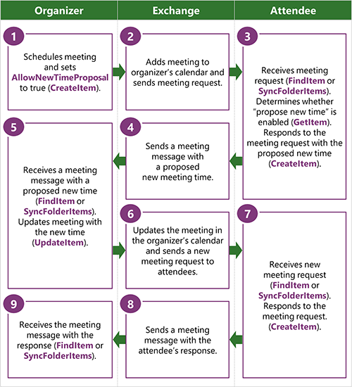

# Propose a new meeting time by using EWS in Exchange

Find out how to propose new meeting times from your Exchange client application by using EWS in Exchange.
  
The propose new time feature enables attendees to propose new meeting times to the meeting organizer as part of the Exchange calendar workflow. When an attendee proposes a new meeting, the organizer can use the proposed new meeting time to update the meeting and send updates to all attendees. Before you can enable attendees to propose new meeting times, you need to determine whether the organizer allows for new time proposals. This article describes how to determine whether you can propose a new time and how to use EWS to propose a new time.
  
> [!NOTE]
> The EWS Managed API does not implement this functionality. 
  
## Determine whether you can propose a new time for a meeting by using EWS
<a name="bk_Determine"> </a>

Before you can propose a new time for a meeting, you need to find a reference to that meeting and determine whether the meeting organizer configured the meeting to support new time proposals. You can get a reference to a meeting by doing either of the following: 
  
- Finding the meeting request in the Inbox
    
- Finding the appointment in the calendar
    
Use the following steps to find a meeting reference:
  
1. Use the [FindItem](https://msdn.microsoft.com/library/ebad6aae-16e7-44de-ae63-a95b24539729%28Office.15%29.aspx) EWS operation (or the [Folder.FindItems](https://msdn.microsoft.com/library/microsoft.exchange.webservices.data.folder.finditems%28v=EXCHG.80%29.aspx) EWS Managed API method) to find the target meeting request or calendar item. Alternatively, you can use the [SyncFolderItems](https://msdn.microsoft.com/library/7f0de089-8876-47ec-a871-df118ceae75d%28Office.15%29.aspx) EWS operation to get the identifier of the target meeting request or calendar item. 
    
2. Parse the results of the **FindItem** operation (or **Folder.FindItems** method) to get the item identifier of the meeting item. 
    
3. Use the [GetItem](https://msdn.microsoft.com/library/e3590b8b-c2a7-4dad-a014-6360197b68e4%28Office.15%29.aspx) EWS operation to get the response objects for the meeting. 
    
The following XML shows what is sent to request the response objects on an item.
  
```XML
<?xml version="1.0" encoding="utf-8"?>
<soap:Envelope xmlns:xsi="http://www.w3.org/2001/XMLSchema-instance"
               xmlns:xsd="http://www.w3.org/2001/XMLSchema"
               xmlns:soap="http://schemas.xmlsoap.org/soap/envelope/"
               xmlns:t="http://schemas.microsoft.com/exchange/services/2006/types"
               xmlns:m="http://schemas.microsoft.com/exchange/services/2006/messages">
  <soap:Header>
    <t:RequestServerVersion Version="Exchange2013" />
    <t:MailboxCulture>en-US</t:MailboxCulture>
  </soap:Header>
  <soap:Body>
    <m:GetItem>
      <m:ItemShape>
        <t:BaseShape>IdOnly</t:BaseShape>
        <t:AdditionalProperties>
          <t:FieldURI FieldURI="item:ResponseObjects"/>
          <t:FieldURI FieldURI="item:Subject"/>
          <t:FieldURI FieldURI="calendar:Start"/>
          <t:FieldURI FieldURI="calendar:End"/>
        </t:AdditionalProperties>
      </m:ItemShape>
      <m:ItemIds>
        <t:ItemId Id="AAMkADEzOTExYjJkL1AAA=" ChangeKey="CwAAAB/G6X"/>
      </m:ItemIds>
    </m:GetItem>
  </soap:Body>
</soap:Envelope>
```

The **GetItem** operation response will look similar to the following XML if you request the item identifier, the meeting start and end time, the response object collection, and if the organizer allows for proposed changes to the meeting time. The response object collection, which is represented by the [ResponseObjects](https://msdn.microsoft.com/library/ad29e064-3f3d-4b7b-aa4c-9ec27326381d%28Office.15%29.aspx) element, contains the set of responses that are valid for the calendar item. The **ProposeNewTime** element is a response object that indicates that the user can propose a new time for the meeting. The [AcceptItem](https://msdn.microsoft.com/library/05a15431-77e1-411a-a16b-5481d364d3cc%28Office.15%29.aspx), [TentativelyAcceptItem](https://msdn.microsoft.com/library/ce6f50ef-ad8a-47e4-915a-487b2ef7a2e0%28Office.15%29.aspx), and [DeclineItem](https://msdn.microsoft.com/library/2d8d2389-924e-4d03-a324-35d56cf0d6b1%28Office.15%29.aspx) elements represent the response objects that you can use to propose a new meeting time to the meeting organizer. 
  
```XML
<s:Envelope xmlns:s="https://schemas.xmlsoap.org/soap/envelope/">
  <s:Header>
    <h:ServerVersionInfo MajorVersion="15" 
                         MinorVersion="0" 
                         MajorBuildNumber="815" 
                         MinorBuildNumber="6" 
                         Version="V2_7" 
                         xmlns:h="http://schemas.microsoft.com/exchange/services/2006/types" 
                         xmlns="http://schemas.microsoft.com/exchange/services/2006/types" 
                         xmlns:xsd="http://www.w3.org/2001/XMLSchema" 
                         xmlns:xsi="http://www.w3.org/2001/XMLSchema-instance"/>
  </s:Header>
  <s:Body xmlns:xsi="http://www.w3.org/2001/XMLSchema-instance" 
          xmlns:xsd="http://www.w3.org/2001/XMLSchema">
    <m:GetItemResponse xmlns:m="http://schemas.microsoft.com/exchange/services/2006/messages" 
                       xmlns:t="http://schemas.microsoft.com/exchange/services/2006/types">
      <m:ResponseMessages>
        <m:GetItemResponseMessage ResponseClass="Success">
          <m:ResponseCode>NoError</m:ResponseCode>
          <m:Items>
            <t:MeetingRequest>
              <t:ItemId Id="AAMkADEzOTExYjJkL1AAA=" ChangeKey="CwAAAB/G6X"/>
              <t:Subject>Competitive analysis: kick off meeting</t:Subject>
              <t:ResponseObjects>
                <t:AcceptItem/>
                <t:TentativelyAcceptItem/>
                <t:DeclineItem/>
                <t:ProposeNewTime/>
                <t:ReplyToItem/>
                <t:ReplyAllToItem/>
                <t:ForwardItem/>
              </t:ResponseObjects>
              <t:Start>2013-11-09T17:00:00Z</t:Start>
              <t:End>2013-11-09T17:30:00Z</t:End>
            </t:MeetingRequest>
          </m:Items>
        </m:GetItemResponseMessage>
      </m:ResponseMessages>
    </m:GetItemResponse>
  </s:Body>
</s:Envelope>
```

## Propose a new meeting time by using EWS
<a name="bk_Propose"> </a>

If you received a **ProposeNewTime** response object when you used the **GetItem** operation to get a calendar item or meeting request, you can respond with a proposed new meeting time. If you didn't receive a **ProposeNewTime** response object, you won't be able to propose a new meeting time as part of the calendar workflow. You can, however, reply to the organizer to request a new meeting time. If you receive a **ProposeNewTime** response object, you can respond to the meeting by referencing its identifier, and propose a new meeting time to the organizer. This is where the **ProposeNewTime** response object is different than the typical response object pattern in that you don't respond with a **ProposeNewTime** response object. You use one of the other meeting response objects, such as **AcceptItem**, **TentativelyAcceptItem**, or **DeclineItem**, to propose a new meeting. This example uses the **AcceptItem** response object. 
  
```XML
<?xml version="1.0" encoding="UTF-8"?>
<soap:Envelope xmlns:soap="http://schemas.xmlsoap.org/soap/envelope/"
               xmlns:t="http://schemas.microsoft.com/exchange/services/2006/types"
               xmlns:m="http://schemas.microsoft.com/exchange/services/2006/messages">
  <soap:Header>
    <t:RequestServerVersion Version="Exchange2013"/>
  </soap:Header>
  <soap:Body>
    <m:CreateItem>
      <m:Items>
        <t:AcceptItem>
          <t:Body BodyType="Text">This time works better for the HiPPO.</t:Body>
          <t:ReferenceItemId Id="AAMkADEzOTExYjJkL1AAA=" ChangeKey="CwAAAB/G6X"/>
          <t:ProposedStart>2013-11-28T04:00:00Z</t:ProposedStart>
          <t:ProposedEnd>2013-11-28T04:30:00Z</t:ProposedEnd>
        </t:AcceptItem>
      </m:Items>
    </m:CreateItem>
  </soap:Body>
</soap:Envelope>
```

The response to this request contains the identifier of the calendar item that was added to the attendee's calendar and a copy of the meeting request that was placed in the attendee's Deleted Items folder. The response message with the new time proposal was also saved in the attendee's Sent Items folder (you will need to find the meeting response message to get a handle on it).
  
```XML
<s:Envelope xmlns:s="http://schemas.xmlsoap.org/soap/envelope/">
  <s:Header>
    <h:ServerVersionInfo MajorVersion="15" 
                         MinorVersion="0" 
                         MajorBuildNumber="815" 
                         MinorBuildNumber="6" 
                         Version="V2_7" 
                         xmlns:h="http://schemas.microsoft.com/exchange/services/2006/types" 
                         xmlns="http://schemas.microsoft.com/exchange/services/2006/types" 
                         xmlns:xsd="http://www.w3.org/2001/XMLSchema" 
                         xmlns:xsi="http://www.w3.org/2001/XMLSchema-instance"/>
  </s:Header>
  <s:Body xmlns:xsi="http://www.w3.org/2001/XMLSchema-instance" 
          xmlns:xsd="http://www.w3.org/2001/XMLSchema">
    <m:CreateItemResponse xmlns:m="http://schemas.microsoft.com/exchange/services/2006/messages" 
                          xmlns:t="http://schemas.microsoft.com/exchange/services/2006/types">
      <m:ResponseMessages>
        <m:CreateItemResponseMessage ResponseClass="Success">
          <m:ResponseCode>NoError</m:ResponseCode>
          <m:Items>
            <t:CalendarItem>
              <t:ItemId Id="AAMkAGRmOWE2OWAAA=" ChangeKey="DwAAJsmU"/>
            </t:CalendarItem>
            <t:MeetingRequest>
              <t:ItemId Id="AAMkAGRmOWE2AAABB=" ChangeKey="AAAGJu1A"/>
            </t:MeetingRequest>
          </m:Items>
        </m:CreateItemResponseMessage>
      </m:ResponseMessages>
    </m:CreateItemResponse>
  </s:Body>
</s:Envelope>
```

The organizer will receive a [MeetingResponse](https://msdn.microsoft.com/library/9f798e79-dafd-4d4d-9967-95fd8e5c0502%28Office.15%29.aspx) message when the attendee responds with a proposed new meeting time. The **MeetingResponse** message contains the proposed new meeting start time and end time, and the identifier of the associated calendar item in the organizer's calendar. The organizer can use that information to update their existing calendar item for the meeting. The following is the workflow for the organizer to respond to a **MeetingResponse** message that proposes a new meeting time: 
  
1. Determine whether the **ProposedStart** or **ProposedEnd** elements have been set in the **MeetingResponse**. If so, go to step 2. If not, the **MeetingResponse** message only indicates whether the attendee has accepted, tentatively accepted, or declined the meeting. 
    
2. Get the organizer's existing calendar item for the meeting by using the EWS identifier returned in the **AssociatedCalendarItemId** element. 
    
3. Compare the original start and end time with the proposed new meeting time. If the proposed new meeting time is acceptable to the organizer, go to step 4. Otherwise, the meeting organizer can either ignore the proposed meeting time, or send an email response to the attendee that proposed the new meeting time.
    
4. (Optional) Perform a [GetUserAvailability](https://msdn.microsoft.com/library/8da17226-5d3a-4525-9ffa-d83730f47bb1%28Office.15%29.aspx) EWS operation call to find out whether the proposed time will work for all attendees, including room and resource mailboxes. (You can also use the [ExchangeService.GetUserAvailability](https://msdn.microsoft.com/library/microsoft.exchange.webservices.data.exchangeservice.getuseravailability%28v=exchg.80%29.aspx) EWS Managed API method to do this.) 
    
5. The organizer can then update their meeting with the new proposed meeting times and send the updates to all attendees by using the [UpdateItem](https://msdn.microsoft.com/library/5d027523-e0bc-4da2-b60b-0cb9fc1fdfe4%28Office.15%29.aspx) EWS operation (or the [Appointment.Update](https://msdn.microsoft.com/library/microsoft.exchange.webservices.data.appointment.update%28v=exchg.80%29.aspx) EWS Managed API method). 
    
The following figure shows the process that occurs between the meeting organizer, the attendee, and the Exchange server that handled the EWS calls.
  
**Figure 1. Process for proposing a new meeting time**


  
## Version differences
<a name="bk_Behavior"> </a>

The propose new time feature was introduced in Exchange build version 15.00.0800.007. In earlier versions of Exchange, EWS application users have to send a separate email to the meeting organizer to request a different meeting time. 
  
## See also


- [Calendars and EWS in Exchange](calendars-and-ews-in-exchange.md)
    
- [Create appointments and meetings by using EWS in Exchange 2013](how-to-create-appointments-and-meetings-by-using-ews-in-exchange-2013.md)
    
- [Get appointments and meetings by using EWS in Exchange](how-to-get-appointments-and-meetings-by-using-ews-in-exchange.md)
    
- [Update appointments and meetings by using EWS in Exchange](how-to-update-appointments-and-meetings-by-using-ews-in-exchange.md)
    
- [Delete appointments and cancel meetings by using EWS in Exchange](how-to-delete-appointments-and-cancel-meetings-by-using-ews-in-exchange.md)
    

