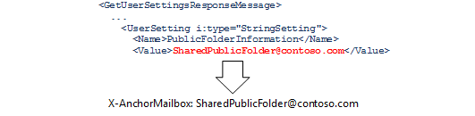
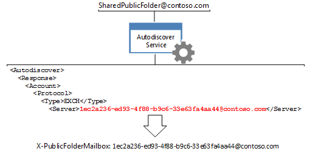

# Route public folder hierarchy requests

All requests for public folder information that require knowledge of the public folder hierarchy, such as moving, updating, deleting, or finding public folders, need to be routed to the default public folder hierarchy mailbox for the given user. To route the requests to that mailbox, you need to set the **X-AnchorMailbox** and **X-PublicFolderMailbox** headers to specific values returned by the Autodiscover service. 
  
**Overview of public folders**

|Header|What do I need?|How do I get it?|
|:-----|:-----|:-----|
|**X-AnchorMailbox** <br/> |The [PublicFolderInformation](https://msdn.microsoft.com/library/dn751006%28v=exchg.150%29.aspx) value from a [GetUserSettings](https://msdn.microsoft.com/library/office/dd877096%28v=exchg.150%29.aspx) Autodiscover SOAP response, which becomes the value of the **X-AnchorMailbox** header.<br/><br/> | 1. Send a **GetUserSetting** request with the SMTP address for the user's mailbox.<br/><br/>2. Cache the value of the **PublicFolderInformation** element that the Autodiscover service returns. This can be a cached from an existing Autodiscover call in your code, or a new [EWS Managed API GetUserSettings call](#bk_getpfinfoewsma) or a [GetUserSettings SOAP request](#bk_getpfinfoews).  <br/><br/>3. Use the **PublicFolderInformation** element to populate the value of the **X-AnchorMailbox** header. The value of the **PublicFolderInformation** element is an SMTP address.  <br/> |
|**X-PublicFolderMailbox** <br/> |The [Server](https://msdn.microsoft.com/library/bb204084%28v=exchg.150%29.aspx) value from a [POX Autodiscover response](https://msdn.microsoft.com/library/bb204082%28v=exchg.150%29.aspx), which becomes the value of the **X-PublicFolderMailbox** header.<br/><br/> |1. [Call the POX Autodiscover](#bk_makeautodrequest) service using the **X-AnchorMailbox** email address.  <br/><br/>2. Use the **Server** element returned by the Autodiscover service to populate the value of the **X-PublicFolderMailbox** header. The value of the **X-PublicFolderMailbox** is an SMTP address where the username is a GUID.  <br/> |

<br/>

After you have determined the header values, include them [when you make public folder hierarchy requests](#bk_setheadervalues).
  
The steps in this article are specific to public folder hierarchy requests. To determine whether your request is a public folder hierarchy or content request, see [Routing public folder requests](public-folder-access-with-ews-in-exchange.md#bk_routing).
  
## Determine the value of the X-AnchorMailbox header by using the EWS Managed API
<a name="bk_getpfinfoewsma"> </a>

To retrieve the [PublicFolderInformation (POX)](https://msdn.microsoft.com/library/a221aa9e-b4ac-4ec5-aa42-7e2a69e8eaa6%28Office.15%29.aspx) value by using the EWS Managed API, you can either cache the value of the **PublicFolderInformation** element that an existing call to the Autodiscover service returns, or make a new call. 
  
If you're making a new call, you can [Get user settings by using the EWS Managed API](how-to-get-user-settings-from-exchange-by-using-autodiscover.md#bk_Managed)[Get user settings by using the EWS Managed API](how-to-get-user-settings-from-exchange-by-using-autodiscover.md#bk_Managed) to your code, and then call the **GetUserSettings** sample method by using the following code, which retrieves only the value of the **PublicFolderInformation** element. Include the SMTP address of the mailbox user as an input parameter. 
  
```cs
GetUserSettingsResponse userResponse = GetUserSettings(adservice, "sonyaf@contoso.com", 3, UserSettingName.PublicFolderInformation);
Console.WriteLine("X-AnchorMailbox value for public folder hierarchy requests: {0}", userResponse.Settings[UserSettingName.PublicFolderInformation]);
```

After running the code, the following information is displayed on the console:
  
`X-AnchorMailbox for public folder hierarchy requests: SharedPublicFolder@contoso.com`

Now that you have the **PublicFolderInformation** value, include it as the value for the X-AnchorMailbox header in all public folder hierarchy requests. 
  
`X-AnchorMailbox: SharedPublicFolder@contoso.com`

## Determine the value of the X-AnchorMailbox header using SOAP
<a name="bk_getpfinfoews"> </a>

The following code example shows how to retrieve the **PublicFolderInformation** value by using the [GetUserSettings](https://msdn.microsoft.com/library/dd877096%28v=exchg.150%29.aspx) SOAP operation. The mailbox user is specified in the [Mailbox](https://msdn.microsoft.com/library/dd877076%28v=exchg.150%29.aspx) element, and the [RequestedSettings](https://msdn.microsoft.com/library/office/dd877107%28v=exchg.150%29.aspx) element limits the response to the [PublicFolderInformation](https://msdn.microsoft.com/library/dn751006%28v=exchg.150%29.aspx) value. 
  
```XML
<?xml version="1.0" encoding="utf-8"?>
<soap:Envelope xmlns:a="http://schemas.microsoft.com/exchange/2010/Autodiscover"
               xmlns:wsa="http://www.w3.org/2005/08/addressing"
               xmlns:xsi="http://www.w3.org/2001/XMLSchema-instance"
               xmlns:soap="http://schemas.xmlsoap.org/soap/envelope/">
  <soap:Header>
    <a:RequestedServerVersion>Exchange2007_SP1</a:RequestedServerVersion>
    <wsa:Action>https://schemas.microsoft.com/exchange/2010/Autodiscover/Autodiscover/GetUserSettings</wsa:Action>
    <wsa:To>https://pod51042.outlook.com/autodiscover/autodiscover.svc</wsa:To>
  </soap:Header>
  <soap:Body>
    <a:GetUserSettingsRequestMessage xmlns:a="http://schemas.microsoft.com/exchange/2010/Autodiscover">
      <a:Request>
        <a:Users>
          <a:User>
            <a:Mailbox>sonyaf@contoso.com</a:Mailbox>
          </a:User>
        </a:Users>
        <a:RequestedSettings>
          <a:Setting>PublicFolderInformation</a:Setting>
        </a:RequestedSettings>
      </a:Request>
    </a:GetUserSettingsRequestMessage>
  </soap:Body>
</soap:Envelope>
```

The response includes the **PublicFolderInformation** value. 
  
```XML
<UserSetting i:type="StringSetting">
    <Name>PublicFolderInformation</Name>
    <Value>SharedPublicFolder@contoso.com</Value>
</UserSetting>
```

Now that you have the **PublicFolderInformation** value, include it as the value for the X-AnchorMailbox header in all public folder hierarchy requests. 
  
`X-AnchorMailbox: SharedPublicFolder@contoso.com`

## Make an Autodiscover request to determine the X-PublicFolderInformation value
<a name="bk_makeautodrequest"> </a>

Make an Autodiscover request by using the **PublicFolderInformation** SMTP address, which is now being used as the **X-AnchorMailbox** value. Use the [Exchange 2013: Get user settings with Autodiscover](https://code.msdn.microsoft.com/exchange/Exchange-2013-Get-user-7e22c86e) code sample to call the Autodiscover service because it streamlines the Autodiscover process for you. This code sample uses the command line arguments listed in the following table to call the POX Autodiscover service on the **PublicFolderInformation** SMTP address. 
  
|**Command-line argument**|**Description**|
|:-----|:-----|
|emailAddress  <br/> |The **PublicFolderInformation** SMTP address.  <br/> |
|-skipSOAP  <br/> | Use POX Autodiscover requests for this scenario.  <br/> |
|-auth authEmailAddress  <br/> |The mailbox user's email address, which is used for authentication. You will be prompted to enter the mailbox user's password when you run the sample.  <br/> |
   
For example, when SharedPublicFolder@contoso.com is the SMTP address of the **PublicFolderInformation** element, and sonyaf@contoso.com is the mailbox user, the command-line arguments should look like this. 
  
`SharedPublicFolder@contoso.com -skipSOAP -auth sonyaf@contoso.com`

When you run the **Exchange 2013: Get user settings with Autodiscover** sample, the last Autodiscover response should be successful and include all the user settings associated with the mailbox GUID. The [Server](https://msdn.microsoft.com/library/bb204084%28v=exchg.150%29.aspx) value associated with the EXCH [Protocol](https://msdn.microsoft.com/library/bb204278%28v=exchg.150%29.aspx)[Type](https://msdn.microsoft.com/library/office/bb204223%28v=exchg.150%29.aspx) element is the **X-PublicFolderInformation** header value. 
  
```XML
<Autodiscover xmlns="http://schemas.microsoft.com/exchange/autodiscover/responseschema/2006">
  <Response xmlns="http://schemas.microsoft.com/exchange/autodiscover/outlook/responseschema/2006a">
    …
    <Account>
      <AccountType>email</AccountType>
      <Action>settings</Action>
      <Protocol>
        <Type>EXCH</Type>
        <Server>1ec2a236-ed93-4f88-b9c6-33e63fa4aa44@contoso.com</Server>

```

Alternatively, if you do not want to use the **Exchange 2013: Get user settings with Autodiscover** sample, you can get the **Server** value by [generating a list of Autodiscover endpoints](how-to-generate-a-list-of-autodiscover-endpoints.md), and then sending the following POX Autodiscover request to each URL until you receive a successful response. SharedPublicFolder@contoso.com is the value of the **X-PublicFolderMailbox** header. 
  
```XML
<?xml version="1.0" encoding="utf-8"?>
<Autodiscover xmlns="http://schemas.microsoft.com/exchange/autodiscover/outlook/requestschema/2006">
  <Request>
    <EMailAddress>SharedPublicFolder@contoso.com</EMailAddress>
    <AcceptableResponseSchema>https://schemas.microsoft.com/exchange/autodiscover/outlook/responseschema/2006a</AcceptableResponseSchema>
  </Request>
</Autodiscover>
```

For more information about the Autodiscover process, see [Autodiscover for Exchange](autodiscover-for-exchange.md), [Generate a list of Autodiscover endpoints](how-to-generate-a-list-of-autodiscover-endpoints.md), and [Get user settings from Exchange by using Autodiscover](how-to-get-user-settings-from-exchange-by-using-autodiscover.md).
  
## Set the values of the X-AnchorMailbox and X-PublicFolderMailbox headers
<a name="bk_setheadervalues"> </a>

Using the value of the **PublicFolderInformation** SMTP address acquired in [Determine the value of the X-AnchorMailbox header by using the EWS Managed API](#bk_getpfinfoewsma) or [Determine the value of the X-AnchorMailbox header using SOAP](#bk_getpfinfoews) and the **Server** value acquired in [Make an Autodiscover request to determine the X-PublicFolderInformation value](#bk_makeautodrequest), set the values of **X-AnchorMailbox** and **X-PublicFolderMailbox** headers in your public folder content request. 
  
For example, given a **PublicFolderInformation** SMTP address of SharedPublicFolder@contoso.com and a **Server** value of 1ec2a236-ed93-4f88-b9c6-33e63fa4aa44@contoso.com, include the following headers when making calls to the following methods or operations. 
  
`X-AnchorMailbox: SharedPublicFolder@contoso.com` <br/>
`X-PublicFolderMailbox: 1ec2a236-ed93-4f88-b9c6-33e63fa4aa44@contoso.com`

**Public folder calls that require the X-AnchorMailbox and X-PublicFolder headers**

|**EWS Managed API methods**|**EWS operations**|
|:-----|:-----|
|[Folder.FindFolders](https://msdn.microsoft.com/library/microsoft.exchange.webservices.data.folder.findfolders%28v=exchg.80%29.aspx) <br/> [Folder.Delete](https://msdn.microsoft.com/library/microsoft.exchange.webservices.data.folder.delete%28v=exchg.80%29.aspx) <br/> [Folder.Update](https://msdn.microsoft.com/library/microsoft.exchange.webservices.data.folder.update%28v=exchg.80%29.aspx) <br/> [Folder.Move](https://msdn.microsoft.com/library/microsoft.exchange.webservices.data.folder.move%28v=exchg.80%29.aspx) <br/> |[CreateFolder](https://msdn.microsoft.com/library/6f6c334c-b190-4e55-8f0a-38f2a018d1b3%28Office.15%29.aspx) <br/> [FindFolder](https://msdn.microsoft.com/library/7a9855aa-06cc-45ba-ad2a-645c15b7d031%28Office.15%29.aspx) <br/> [DeleteFolder](https://msdn.microsoft.com/library/b0f92682-4895-4bcf-a4a1-e4c2e8403979%28Office.15%29.aspx) <br/> [UpdateFolder](https://msdn.microsoft.com/library/3494c996-b834-4813-b1ca-d99642d8b4e7%28Office.15%29.aspx) <br/> [MoveFolder](https://msdn.microsoft.com/library/c7233966-6c87-4a14-8156-b1610760176d%28Office.15%29.aspx) <br/> |
   
To add these headers by using the EWS Managed API, use the [HttpHeaders.Add](https://msdn.microsoft.com/library/system.net.http.headers.httpheaders.add%28v=vs.118%29.aspx) method. 
  
```cs
service.HttpHeaders.Add("X-AnchorMailbox", "SharedPublicFolder@contoso.com");service.HttpHeaders.Add("X-PublicFolderMailbox", "1ec2a236-ed93-4f88-b9c6-33e63fa4aa44@contoso.com");
```

For example, the following code shows a [FindFolder](https://msdn.microsoft.com/library/7a9855aa-06cc-45ba-ad2a-645c15b7d031%28Office.15%29.aspx) request with the **X-AnchorMailbox** and **X-PublicFolderMailbox** header set to the values retrieved in the examples in this article. 
  
```XML
POST https://outlook.office365.com/EWS/Exchange.asmx HTTP/1.1
Content-Type: text/xml; charset=utf-8
User-Agent: SoapSender1.0
X-AnchorMailbox: SharedPublicFolder@contoso.com
X-PublicFolderMailbox: 1ec2a236-ed93-4f88-b9c6-33e63fa4aa44@contoso.com
Host: outlook.office365.com
Content-Length: 1174
Expect: 100-continue
Connection: Keep-Alive
<?xml version="1.0" encoding="utf-8"?>
<soap:Envelope xmlns:xsi="http://www.w3.org/2001/XMLSchema-instance" xmlns:m="http://schemas.microsoft.com/exchange/services/2006/messages" xmlns:t="http://schemas.microsoft.com/exchange/services/2006/types" xmlns:soap="http://schemas.xmlsoap.org/soap/envelope/">
  <soap:Header>
    <t:RequestServerVersion Version="Exchange2013_SP1" />
  </soap:Header>
  <soap:Body>
    <m:FindFolder Traversal="Shallow">
      <m:FolderShape>
        <t:BaseShape>AllProperties</t:BaseShape>
      </m:FolderShape>
      <m:IndexedPageFolderView MaxEntriesReturned="1" Offset="0" BasePoint="Beginning" />
      <m:Restriction>
        <t:IsEqualTo>
          <t:FieldURI FieldURI="folder:DisplayName" />
          <t:FieldURIOrConstant>
            <t:Constant Value="My Public Contacts" />
          </t:FieldURIOrConstant>
        </t:IsEqualTo>
      </m:Restriction>
      <m:ParentFolderIds>
        <t:FolderId Id="AQEuAAADy/LIWjRCp0GFb0W6aGPbwwEARg5aCLUc8k6wLfl1c0a/2AAAAwIAAAA=" ChangeKey="AQAAABYAAABGDloItRzyTrAt+XVzRr/YAABdo/XB" />
      </m:ParentFolderIds>
    </m:FindFolder>
  </soap:Body>
</soap:Envelope>
```

## See also

- [Public folder access with EWS in Exchange](public-folder-access-with-ews-in-exchange.md)    
- [Route public folder content requests](how-to-route-public-folder-content-requests.md)    
- [Get user settings by using the EWS Managed API](how-to-get-user-settings-from-exchange-by-using-autodiscover.md#bk_Managed)
    

