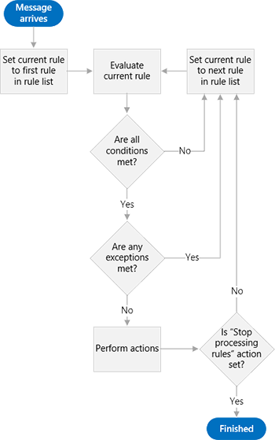
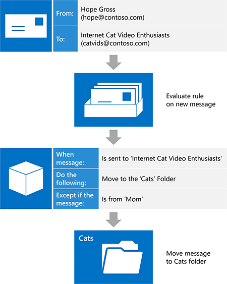

# Inbox management and EWS in Exchange

Find out how you can manage your Inbox in your EWS Managed API or EWS application by using Inbox rules and the blocked senders list.
  
Exchange mailboxes come equipped with features to help users organize their incoming mail automatically. These features all operate on the server without user intervention, but they serve different needs. The EWS Managed API and EWS provide access to these features, enabling your users to manage their Inboxes.
  
**Table 1. Inbox management features**

|**If you want to…**|**Use…**|
|:-----|:-----|
|Take action on incoming messages (such as moving them to another folder or deleting them) based on specific criteria (such as sender, subject, or attachments)    |Inbox rules    |
|Delete all incoming mail from a particular sender    |Blocked Senders List    |
   
## Inbox rules

Let's face it: not every email message is created equal. For every email a user gets from his or her manager, there's one from an Internet cat video distribution list he or she joined years ago and never got around to leaving. While Internet cat videos are entertaining, the amount of traffic that distribution list gets can get out of hand, and important messages can easily be lost in the sea of distribution list mail in an Inbox. Many users turn to Inbox rules to help pare down those messages, and make their Inbox a much nicer place to be. With Exchange Web Services (EWS), your application can bring the power of rules to bear.
  
The EWS Managed API provides the [ExchangeService.GetInboxRules](https://msdn.microsoft.com/library/microsoft.exchange.webservices.data.exchangeservice.getinboxrules%28v=exchg.80%29.aspx) and [ExchangeService.UpdateInboxRules](https://msdn.microsoft.com/library/microsoft.exchange.webservices.data.exchangeservice.updateinboxrules%28v=exchg.80%29.aspx) methods for working with rules. EWS provides the [GetInboxRules](https://msdn.microsoft.com/library/b4b2701a-4a23-4acc-8c75-19f7955ad7ae%28Office.15%29.aspx) and [UpdateInboxRules](https://msdn.microsoft.com/library/f982a237-471e-45c5-a2b5-468cfc53150b%28Office.15%29.aspx) operations for working with rules. However, note that the EWS Managed API and EWS have the following limitations when working with Inbox rules: 
  
- EWS cannot access or create "client-only" rules or rules that are set in Outlook to run "on this computer only".
    
- To change the current set of rules by using EWS, you have to remove the Outlook rules BLOB, if it is present. This means that using EWS to modify rules deletes any rules that were previously turned off (disabled) by using Outlook. 
    
### How do rules work?

The rules engine acts as a gatekeeper to a user's mailbox. As a message arrives in the user's mailbox, but before the message appears in the Inbox, that message is evaluated against an ordered list of rules. Note that this only occurs at arrival time, and only in the Inbox. These rules are comprised of three parts: [Conditions](#bk_Conditions), [Actions](#bk_Actions), and [Exceptions](#bk_Exceptions).
  
Starting with the rule at the top of the rule list, the rules engine performs the following steps until it reaches the end of the list of rules:
  
1. Checks the message to determine whether it meets all the conditions specified in the rule.
    
1. If it meets all the conditions, evaluation continues with step 2.
    
2. If it does not meet all the conditions, the rules engine loads the next rule in the rule list and starts over at step 1.
    
2. Checks the message to determine whether it meets any of the exceptions specified in the rule.
    
1. If it meets any of the exceptions, the rules engine loads the next rule in the rule list and starts over at step 1.
    
2. If it does not meet any of the exceptions, evaluation continues with step 3.
    
3. Performs the actions specified in the rule on the message.
    
1. If the "stop processing more rules" action is specified, the rules engine performs all the other actions on the message, then exits without evaluating any additional rules against the message.
    
2. If the "stop processing more rules" action is not specified, the rules engine loads the next rule in the rule list and starts over at step 1.
    
The following figure shows the process that the rules engine follows.
  
**Figure 1: Rules engine overview**

  
### Putting the pieces together - parts of a rule

One way to visualize the parts of a rule is to imagine that you are giving instructions to someone who is tasked with organizing your incoming email. You might say to this person: "When a message arrives that \<insert conditions here\>, do \<insert actions here\>, unless the message \<insert exceptions here\>. Let's take a closer look at each part.
  
#### Conditions

[Conditions](https://msdn.microsoft.com/library/f049a48c-9585-43f7-8549-0b8cb19a5eea%28Office.15%29.aspx) describe when a rule should be applied. While you can omit the conditions of a rule (resulting in a rule that applies to every message received), it is far more common for rules to have conditions that apply to a subset of incoming messages. Some examples are "when a message is from Sadie" or "when a message is sent to the 'Cat Video Lovers' distribution list". Rules can have multiple conditions. When rules have more than one condition, all the conditions must be met in order for the rules engine to take the specified action. 
  
#### Actions

[Actions](https://msdn.microsoft.com/library/c5aa96b1-2d8b-422f-8c2f-f118572ab23f%28Office.15%29.aspx) describe what happens when a rule applies. Examples are "move the message to the 'Cats' folder" or "mark the message with 'Low' importance". Rules can have multiple actions. When you specify multiple actions for a rule, all the actions are performed when the rule is applied. 
  
#### Exceptions

[Exceptions](https://msdn.microsoft.com/library/7cd63ac2-3441-4ed4-915b-6f90af4b28fc%28Office.15%29.aspx) describe when a rule should not apply, even if the criteria specified in the conditions are met. Examples are "except if the message is sent only to me" or "except if the message is from Mom". A rule can have multiple exceptions. When rules have more than one exception, and any of the exceptions are met, the rule is not applied. 
  
### Example: Herding those cats

Let's take a look at how your users can use rules to eliminate the traffic from that Internet cat video distribution list. Let's assume the following:
  
- These messages are sent to a distribution list called "Internet Cat Video Enthusiasts".
    
- Your users want to read these messages eventually, they just don't want them cluttering their Inbox. They'd rather file them in a folder called "Cats".
    
- Your users want to read messages sent to this distribution list by their mother right away, because Mom sends the funniest videos.
    
This tells the rules engine the following: "When a message arrives that is sent to the 'Internet Cat Video Enthusiasts' distribution list, move it to the 'Cats' folder, unless the message is from Mom." 
  
**Table 2. Rule definition**

|**Rule part**|**Value**|
|:-----|:-----|
|Conditions    |Sent to the 'Internet Cat Video Enthusiasts' distribution list    |
|Actions    |Move the message to the 'Cats' folder    AND stop processing more rules    |
|Exceptions    |From 'Mom'    |
   
> [!NOTE]
> Notice that "stop processing more rules" is one of the actions in the resulting rule. In general it's a good idea to include this action to avoid confusion over which rules act on any given message. However, by omitting this action and properly ordering your rules, you can achieve more advanced processing of your incoming mail. In this case, it's probably a safe bet that Internet cat video messages don't require much in the way of advanced processing. 
  
Shortly after creating this rule, a new message comes in. A coworker Hope sends a message to the distribution list. If we mentally perform the work of the rules engine, the message meets all the conditions (it is sent to 'Internet Cat Videos Enthusiasts'), and it meets none of the exceptions (it isn't from 'Mom'), so the rule applies and the message gets moved to the 'Cats' folder.
  
The following figure shows how the rule is applied to an incoming mail message.
  
**Figure 2. Incoming message is processed by a rule**

  
## Blocking senders

Although you can create a rule that will move all mail from a specific sender to the Junk Mail folder, you can also do this by using the Blocked Senders List in your Junk Email options. Because there is a limit to how many rules a user can have, it makes sense to use the Blocked Senders List. You can [add or remove specific email addresses from the Blocked Senders List](how-to-add-and-remove-email-addresses-from-blocked-senders-list-by-using-ews.md) by using the [ExchangeService.MarkAsJunk](https://msdn.microsoft.com/library/microsoft.exchange.webservices.data.exchangeservice.markasjunk%28v=exchg.80%29.aspx) EWS Managed API method or the [MarkAsJunk](https://msdn.microsoft.com/library/1f71f04d-56a9-4fee-a4e7-d1034438329e%28Office.15%29.aspx) EWS operation. Note that in order for EWS to access the Blocked Senders List, the user's mailbox must contain an email message from the email address that you want to add or remove. 
  
## In this section

- [Manage Inbox rules by using EWS in Exchange](how-to-manage-inbox-rules-by-using-ews-in-exchange.md)
    
- [Add and remove email addresses from the Blocked Senders List by using EWS in Exchange](how-to-add-and-remove-email-addresses-from-blocked-senders-list-by-using-ews.md)
    
## See also

- [Develop web service clients for Exchange](develop-web-service-clients-for-exchange.md)
    
- [GetInboxRules operation](https://msdn.microsoft.com/library/b4b2701a-4a23-4acc-8c75-19f7955ad7ae%28Office.15%29.aspx)
    
- [UpdateInboxRules operation](https://msdn.microsoft.com/library/f982a237-471e-45c5-a2b5-468cfc53150b%28Office.15%29.aspx)
    
- [MarkAsJunk operation](https://msdn.microsoft.com/library/1f71f04d-56a9-4fee-a4e7-d1034438329e%28Office.15%29.aspx)
    

