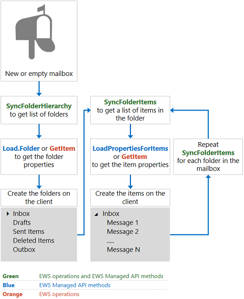
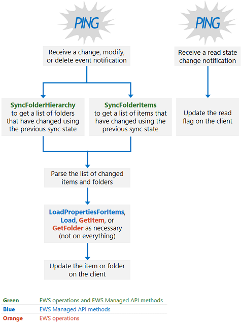

# Mailbox synchronization and EWS in Exchange

Find out how mailbox synchronization works when you use EWS to access Exchange.
  
EWS in Exchange uses two types of synchronization to retrieve mailbox content and changes to mailbox content:
  
- Folder synchronization
- Item synchronization
  
In this article, you'll learn about both types of synchronization, how synchronization works, synchronization design patterns, and synchronization best practices.
  
## Folder and item synchronization

Folder synchronization syncs a folder structure, or folder hierarchy. Item synchronization syncs the items within a folder. When you synchronize items, you have to sync each folder in the mailbox independently. You can use EWS or the EWS Managed API in your application to implement both folder and item synchronization.
  
**Table 1. EWS operations and EWS Managed API methods for syncing folders and items**

|**EWS operation**|**EWS Managed API method**|
|:-----|:-----|
|[SyncFolderHierarchy](https://msdn.microsoft.com/library/b31916b1-bc6c-4451-a475-b7c5417f752d%28Office.15%29.aspx) |[ExchangeService.SyncFolderHierarchy method](https://msdn.microsoft.com/library/microsoft.exchange.webservices.data.exchangeservice.syncfolderhierarchy%28v=exchg.80%29.aspx) |
|[SyncFolderItems](https://msdn.microsoft.com/library/7f0de089-8876-47ec-a871-df118ceae75d%28Office.15%29.aspx) |[ExchangeService.SyncFolderItems method](https://msdn.microsoft.com/library/microsoft.exchange.webservices.data.exchangeservice.syncfolderitems%28v=exchg.80%29.aspx) |

The scope of the synchronization that occurs differs depending on whether it is an initial or an ongoing sync, as follows:
  
- An initial synchronization syncs all folders or items on the server to the client. After the initial synchronization, the client has a sync state that it stores for future synchronizations. The sync state represents all the changes on the server that the server communicated to the client.
- Ongoing synchronizations sync any items or folders that have been added, deleted, or changed since the previous synchronization. The server uses the sync state to calculate the changes to report to the client during each of the ongoing synchronization loops.
  
Each synchronization method or operation returns a list of changes, not the actual folder or message that changed. Changes to items and folders are reported by means of the following change types:
  
- Create — Indicates that a new item or folder should be created on the client.
- Update — Indicates that an item or folder should be changed on the client.
- Delete — Indicates that an item or folder should be deleted on the client.
- ReadStateChange for EWS or ReadFlagChange for the EWS Managed API — Indicates that that the read state of the item has changed, either from unread to read, or read to unread.

In Exchange Online, Exchange Online as part of Office 365, and versions of Exchange starting with Exchange 2010 SP2, items and folders are returned in order from newest to oldest. In previous versions of Exchange, items and folders are returned from oldest to newest.
  
## How does EWS synchronization work?

In a nutshell, if you're synchronizing a mailbox for the first time, use the process as shown in Figure 1. Although you can use other [synchronization design patterns](mailbox-synchronization-and-ews-in-exchange.md#bk_syncpatterns), we recommend this approach for scalable applications.
  
**Figure 1. Initial synchronization design pattern**

  
If you're using an existing sync state on the client to synchronize a mailbox, we recommend that you implement the design pattern as shown in Figure 2.
  
**Figure 2. Ongoing synchronization design pattern**

  
## Synchronization design patterns

You can use one of two synchronization design patterns in your application to keep your mailboxes up to date: notification-based synchronization, or the synchronization-only approach.
  
Notification-based synchronization, as illustrated in [Figure 2](mailbox-synchronization-and-ews-in-exchange.md#bk_howdoesitwork), relies on notifications to alert the client to make a call to the EWS Managed API [SyncFolderItems](https://msdn.microsoft.com/library/microsoft.exchange.webservices.data.exchangeservice.syncfolderitems%28v=exchg.80%29.aspx) or [SyncFolderHierarchy](https://msdn.microsoft.com/library/microsoft.exchange.webservices.data.exchangeservice.syncfolderhierarchy%28v=exchg.80%29.aspx) methods, or the EWS [SyncFolderHierarchy](https://msdn.microsoft.com/library/b31916b1-bc6c-4451-a475-b7c5417f752d%28Office.15%29.aspx) or [SyncFolderItems](https://msdn.microsoft.com/library/7f0de089-8876-47ec-a871-df118ceae75d%28Office.15%29.aspx) operations. This type of synchronization is generally recommended for scalable applications, but it might not be the best approach for everyone. Notification-based synchronization has the following advantage:
  
Notifications are optimized to reduce calls to the backend Exchange database. Event queues and subscriptions are managed by the mailbox server (or the Client Access server in Exchange 2010 and Exchange 2007); however, the management of the events and subscriptions uses fewer resources than the alternative, which is more frequent synchronization calls to the Exchange database. In addition, Exchange has specific [throttling policies](ews-throttling-in-exchange.md) for notifications and subscriptions, to safeguard consumption of resources.
  
However, there are also some drawbacks to using notification-based synchronization:
  
- Notifications are noisy because most scenarios involve multiple notifications for one user intent. This is especially true of the Calendar folder. For example, when a single meeting request is received, multiple item and folder notifications are created, including a notification to create the item and another to modify the item. One way to mitigate this drawback is to build a delay of a few seconds into your [Load](https://msdn.microsoft.com/library/microsoft.exchange.webservices.data.serviceobject.load%28v=exchg.80%29.aspx), [LoadPropertiesForItems](https://msdn.microsoft.com/library/microsoft.exchange.webservices.data.exchangeservice.loadpropertiesforitems%28v=exchg.80%29.aspx), [GetItem](https://msdn.microsoft.com/library/exchange/aa565934%28v=exchg.150%29.aspx.aspx), or [GetFolder](https://msdn.microsoft.com/library/exchange/aa580274%28v=exchg.150%29.aspx.aspx) call. In the case of a meeting request, if you made calls to the **GetItem** operation immediately, you might have one call to create the item and another to modify the item. Instead, by delaying the call, you can call the **GetItem** operation once and get the changes that encompass the creation and the modification of the item at the same time.
- Notifications are queued on the mailbox server and subscriptions are saved on the mailbox server. If the mailbox server that manages the subscription is unavailable, you lose any new notifications, your mailbox won't synchronize, and you'll have to resubscribe to the notifications.
- You'll need to plan for mitigation strategies in the event that notifications fail. In this way, the second approach, the synchronization-only design pattern, is more resilient than notification-based synchronization, because it only requires that the client maintain the sync state — there are no issues with affinity to the mailbox server managing the subscription.
  
If implemented as recommended, the notification-based subscription design pattern relies on:
  
- Notifications to determine  *when*  the data changed.
- The EWS Managed API **SyncFolderHierarchy** or **SyncFolderItems** methods, or the EWS **SyncFolderHierarchy** or **SyncFolderItems** operations to determine  *what*  changed, optimizing the number of sync events returned. Was a new item created, updated, or deleted? That's all you need to know from these methods, don't rely on them for the property list of changes. (Don't do a **GetItem** or **LoadPropertiesForItems** call on all items or folders returned).
- Using the **Load** or **LoadPropertiesForItems** methods in the EWS Managed API, or the EWS **GetItem** operation to determine  *how*  the data changed and to retrieve properties from the server as needed, organizing batched requests based on the amount of data that will be returned. This is followed by a comparison of the properties on the client and those just returned from the server, and ultimately the creation, deletion, or modification of the item or folder on the client.
  
The synchronization-only approach relies entirely on the **SyncFolderItems** and **SyncFolderHierarchy** EWS Managed API methods, or the **SyncFolderHierarchy** or **SyncFolderItems** EWS operations, which you can either call continuously, or as a timed event. There are pros and cons to this option as well. The synchronization-only approach is more resilient because the sync state is stored on the client at the mailbox level and a unique relationship between the sync state and any the mailbox server that maintains the notification subscription is not required. The synchronization approach can survive a mailbox failover because of its independence from the mailbox server. However, the synchronization approach increases latency for the user because items are synchronized on a timed or intermittent basis — not in real time when items arrive. This approach is also more costly, because you're making calls to the Exchange database when it's possible that no changes have occurred.
  
## Synchronization best practices

For highly scalable applications, we recommend that you apply the following best practices to synchronize mailboxes in your application:
  
- When calling the EWS Managed API **SyncFolderItems** or **SyncFolderHierarchy** method use the *IdOnly* value for the *propertySet* parameter, or when using the EWS **SyncFolderHierarchy** or **SyncFolderItems** operations use the **IdOnly** value for the [BaseShape](https://msdn.microsoft.com/library/42c04f3b-abaa-4197-a3d6-d21677ffb1c0%28Office.15%29.aspx) value to reduce calls to the Exchange database. The more properties you request in the property set of the **SyncFolderItems** or **SyncFolderHierarchy** call, the more backend calls are created. A new RPC call is made for every property value requested, whereas only one RPC call is made to retrieve all the **ItemIds** for a request - no matter the number of results to report. So an **IdOnly** request results in one database call, whereas a property bag request for the subject and sender results in three database calls: one for the **Subject**, one for the **Sender**, and one for the **ItemId**.

- Don't call the EWS Managed API **Load** or **LoadPropertiesForItems** methods, or the EWS **GetItem** or **GetFolder** operations, on every item in a synchronization response. Instead, parse the results; look for changes that don't require all the properties to be retrieved, like read state changes. If a response includes a read state change, just update the flag on the client and you're done; no need to get all the item properties. And make sure that you don't duplicate effort by making changes that originated from the same client. For example, if the synchronization response includes the deletion of an item, and the deletion happened on the local client, you don't need to delete the message again or get all the properties for that item.
  
- Avoid getting throttled, by doing the following:
  
  - When you do call the EWS Managed API **LoadPropertiesForItems** method or the EWS **GetItem** operation to get the items in a batch, do not batch too many items in your request; otherwise, you might get [throttled](ews-throttling-in-exchange.md). We recommend that you include 10 items per batch.
  - Don't make too many requests in too short a time. This will also cause throttling, and increase the response time, rather than shorten it.
  - If you are batching items, batch all items with the same values for the **Id** and **ChangeKey** attributes of the [FolderId](https://msdn.microsoft.com/library/00d14e3e-4365-4f21-8f88-eaeea73b9bf7%28Office.15%29.aspx) element.
  - If you do get throttled, stop sending requests. Resending requests will prolong the recovery effort. Instead, wait for the back off time to expire, and then try sending your sync requests again.
- Depending on the type of [notification event](notification-subscriptions-mailbox-events-and-ews-in-exchange.md#bk_eventtypes) received:
  
  - For **NewMail** or **Modified** events, call the EWS Managed API **SyncFolderItems** method or the EWS **SyncFolderItems** operation because notifications do not provide a **ChangeKey**, and notifications do not call out read state changes.
  - For **Deleted** events, if the notification subscription was active before the previous sync, just delete the event locally. You do not need to call the EWS Managed API **SyncFolderItems** method or the EWS **SyncFolderItems** operation immediately after the deletion.
  - If a **Modified** event was caused by a read state change, do not call the EWS Managed API **LoadPropertiesForItems** method or the EWS **GetItem** operation , just change the flag on the item.

- When synchronizing calendar data, proceed as follows:

  - Use an approach similar to notification-based synchronization. Because **SyncFolderItem** does not include any calendaring logic, use the EWS Managed API [FindAppointments](https://msdn.microsoft.com/library/dd633767%28v=exchg.80%29.aspx) method, or the EWS [FindItem operation](https://msdn.microsoft.com/library/ebad6aae-16e7-44de-ae63-a95b24539729%28Office.15%29.aspx) with the [CalendarView](https://msdn.microsoft.com/library/a4a953b8-0710-416c-95ef-59e51eba9982%28Office.15%29.aspx) element to view appointments between two dates, and then call the EWS Managed API **LoadPropertiesForItems** method, or the EWS **GetItem** operation to retrieve the item properties for the calendar item.

  - Do not poll using the EWS Managed API **FindAppointments** method, or the EWS **FindItem** operation with a **CalendarView** element.

- When synchronizing search folders:
  - Use an approach similar to notification-based synchronization.
  - Use notifications to determine when data changes.
  - Because you can't use **SyncFolderItem** in a search folder, use a sorted and paged EWS Managed API [FindItems](https://msdn.microsoft.com/library/microsoft.exchange.webservices.data.exchangeservice.finditems%28v=exchg.80%29.aspx) method, or EWS **FindItem** operation with the [FractionalPageItemView](https://msdn.microsoft.com/library/4111afec-35e7-4c6f-b291-9bbba603f633%28Office.15%29.aspx) and [SortOrder](https://msdn.microsoft.com/library/c2413f0b-8c03-46ae-9990-13338b3c53a6%28Office.15%29.aspx) element set, to determine what changed.

  - Use the EWS Managed API **LoadPropertiesForItems** method or the EWS **GetItem** operation to retrieve data.

## Filtered synchronization

The EWS Managed API **SyncFolderItems** method and the EWS **SyncFolderItems** operation enable you to ignore specific items, based on their ItemIds, by setting the *ignoreItemIds* parameter in the EWS Managed API or the [Ignore](https://msdn.microsoft.com/library/7789eec5-ceec-43f2-84d5-d0d15b734076%28Office.15%29.aspx) element in EWS. This is ideal when, for example, individuals begin to reply all to an email message sent to everyone in the company.
  
You might wonder, can I filter my notifications (and therefore only trigger synchronization) if specific properties change? Although that does seem reasonable, because notification subscriptions are based on the type of change (create, update, delete), and not the property being updated, you cannot filter notifications in this way. Instead, you can do the following:
  
- Use the notification-based subscription design pattern.
- Call the EWS Managed API **SyncFolderItems** and **SyncFolderHierarchy** methods repeatedly with the *propertySet* parameter set to *IdOnly* to make your sync state current. Or if using EWS, call the **SyncFolderHierarchy** and **SyncFolderItems** operations repeatedly with the **BaseShape** value set to **IdOnly**.
- Discard the response (don't parse it or do any property comparisons).
- Use the EWS Managed API **FindItems** method or the EWS **FindItem** operation and sort and page to prepopulate the items in the filtered scope that you care about.
- Use your synchronization state to continue to call the EWS Managed API **SyncFolderItems** method or the EWS **SyncFolderItems** operation, but only monitor the changes in the filtered item set. If new items are created, you'll have to see if those new items are within your filtered scope.
  
## In this section

- [Synchronize folders by using EWS in Exchange](how-to-synchronize-folders-by-using-ews-in-exchange.md)
- [Synchronize items by using EWS in Exchange](how-to-synchronize-items-by-using-ews-in-exchange.md)
- [Handling synchronization-related errors in EWS in Exchange](handling-synchronization-related-errors-in-ews-in-exchange.md)

## See also

- [Develop web service clients for Exchange](develop-web-service-clients-for-exchange.md)
- [SyncFolderItems method](https://msdn.microsoft.com/library/microsoft.exchange.webservices.data.exchangeservice.syncfolderitems%28v=exchg.80%29.aspx)
- [SyncFolderHierarchy method](https://msdn.microsoft.com/library/microsoft.exchange.webservices.data.exchangeservice.syncfolderhierarchy%28v=exchg.80%29.aspx)
- [SyncFolderHierarchy operation](https://msdn.microsoft.com/library/b31916b1-bc6c-4451-a475-b7c5417f752d%28Office.15%29.aspx)
- [SyncFolderItems operation](https://msdn.microsoft.com/library/7f0de089-8876-47ec-a871-df118ceae75d%28Office.15%29.aspx)
