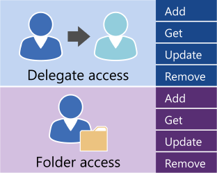

# Managing user access by using EWS in Exchange

Find out what your options are for managing user account access to your Exchange server.
  
Exchange Web Services (EWS) and the EWS managed API provide a limited number of operations that you can use to manage accounts on Exchange Online, Exchange Online as part of Office 365, or a version of Exchange starting with Exchange 2013. You can use the operations shown in the following figure to manage delegates and to set folder access permissions for other accounts. 
  
**EWS operations for delegate and folder access**

  
If your application needs additional control over the accounts on an Exchange server, you can use Exchange Management Shell cmdlets to manage the accounts. You can call the Exchange Management Shell cmdlets by doing one of the following:
  
- Writing an application using C# or Visual Basic that calls the Exchange Management Shell cmdlets. You can look at the sample code in the [Exchange Management Shell API documentation](../management/exchange-management-shell.md) to learn how to call a cmdlet. 
    
- Using Windows PowerShell and Windows PowerShell scripts to call Exchange Management Shell cmdlets. You can find a complete list of the [Exchange Server PowerShell (Exchange Management Shell)](/powershell/exchange/exchange-server/exchange-management-shell?view=exchange-ps), along with examples that show how to use them. 
    
## See also

- [Setting up your EWS application](setting-up-your-ews-application.md)   
- [Exchange 2013 Cmdlets](/powershell/exchange/?view=exchange-ps)  
