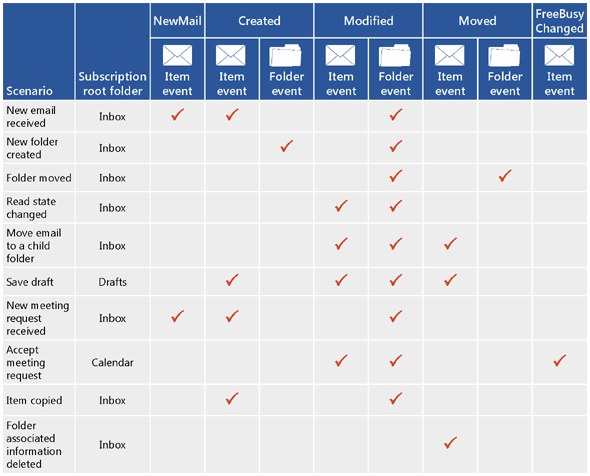
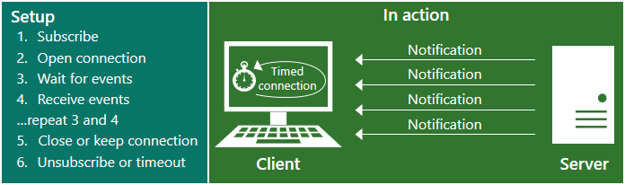
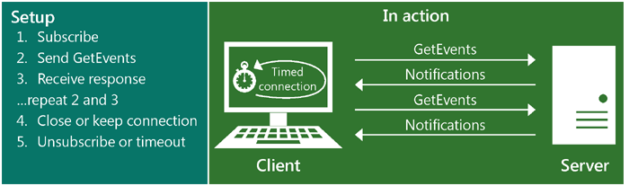
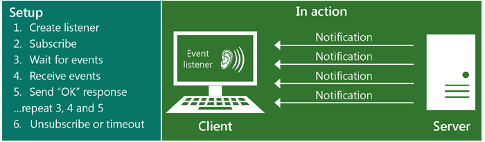

# Notification subscriptions, mailbox events, and EWS in Exchange

Find out about notification subscriptions and mailbox event in EWS in Exchange.
  
You can use both the EWS Managed API and Exchange Web Services (EWS) to subscribe to receive notifications when events occur in a mailbox, or in one or more of the folders in a mailbox. Three subscription types are available: streaming notifications, pull notifications, and push notifications. Each of these subscription types uses different techniques to receive or retrieve the notifications.
  
## Getting notifications - what are my options?

EWS includes three subscription types that work independently to notify the client of changes on the server. No matter which subscription type you choose, you'll have access to all the same notification events in the end - it's just a matter of how you get them.
  
**Table 1. Subscription types**

|**Option**|**Description**|**Is it right for me?**|
|:-----|:-----|:-----|
|Streaming notifications    |Notifications that are sent by the server through a connection that remains open for a specified period of time.    |Streaming notifications are generally recommended for most applications. They're similar to pull and push notifications, and offer the best of both worlds. After you establish your notification subscription, the connection remains open for up to 30 minutes to allow the server to push notifications back to the client. No need to request updates, like you would with a pull subscription, and you don't have to create a web service listener application like you would with a push subscription.    |
|Pull notifications    |Notifications that are requested (or pulled) by the client.    |Pull notifications are generally most appropriate for loosely coupled clients, where the client is not reliably connected to the network. Pull notifications can create excess traffic between the client and the server because the client is sending frequent requests to the server to retrieve notifications, and not all requests result in notifications retrieved.    |
|Push notifications    |Notifications that are sent (or pushed) by the server to a client-side web service via a callback address.    |Generally, push notifications provide for smaller notification latency than pull notifications and are suited for tightly coupled clients to which the server has reliable access and the client is IP addressable. However, push notifications have fallen out of favor since the advent of streaming notifications in Exchange 2010. If possible, we recommend that you use streaming notifications instead of push notifications going forward. Push notifications require that you write a listener application, which is where the notifications are pushed to. This has a slight benefit over pull notifications in that it reduces wire traffic, but it adds overhead by requiring a separate application.    |
   
## What EWS events can I subscribe to?

The types of EWS events that clients subscribe to are defined by the [EventType](https://msdn.microsoft.com/library/microsoft.exchange.webservices.data.eventtype%28v=exchg.80%29.aspx) enumeration for the EWS Managed API or the [EventType](https://msdn.microsoft.com/library/04b70f9e-c226-4130-958e-0db0275cf58b%28Office.15%29.aspx) element for EWS. The following EWS events are available for subscription: 
  
- NewMail — A new message arrived in the Inbox.
    
- Deleted — A message was hard deleted from the Inbox. To learn more about deleted item notifications, see [Deleting items by using EWS in Exchange](deleting-items-by-using-ews-in-exchange.md) and [Pull notifications for EWS deletion-related mailbox events in Exchange](pull-notifications-for-ews-deletion-related-mailbox-events-in-exchange.md).
    
- Modified — An item or folder was changed.
    
- Moved — An item or folder was moved. 
    
- Copied — An item or folder was copied.
    
- Created — An item or folder was created. 
    
- FreeBusyChanged — A user's free busy information has been changed.
    
Another EWS event type, the Status event, is defined by the [EventType](https://msdn.microsoft.com/library/microsoft.exchange.webservices.data.eventtype%28v=exchg.80%29.aspx) element, but you don't subscribe to this event. Instead, it's sent by the server to check the status of the client for streaming and push notifications only. The client needs to respond to this event or the client will time out. 
  
A single user action often results in the creation of multiple notifications. To illustrate this, the following figure shows some common scenarios and the notifications created for each one. Client settings have an impact on the notifications received, so this is not an exhaustive list of all the configuration options and resulting notifications.
  
**Figure 1. Event types returned by notification subscriptions**

  
Figure 1 simplifies the notification process. In reality, multiple notifications (even multiple notifications of the same type) can be created for a single user action. For example, in the case of a folder move operation, three folder events are created: one for the folder being modified, one for the old parent folder, and one for the new parent folder. Because numerous events can be fired for a single operation, we recommend that you [build a wait time of a few seconds into your synchronization operations](mailbox-synchronization-and-ews-in-exchange.md#bk_bestpractices), so that you only synchronize when the action is complete, instead of partway through the operation.
  
It's also important to realize that the configuration settings that each user chooses will affect which notifications are created. For example, some users' free busy data is updated automatically and the FreeBusyChanged event is created when a new meeting request is received, even before they've read the item. For other users, free busy data isn't updated and the FreeBusyChanged event isn't created until after the meeting has been accepted. These settings can have a considerable impact on the notifications created by the server.
  
## How do EWS notifications work?

EWS notifications are handled on a subscription basis. Typically there's one subscription per mailbox, and within the mailbox subscription you can subscribe to some or all folders. You decide what kind of notification to subscribe to (streaming, pull, or push) and what kind of events you'd like to receive (NewMail, Created, Deleted, Modified, etc.), and then you create a subscription. The EWS events are then sent asynchronously from the mailbox server to the client. (History lesson: events are synchronous in Exchange 2007 - and events are stored on the Client Access server in Exchange 2010, but no more!).
  
Depending on the type of subscription you have, the ways in which the notifications are sent to the client vary. This section describes how each type of subscription works in more detail.
  
### EWS streaming notifications

Streaming notifications rely on a hanging get request on the server to keep a streaming subscription connection open, so that any events that occur while the connection is active are streamed to the client immediately. Multiple notifications can be sent over the course of a single connection, and the connection stays open until the interval expires, or for a maximum of 30 minutes. After the connection expires, the client sends the hanging get request again. Figure 2 shows how streaming subscriptions and streaming notifications work.
  
**Figure 2. Streaming notification overview**

  
For information about creating streaming notifications, see [Stream notifications about mailbox events by using EWS in Exchange](how-to-stream-notifications-about-mailbox-events-by-using-ews-in-exchange.md).
  
### EWS pull notifications

Pull notifications rely on the client asking for the notifications on an interval that the client manages. This can result in GetEvents responses with no notifications. Figure 3 shows how pull subscriptions and pull notifications work.
  
**Figure 3. Pull notification overview**

  
For information about creating pull notifications, see [Pull notifications about mailbox events by using EWS in Exchange](how-to-pull-notifications-about-mailbox-events-by-using-ews-in-exchange.md).
  
### EWS push notifications

Push notifications rely on the server pushing notifications back to the client. There's only traffic if there's a notification. Figure 4 shows how push subscriptions and push notifications work.
  
**Figure 4. Push notification overview**

If you are using [push notifications with Exchange 2010](https://msdn.microsoft.com/library/db1f8523-fa44-483f-bdb6-ab5939b52eee%28Office.15%29.aspx), consider upgrading your application to [use streaming notifications](https://code.msdn.microsoft.com/exchange/Exchange-2013-Set-push-82738cc5), so that you don't need a separate application to receive the events.

  
## How do I subscribe to notifications?

Depending on the type of subscription you'd like to create, you have a number of options to choose from for subscribing to notifications.
  
**Table 2. Operations and methods for subscribing to notifications**

|**Subscription type**|**EWS operation**|**EWS Managed API methods**|**What it does**|
|:-----|:-----|:-----|:-----|
|Streaming    |[Subscribe operation](https://msdn.microsoft.com/library/f17c3d08-c79e-41f1-ba31-6e41e7aafd87%28Office.15%29.aspx)   |[ExchangeService.BeginSubscribeToStreamingNotifications method](https://msdn.microsoft.com/library/microsoft.exchange.webservices.data.exchangeservice.beginsubscribetostreamingnotifications%28v=exchg.80%29.aspx)   [ExchangeService.BeginSubscribeToStreamingNotificationsOnAllFolders method](https://msdn.microsoft.com/library/microsoft.exchange.webservices.data.exchangeservice.beginsubscribetostreamingnotificationsonallfolders%28v=exchg.80%29.aspx)   [ExchangeService.SubscribeToStreamingNotificationsOnAllFolders method](https://msdn.microsoft.com/library/microsoft.exchange.webservices.data.exchangeservice.subscribetostreamingnotifications%28v=exchg.80%29.aspx)   |Creates a request to subscribe to streaming notifications.    |
|Pull    |[Subscribe operation](https://msdn.microsoft.com/library/f17c3d08-c79e-41f1-ba31-6e41e7aafd87%28Office.15%29.aspx)   |[ExchangeService.BeginSubscribeToPullNotifications method](https://msdn.microsoft.com/library/microsoft.exchange.webservices.data.exchangeservice.beginsubscribetopullnotifications%28v=exchg.80%29.aspx)   [ExchangeService.BeginSubscribeToPullNotificationsOnAllFolders method](https://msdn.microsoft.com/library/microsoft.exchange.webservices.data.exchangeservice.beginsubscribetopullnotificationsonallfolders%28v=exchg.80%29.aspx)   [ExchangeService.SubscribeToPullNotifications method](https://msdn.microsoft.com/library/microsoft.exchange.webservices.data.exchangeservice.subscribetopullnotifications%28v=exchg.80%29.aspx)   [ExchangeService.SubscribeToPullNotificationsOnAllFolders method](https://msdn.microsoft.com/library/microsoft.exchange.webservices.data.exchangeservice.subscribetopullnotificationsonallfolders%28v=exchg.80%29.aspx)   |Creates a request to subscribe to pull notifications.    |
|Push    |[Subscribe operation](https://msdn.microsoft.com/library/f17c3d08-c79e-41f1-ba31-6e41e7aafd87%28Office.15%29.aspx)   |[ExchangeService.BeginSubscribeToPushNotifications overloaded method](https://msdn.microsoft.com/library/microsoft.exchange.webservices.data.exchangeservice.beginsubscribetopushnotifications%28v=exchg.80%29.aspx)   [ExchangeService.BeginSubscribeToPushNotificationsOnAllFolders overload method](https://msdn.microsoft.com/library/microsoft.exchange.webservices.data.exchangeservice.beginsubscribetopushnotificationsonallfolders%28v=exchg.80%29.aspx)   [ExchangeService.SubscribeToPushNotifications overloaded method](https://msdn.microsoft.com/library/microsoft.exchange.webservices.data.exchangeservice.subscribetopushnotifications%28v=exchg.80%29.aspx)   [ExchangeService.SubscribeToPushNotificationsOnAllFolders overloaded method](https://msdn.microsoft.com/library/microsoft.exchange.webservices.data.exchangeservice.subscribetopushnotificationsonallfolders%28v=exchg.80%29.aspx)   |Creates a request to subscribe to push notifications.    |
   
## How do I get EWS events?

After the subscription is created, the way in which the actual events are sent to the client depends on the subscription type. 
  
For streaming notifications, a streaming subscription connection must be created, and then the subscription is added to the connection. You can read more about this process in [Stream notifications about mailbox events by using EWS in Exchange](how-to-stream-notifications-about-mailbox-events-by-using-ews-in-exchange.md). 
  
For pull notifications, the subscription object was initialized when the subscription was created, so you just have to call the **GetEvent** method or operation to retrieve the events from the server. You can read more about this in [Pull notifications about mailbox events by using EWS in Exchange](how-to-pull-notifications-about-mailbox-events-by-using-ews-in-exchange.md). 
  
The following table lists the operations and classes required to retrieve events. 
  
**Table 3. Elements and classes for creating a connection and getting events**

|**Subscription type**|**EWS operation**|**EWS Managed API method**|**What it does**|
|:-----|:-----|:-----|:-----|
|Streaming    |[GetStreamingEvents operation](https://msdn.microsoft.com/library/8da95423-72bc-4034-90a8-162eedcd059b%28Office.15%29.aspx)   |[StreamingSubscriptionConnection.AddSubscription method](https://msdn.microsoft.com/library/microsoft.exchange.webservices.data.streamingsubscriptionconnection.addsubscription%28v=exchg.80%29.aspx)   |Creates a hanging get request on the server, which is responded to when events occur.    |
|Pull    |[GetEvents operation](https://msdn.microsoft.com/library/f268efe5-9a1a-41a2-b6a6-51fcde7720a1%28Office.15%29.aspx)   |[PullSubscription.GetEvents method](https://msdn.microsoft.com/library/microsoft.exchange.webservices.data.pullsubscription.getevents%28v=exchg.80%29.aspx)   |Gets pull notification events from the server.    |
|Push    |Not applicable.    |Not applicable.    |Push notifications are automatically sent to the web service listener (the callback URL specified in the subscription request). No additional methods or operations need to be called.    |
   
## How do I unsubscribe to notifications?

The following table lists the ways in which you can unsubscribe to each type of subscription.
  
**Table 4. Operations and methods for unsubscribing to notifications**

|**Subscription type**|**EWS**|**EWS Managed API**|
|:-----|:-----|:-----|
|Streaming    |[Unsubscribe operation](https://msdn.microsoft.com/library/994a9d2b-1501-4804-90f0-12bd914496ec%28Office.15%29.aspx)   |[StreamingSubscription.BeginUnsubscribe method](https://msdn.microsoft.com/library/microsoft.exchange.webservices.data.streamingsubscription.beginunsubscribe%28v=exchg.80%29.aspx)   [StreamingSubscription.EndUnsubscribe method](https://msdn.microsoft.com/library/microsoft.exchange.webservices.data.streamingsubscription.endunsubscribe%28v=exchg.80%29.aspx)   [StreamingSubscription.Unsubscribe method](https://msdn.microsoft.com/library/microsoft.exchange.webservices.data.streamingsubscription.unsubscribe%28v=exchg.80%29.aspx)   |
|Pull    |[Unsubscribe operation](https://msdn.microsoft.com/library/994a9d2b-1501-4804-90f0-12bd914496ec%28Office.15%29.aspx)   |[PullSubscription.BeginUnsubscribe method](https://msdn.microsoft.com/library/microsoft.exchange.webservices.data.pullsubscription.beginunsubscribe%28v=exchg.80%29.aspx)   [PullSubscription.EndUnsubscribe method](https://msdn.microsoft.com/library/microsoft.exchange.webservices.data.pullsubscription.endunsubscribe%28v=exchg.80%29.aspx)   [PullSubscription.Unsubscribe method](https://msdn.microsoft.com/library/microsoft.exchange.webservices.data.pullsubscription.unsubscribe%28v=exchg.80%29.aspx)   |
|Push    |Return **Unsubscribe** in the [StatusFrequency](https://msdn.microsoft.com/library/917474e2-a426-4166-b825-53783a41dad4%28Office.15%29.aspx) element of the [SendNotificationResponseMessage](https://msdn.microsoft.com/library/2c6d681b-67ac-4331-bc6b-a2e709b638e3%28Office.15%29.aspx)   |Not applicable. Let the subscription time out instead.    |
   
Alternatively, you can let each of the subscriptions time out. 
  
**Table 5. Subscription time-outs**

|**Subscription type**|**Timeout value in EWS**|**Timeout value in the EWS Managed API**|**Timeout handling**|
|:-----|:-----|:-----|:-----|
|Streaming    |[ConnectionTimeout](https://msdn.microsoft.com/library/14da68a0-bcca-4281-a774-47644baa4ee9%28Office.15%29.aspx) element    | *lifetime*  parameter of the [StreamingSubscriptionConnection](https://msdn.microsoft.com/library/microsoft.exchange.webservices.data.streamingsubscriptionconnection.streamingsubscriptionconnection%28v=exchg.80%29.aspx) constructor    |For the EWS Managed API, after the timeout value elapses, the [OnDisconnect](https://msdn.microsoft.com/library/microsoft.exchange.webservices.data.streamingsubscriptionconnection.ondisconnect%28v=exchg.80%29.aspx) event is raised. If the [StreamingSubscriptionConnection.Open](https://msdn.microsoft.com/library/microsoft.exchange.webservices.data.streamingsubscriptionconnection.open%28v=exchg.80%29.aspx) method is not called, the connection is closed.    For EWS, after the timeout value elapses, the [GetUserConfigurationResponse](https://msdn.microsoft.com/library/5e418c91-c836-4de0-a80d-f0dad0c684d7%28Office.15%29.aspx) message returns a [ConnectionStatus](https://msdn.microsoft.com/library/4300f9d6-8bf9-48c2-9f07-d80197864e17%28Office.15%29.aspx) value of Closed.    |
|Pull    |[Timeout](https://msdn.microsoft.com/library/c2e1ca5a-6667-4f6f-aac4-89de33bddc54%28Office.15%29.aspx) element    | *timeout*  parameter of the [SubscribeToPullNotification](https://msdn.microsoft.com/library/microsoft.exchange.webservices.data.exchangeservice.subscribetopullnotifications%28v=exchg.80%29.aspx) method    |After the timeout value elapses, the server deletes the subscription.    |
|Push    |[StatusFrequency](https://msdn.microsoft.com/library/917474e2-a426-4166-b825-53783a41dad4%28Office.15%29.aspx) element    | *frequency*  parameter of the [SubscribeToPushNotification](https://msdn.microsoft.com/library/microsoft.exchange.webservices.data.exchangeservice.subscribetopushnotifications%28v=exchg.80%29.aspx) method    |If the server does not receive a response to a push notification or status ping, it retries sending the notification several times before it stops sending the notifications. For more information, see [StatusFrequency](https://msdn.microsoft.com/library/917474e2-a426-4166-b825-53783a41dad4%28Office.15%29.aspx).    |
   
## Can I limit subscriptions?

In an on-premises deployment, you can limit the number of subscriptions per user with the [EwsMaxSubscriptions throttling parameter](ews-throttling-in-exchange.md) of the throttling policy. That policy can be applied to all users or just specific users. The **EwsMaxSubscriptions** throttling policy is not configurable for Exchange Online. 
  
## In this section

- [Stream notifications about mailbox events by using EWS in Exchange](how-to-stream-notifications-about-mailbox-events-by-using-ews-in-exchange.md)    
- [Pull notifications about mailbox events by using EWS in Exchange](how-to-pull-notifications-about-mailbox-events-by-using-ews-in-exchange.md)    
- [Maintain affinity between a group of subscriptions and the Mailbox server in Exchange](how-to-maintain-affinity-between-group-of-subscriptions-and-mailbox-server.md)    
- [Handling notification-related errors in EWS in Exchange](handling-notification-related-errors-in-ews-in-exchange.md)
    
## See also

- [Develop web service clients for Exchange](develop-web-service-clients-for-exchange.md)
- [Web services reference for Exchange](../web-service-reference/web-services-reference-for-exchange.md)
- [Start using web services in Exchange](start-using-web-services-in-exchange.md)
- [Mailbox synchronization and EWS in Exchange](mailbox-synchronization-and-ews-in-exchange.md)
- [Push Notification Sample Application](https://msdn.microsoft.com/library/db1f8523-fa44-483f-bdb6-ab5939b52eee%28Office.15%29.aspx)
