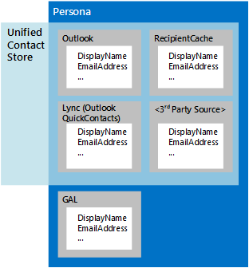

# People and contacts in EWS in Exchange

Learn about personas, the Unified Contact Store, and how to work with contacts by using the EWS Managed API or EWS in Exchange. 
  
Contacts are items in Exchange that store information about an individual, group, or organization. Contacts can include names and email addresses, and other information, including IM addresses, physical addresses, birthdays, family information, and a photo or image that represents the contact.
  
Contact information is stored in one of two places:
  
- Active Directory Domain Services (AD DS), if the contact is within the organization.
    
- The Contacts folder or another folder in a user's mailbox, if the contact is outside the organization.
    
Multiple contact items can represent a single individual. Exchange uses personas to help bring these different contact items together. A  *persona*  is an aggregation of contact information for the same individual from different sources. In addition to contact information in Exchange, personas can also be aggregated from information in the recipient cache for the mailbox, a hidden folder for IM contacts called QuickContacts, and from third-party data sources. The Unified Contact Store in Exchange enables IM clients to use this aggregation; the only difference is that the Unified Contact Store does not aggregate information from AD DS, as shown in Figure 1. 
  
**Figure 1. Contact information sources for personas and for the Unified Contact Store**

  
**Table 1. EWS Managed API methods and EWS operations for working with contacts**

|**If you want to…**|**Use this EWS Managed API method**|**Use this EWS operation**|
|:-----|:-----|:-----|
|Create a new contact    |Instantiate a new [Contact](https://msdn.microsoft.com/library/office/microsoft.exchange.webservices.data.contact%28v=exchg.80%29.aspx) object, and use [Contact.Save](https://msdn.microsoft.com/library/office/microsoft.exchange.webservices.data.contact.save%28v=exchg.80%29.aspx)   |[CreateItem](https://msdn.microsoft.com/library/417e994b-0a17-4c24-9527-04796b80b029%28Office.15%29.aspx)   |
|Copy a contact    |[Contact.Copy](https://msdn.microsoft.com/library/office/microsoft.exchange.webservices.data.contact.copy%28v=exchg.80%29.aspx)   |[CopyItem](https://msdn.microsoft.com/library/bcc68f9e-d511-4c29-bba6-ed535524624a%28Office.15%29.aspx)   |
|Move a contact    |[Contact.Move](https://msdn.microsoft.com/library/office/microsoft.exchange.webservices.data.contact.move%28v=exchg.80%29.aspx)   |[MoveItem](https://msdn.microsoft.com/library/dcf40fa7-7796-4a5c-bf5b-7a509a18d208%28Office.15%29.aspx)   |
|Update an existing contact    |[Contact.Bind](https://msdn.microsoft.com/library/office/microsoft.exchange.webservices.data.contact.bind%28v=exchg.80%29.aspx) and [Contact.Update](https://msdn.microsoft.com/library/office/microsoft.exchange.webservices.data.contact.update%28v=exchg.80%29.aspx)   |[UpdateItem](https://msdn.microsoft.com/library/298fdd71-a83d-4407-9728-4f0a8e2d857c%28Office.15%29.aspx)   |
|Delete a contact    |[Contact.Bind](https://msdn.microsoft.com/library/office/microsoft.exchange.webservices.data.contact.bind%28v=exchg.80%29.aspx) and [Contact.Delete](https://msdn.microsoft.com/library/office/microsoft.exchange.webservices.data.contact.delete%28v=exchg.80%29.aspx)   |[DeleteItem](../web-service-reference/deleteitem-operation.md)   |
|Search for a contact    |[ExchangeService.FindItems](https://msdn.microsoft.com/library/office/microsoft.exchange.webservices.data.exchangeservice.finditems%28v=exchg.80%29.aspx)   |[FindItem](https://msdn.microsoft.com/library/ebad6aae-16e7-44de-ae63-a95b24539729%28Office.15%29.aspx)   |
|Search for people    |N/A    |[FindPeople](https://msdn.microsoft.com/library/446106b7-ff2d-4107-90c1-29f4d38ba128%28Office.15%29.aspx)   |
|Expand a distribution group    |[ExchangeService.ExpandGroup](https://msdn.microsoft.com/library/office/microsoft.exchange.webservices.data.exchangeservice.expandgroup%28v=exchg.80%29.aspx)   |[ExpandDL](https://msdn.microsoft.com/library/1f7837e7-9eff-4e10-9577-c40f7ed6af94%28Office.15%29.aspx)   |
|Resolve an ambiguous name    |[ExchangeService.ResolveName](https://msdn.microsoft.com/library/office/microsoft.exchange.webservices.data.exchangeservice.resolvename%28v=exchg.80%29.aspx)   |[ResolveNames](https://msdn.microsoft.com/library/6b4eb4b3-9ad6-4804-a09f-7e20cfea4dbb%28Office.15%29.aspx)   |
|Get a persona    |N/A    |[GetPersona](https://msdn.microsoft.com/library/e2146df0-53d0-4caf-9758-b600bbc14b6a%28Office.15%29.aspx)   |
|Work with contact photos    |[Contact.SetContactPicture](https://msdn.microsoft.com/library/office/microsoft.exchange.webservices.data.contact.setcontactpicture%28v=exchg.80%29.aspx), [Contact.GetContactPictureAttachment](https://msdn.microsoft.com/library/office/microsoft.exchange.webservices.data.contact.getcontactpictureattachment%28v=exchg.80%29.aspx), or [Contact.RemoveContactPicture](https://msdn.microsoft.com/library/office/microsoft.exchange.webservices.data.contact.setcontactpicture%28v=exchg.80%29.aspx)   |[GetUserPhoto](https://msdn.microsoft.com/library/f6e8143d-4235-428e-8f9c-ab6e9b1cfa6e%28Office.15%29.aspx) or [GetAttachment](https://msdn.microsoft.com/library/24d10a15-b942-415e-9024-a6375708f326%28Office.15%29.aspx)   |
   
## Personas

Until recently, contacts were commonly stored in a single location — typically, on an email client. Today, it is becoming more common to store contacts in many different locations, such as on a phone, on a social networking site, in a Contacts folder in an Exchange mailbox, or in an organization's directory service. With the proliferation of contact information, it's possible that multiple contacts that represent the same person contain different information; for example, one contact might include a business phone number and another a personal phone number, or a contact stored in a Contacts folder might have a different name than the contact for the same person that is stored on your phone.
  
In Exchange Online, Exchange Online as part of Office 365, and on-premises versions of Exchange starting with Exchange 2013, contacts from different sources that represent the same person are associated with one another, similar to the way that email messages are aggregated into conversations, by means of a common link ID. When aggregated contact information is returned by an Exchange server, it includes a set of attributes for each contact, such as a source folder, a display name, an ID, and a source ID. The sum of the properties and attributes returned is known as a persona, and the set of properties returned is referred to as the [persona's shape](https://msdn.microsoft.com/library/61d87cd5-3270-40d1-bab7-d0d5bf938607%28Office.15%29.aspx).
  
Because the information that makes up a persona is not stored in a single location, and because that information can change at any time, a persona is created only when you make a request to an Exchange server. You use the [FindPeople](https://msdn.microsoft.com/library/446106b7-ff2d-4107-90c1-29f4d38ba128%28Office.15%29.aspx) EWS operation to make a persona search request. Your request can include a sort order, and can be filtered according to a query string to help you find the correct persona by ordering and filtering the results. For example, you can retrieve the display name and a set of all email addresses that are associated with a specific contact from the Contacts folder, a Hotmail account, a LinkedIn account, and a company's directory service, or you can retrieve a set of all personas that have IM addresses. The linking of contacts into personas is automatic based on an algorithm that recognizes a relationship between contacts stored on various devices. 
  
> [!NOTE]
> The EWS Managed API does not implement this functionality. 
  
**Table 2. EWS operations for working with personas**

|**Operation name**|**Description**|
|:-----|:-----|
|[FindPeople](https://msdn.microsoft.com/library/446106b7-ff2d-4107-90c1-29f4d38ba128%28Office.15%29.aspx)   |Returns all available personas from a specified contacts folder or retrieves contacts that match a specified query string.    |
|[GetPersona](https://msdn.microsoft.com/library/e2146df0-53d0-4caf-9758-b600bbc14b6a%28Office.15%29.aspx)   |Returns a set of properties associated with a specific persona, such as all the IM addresses or display names for a specified persona ID.    |
   
You can use the **GetPersona** and **FindPeople** operations to efficiently retrieve contact information from multiple sources. Because all items related to a persona are associated with a link ID, you can use these operations in a wide variety of applications that use contact data. The following are some examples: 
  
- A mobile phone app that uses the **GetPersona** operation when a user calls a contact, and then offers additional phone numbers to call if no one answers. 
    
- An application that uses the **FindPeople** operation to scan Inbox messages for email addresses to determine whether they are found in an existing persona. Addresses that are not already associated with a persona can be used to create sales leads or list all recent communications with the person represented by that persona. 
    
- [A mail app for Outlook](mail-apps-for-outlook-and-ews-in-exchange.md) that offers different salutations based on whether correspondence is formal or informal. Formal salutations are supplied by the display names from the directory service and informal salutations come from the display name that originates in social network contacts. 
    
## Unified Contact Store

Personas aren't just limited to an email client. If you're developing an IM client, you might ask yourself any or all of the following:
  
- How can I provision Lync client applications with a default set of IM contact items?
    
- How do I manage IM contact and group lists?
    
- How do I manage custom Lync client access to IM contacts and IM groups?
    
The Unified Contact Store works behind the scenes in Exchange to aggregate contact data from Exchange and other sources into a single entity, or persona. Although the EWS operations that you use to access the Unified Contact Store are specific to IM contacts, You can use the Unified Contact Store in Exchange to work with personas in all types of applications. Keep in mind that the Unified Contact Store cannot access contact data AD DS.
  
IM contacts are stored in a hidden folder called QuickContacts. You can use the **AddNewImContactToGroup** and **AddImContactToGroup** operations to add contacts to groups that are stored in this hidden folder. And because you can use the Unified Contact Store to group IM contacts, you can access and update groups of contacts more easily. 
  
> [!NOTE]
> The EWS Managed API does not implement this functionality. 
  
**Table 3. EWS operations for accessing the Unified Contact Store**

|**Operation name**|**Description**|
|:-----|:-----|
|[AddNewImContactToGroup](https://msdn.microsoft.com/library/0cb5525f-faa3-48f1-9551-df55ffc26f46%28Office.15%29.aspx)   |Adds a new IM contact to an IM group, up to a maximum of 1000 contacts.    |
|[AddImContactToGroup](https://msdn.microsoft.com/library/376acc42-2684-4596-aca1-82a4a10865c9%28Office.15%29.aspx)   |Adds an existing IM contact to an IM group, up to a maximum of 1000 contacts.    |
|[AddImGroup](https://msdn.microsoft.com/library/6df6e504-b7c8-4773-b10f-ffa5defac229%28Office.15%29.aspx)   |Adds a new IM group, up to a maximum of 64 groups.    |
|[AddDistributionGroupToImList](https://msdn.microsoft.com/library/5aa9bec8-71cf-4a6e-8ec8-b4965b40fd4a%28Office.15%29.aspx)   |Adds a new distribution group to an IM group, up to a maximum of 64 groups.    |
|[GetImItemList](https://msdn.microsoft.com/library/e31d14e1-0c1f-4b69-98b7-157d59c13698%28Office.15%29.aspx)   |Retrieves a list of IM groups and IM contact personas.    |
|[GetImItems](https://msdn.microsoft.com/library/51186691-46d2-4d5c-b8bc-4ee2bb20fbe7%28Office.15%29.aspx)   |Retrieves information about specific IM groups and IM contact personas.    |
|[RemoveContactFromImList](https://msdn.microsoft.com/library/28ec96c3-45af-48ff-9f17-718a527dc0ad%28Office.15%29.aspx)   |Removes a contact from an IM group.    |
|[RemoveImContactFromGroup](https://msdn.microsoft.com/library/a190bbec-c71b-4e6a-880b-55854c724d8c%28Office.15%29.aspx)   |Removes an IM contact from an IM group.    |
|[RemoveDistributionGroupFromImList](https://msdn.microsoft.com/library/252bddf2-98b6-4824-b548-2fba2bda5384%28Office.15%29.aspx)   |Removes a distribution group from an IM group.    |
|[RemoveImGroup](https://msdn.microsoft.com/library/5e788016-68e0-4a3f-9243-03f6b6c6b389%28Office.15%29.aspx)   |Removes an IM group.    |
|[SetImGroup](https://msdn.microsoft.com/library/2d48aa07-8152-4c3d-a519-061253e80174%28Office.15%29.aspx)   |Changes the display name of an IM group.    |
   
## In this section

- [Process contacts in batches by using EWS in Exchange](how-to-process-contacts-in-batches-by-using-ews-in-exchange.md)
    
- [Resolve ambiguous names by using EWS in Exchange 2013](how-to-resolve-ambiguous-names-by-using-ews-in-exchange-2013.md)
    
- [Get user photos by using EWS in Exchange](how-to-get-user-photos-by-using-ews-in-exchange.md)
    
## See also

- [Develop web service clients for Exchange](develop-web-service-clients-for-exchange.md)
    
- [Start using web services in Exchange](start-using-web-services-in-exchange.md)
    
- [EWS client design overview for Exchange](ews-client-design-overview-for-exchange.md)
    

