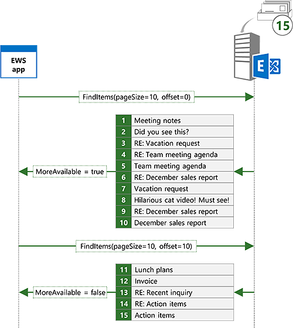

# Search and EWS in Exchange

Find out how to search for items in Exchange by using the EWS Managed API or EWS.

Does this sound familiar? You're finally starting that project you've been putting off for weeks, and you need information about the project that your manager sent you in email weeks ago. Your Inbox has hundreds or perhaps thousands of messages in it. What do you do? Do you scroll through your email scanning each subject and sender until you find it? Or do you use the search feature in your favorite email client to quickly zero in on what you need?

Search is arguably a must-have feature for any email client. But search can be used for a lot more than just enabling users to search their mailbox. Does your app need to process appointments that fall within specific time windows? Maybe you need to report on all task items with a specific status, or move all contacts with a specific company name to a different folder. Search can help with all of these requirements.

## Search basics
<a name="bk_SearchBasics"> </a>

The EWS Managed API and EWS offer two basic methods for specifying a search. You can use a [search filter](how-to-use-search-filters-with-ews-in-exchange.md) or a [query string](how-to-perform-an-aqs-search-by-using-ews-in-exchange.md). The method you use depends on the intent behind your search.

**Table 1. Scenarios for search filters and search queries**

|**If you want to…**|**Use a…**|**Notes**|
|:-----|:-----|:-----|
|Limit your search to a specific property or set of properties  <br/> |Search filter  <br/> |Search filters provide the best level of control over which properties are searched. Although query strings can target a limited set of properties by using Advanced Query Syntax (AQS), search filters can target any property.  <br/> |
|Create searches with multiple criteria  <br/> |Search filter  <br/> |With search filters, multiple search criteria can be joined together with logical ANDs or ORs, allowing for searches like "subject contains 'Meeting Notes' AND sender equals 'Sadie Daniels'". Although query strings can also join multiple search criteria, they are limited to the set of properties supported by query strings.  <br/> |
|Search custom properties  <br/> |Search filter  <br/> |Search filters can target custom properties. Query strings do not search custom properties.  <br/> |
|Perform a case sensitive search of string properties  <br/> |Search filter  <br/> |Query string searches are not case sensitive.  <br/> |
|Control the containment mode when searching string properties  <br/> |Search filter  <br/> |Query string searches are always substring searches. If you need to search for specific prefixes, or require exact matches, a search filter is the best choice.  <br/> |
|Search for folders  <br/> |Search filter  <br/> |EWS does not support searching for folders with a query string.  <br/> |
|Create a search folder  <br/> |Search filter  <br/> |EWS does not support creating search folders with a query string.  <br/> |
|Search across all commonly used properties  <br/> |Query string  <br/> |Query strings that do not contain AQS will search across all commonly used properties. For example, a query string value of "Mack Chaves" will return all messages sent by Mack Chaves as well as any messages that have "Mack Chaves" in the body or subject.  <br/> |
|Construct a search based on simple user input  <br/> |Query string  <br/> |A query string is a great choice for allowing an end user to do a quick search by typing in a simple string. Because a query string search includes all commonly used properties, the results will contain any items that contain the user's search terms.  <br/> |

### Using a search filter

Search filters give you a wide range of search options and the greatest degree of control over how the search is performed. You can use search filters to perform basic equality and comparison searches, but you can also search within the contents of string properties or do bitmask comparisons.

For example, you can search the contents of the subject of items by using the [SearchFilter.ContainsSubstring](https://msdn.microsoft.com/library/microsoft.exchange.webservices.data.searchfilter.containssubstring%28v=exchg.80%29.aspx) class in the EWS Managed API. In this example, a search filter is created to search the subject for the substring "meeting notes", ignoring case.

```cs
SearchFilter.ContainsSubstring subjectFilter = new SearchFilter.ContainsSubstring(ItemSchema.Subject,
    "meeting notes", ContainmentMode.Substring, ComparisonMode.IgnoreCase);
```

You can also search against custom properties. In this example, the custom property **ItemIndex** is searched for values greater than 3.

```cs
Guid MyAppGuid = new Guid("{AA3DF801-4FC7-401F-BBC1-7C93D6498C2E}");
ExtendedPropertyDefinition customPropDefinition =
    new ExtendedPropertyDefinition(MyAppGuid, "ItemIndex", MapiPropertyType.Integer);
SearchFilter.IsGreaterThan customPropFilter =
    new SearchFilter.IsGreaterThan(customPropDefinition, 3);
```

You can also combine multiple search filters to create more complex searches. For example, you can combine the previous two filters with a logical AND by using the [SearchFilter.SearchFilterCollection](https://msdn.microsoft.com/library/microsoft.exchange.webservices.data.searchfilter.searchfiltercollection%28v=exchg.80%29.aspx) class.

```cs
SearchFilter.SearchFilterCollection compoundFilter =
    new SearchFilter.SearchFilterCollection(LogicalOperator.And, subjectFilter, customPropFilter);
```

### Using a query string

Query strings provide a different approach to search. You have less control over the fields that are searched and how the search is performed when you use a query string search. Not that that's a bad thing! In some cases, you might want to cast a wider net, so to speak.

For example, you can search for "meeting notes" by using the [ExchangeService.FindItems](https://msdn.microsoft.com/library/jj223808%28v=exchg.80%29.aspx) EWS Managed API method.

```cs
FindItemsResults<Item> results = service.FindItems(folder, "meeting notes", view);
```

If you compare the results of this search to the results of the **SearchFilter.ContainsSubstring** search example earlier, this search will contain more results. The search filter search will return only items that have "meeting notes" in the subject, while this search will return items that have "meeting notes" in the subject, body, and other fields.

Let's take a look at how you can refine the query string to get closer to the results you see from the search filter. Using AQS, you can limit your search to the subject.

```cs
FindItemsResults<Item> results = service.FindItems(folder, "subject:meeting notes", view);
```

This is closer, but the results are still not quite the same. When you use a query string with multiple words, you will get matches even if the words are not in the order you specify, or even if they're not adjacent to each other. With the query string "subject:meeting notes", you will get matches for "meeting notes", "notes from the meeting", and so on. To further refine, you can wrap the search terms in double quotes to indicate that you want that phrase only.

```cs
FindItemsResults<Item> results = service.FindItems(folder, "subject:\"meeting notes\"", view);
```

## Requesting specific properties in search results
<a name="bk_RequestSpecific"> </a>

By default, search results will contain all properties on the items that match the search. In some cases this might be what you want, but in most cases your application only requires a discrete set of properties. In this case, you should limit the set of properties that are returned to only the properties your application needs. In the following example, the [ItemView](https://msdn.microsoft.com/library/microsoft.exchange.webservices.data.itemview%28v=exchg.80%29.aspx) class is used to limit the returned properties to the subject, date/time received, and ID of the items.

```cs
ItemView view = new ItemView(10);
// Creating a new PropertySet with this constructor includes
// ItemSchema.Id.
view.PropertySet = new PropertySet(ItemSchema.Subject, ItemSchema.DateTimeReceived);
```

## Controlling search depth
<a name="bk_SearchDepth"> </a>

Setting the traversal on the view controls the depth and scope of the search.

**Table 2. Search traversal values**

|**Traversal value**|**Applies to**|**Description**|
|:-----|:-----|:-----|
|Shallow  <br/> |Items and Folders  <br/> |Shallow searches are limited to direct children of the folder being searched.  <br/> |
|Deep  <br/> |Items (only with search folders) and Folders  <br/> |Deep searches recursively search the folder being searched and subfolders.  <br/> |
|Associated  <br/> |Items  <br/> |Associated searches only include associated items from the folder being searched. Associated items are hidden items within the folder.  <br/> |
|SoftDeleted  <br/> |Items and Folders  <br/> |This traversal type is deprecated. SoftDeleted searches only include items that are in the dumpster. The dumpster has been replaced by the [Recoverable Items Folder](/exchange/policy-and-compliance/recoverable-items-folder/recoverable-items-folder) in Exchange Online, Exchange Online as part of Office 365, and versions of Exchange starting with Exchange 2010.  <br/> |

## Managing search results
<a name="bk_ManageSearchResults"> </a>

The EWS Managed API and EWS also allow you to change how your search results are returned. You can use views to specify which properties are included in the results, sort results, and page your results to only get back a set number of results per response. You can also group results by specific field values and control the depth of a search by specifying a traversal type. Finally, you can use search folders to create persistent searches that are updated dynamically as new items arrive.

### Sorting

You can get the server to return sorted results, which can make it easier to display or process items in order. In this example, the results will be sorted by the date/time received, with the newest items being first.

```cs
view.OrderBy.Add(ItemSchema.DateTimeReceived, SortDirection.Descending);
```

### Paging

When you send a search request by using the EWS Managed API or EWS, you specify a view size, which controls the maximum number of items returned. However, the number of items on the server that match your search might be larger than the view size. In this case, the server indicates that more items are available. You can [use paging to repeat your search](how-to-perform-paged-searches-by-using-ews-in-exchange.md) and get the next set of results.

For example, you can send a search request with a view size of 10. There might be 15 items on the server that match your search, but you will only get back the first 10, along with an indicator (the [FindItemsResults\<TItem\>.MoreAvailable](https://msdn.microsoft.com/library/dd635477%28v=exchg.80%29.aspx) property if you're using the EWS Managed API) that there are more results on the server. You can then send the same search with an offset of 10 to ask for the next 10 items that match your search. The server will return the remaining five items.

**Figure 1. Paged search example**



### Grouping

 Exchange enables you to group search results by a specific field. This can help break up search results into more manageable sets. For example, you can search for "meeting notes" and group the results by sender. As shown in the following figure, the items returned will be separated into groups, with all the items that match the criteria from the same sender in one group, all the matching items from another sender in another group, and so on.

**Figure 2. Search results grouped by sender**


## Search folders
<a name="bk_SearchFolders"> </a>

With a regular search, the search is executed, the results are returned to your application for processing, and the search ceases to exist. Search folders provide a way to make a search persistent. This is a great option for searches that you know you will want to execute multiple times. Rather than executing the same search repeatedly, causing the server to evaluate the search from scratch each time, a search folder makes a search always on, allowing the server to update the existing result set as items are added to or removed from the search scope. Search folders act like regular folders, in that they appear as folders that have items in them. The difference is that the only items contained in the folder are those that match the search criteria that are associated with the folder. After a search folder is created, your application can get up-to-date results of the search just by checking the contents of the folder.

Creating a search folder is simple when you've mastered creating search filters. In the following example, a search folder is created to show all email with a subject that contains "meeting notes".

```cs
static void CreateSearchFolder(ExchangeService service)
{
    SearchFilter.ContainsSubstring subjectFilter = new SearchFilter.ContainsSubstring(ItemSchema.Subject,
        "meeting notes", ContainmentMode.Substring, ComparisonMode.IgnoreCase);
    SearchFolder searchFolder = new SearchFolder(service);
    searchFolder.DisplayName = "Meeting Notes";
    searchFolder.SearchParameters.RootFolderIds.Add(WellKnownFolderName.Inbox);
    searchFolder.SearchParameters.Traversal = SearchFolderTraversal.Deep;
    searchFolder.SearchParameters.SearchFilter = subjectFilter;
    searchFolder.Save(WellKnownFolderName.SearchFolders);
}
```

## In this section
<a name="bk_InThisSection"> </a>

- [Use search filters with EWS in Exchange](how-to-use-search-filters-with-ews-in-exchange.md)

- [Perform an AQS search by using EWS in Exchange](how-to-perform-an-aqs-search-by-using-ews-in-exchange.md)

- [Perform paged searches by using EWS in Exchange](how-to-perform-paged-searches-by-using-ews-in-exchange.md)

- [Perform grouped searches by using EWS in Exchange](how-to-perform-grouped-searches-by-using-ews-in-exchange.md)

- [Work with search folders by using EWS in Exchange](how-to-work-with-search-folders-by-using-ews-in-exchange.md)

## See also


- [Develop web service clients for Exchange](develop-web-service-clients-for-exchange.md)

- [Recoverable Items Folder](/exchange/policy-and-compliance/recoverable-items-folder/recoverable-items-folder)

- [ExchangeService.FindItems](https://msdn.microsoft.com/library/microsoft.exchange.webservices.data.exchangeservice.finditems%28v=exchg.80%29.aspx)

- [Throttling policy parameters that affect EWS search operations](ews-throttling-in-exchange.md#throttling-policy-parameters-that-affect-ews-search-operations)
