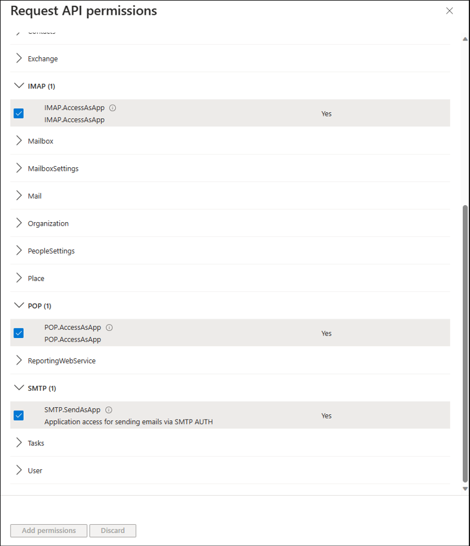
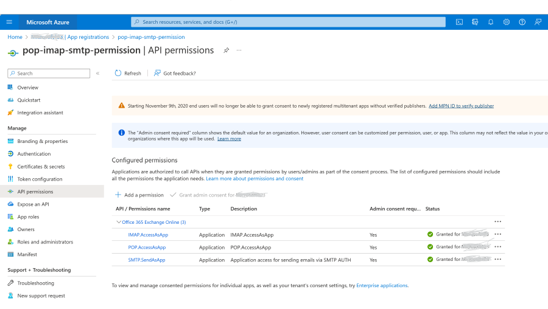

# Authenticate an IMAP, POP or SMTP connection using OAuth

Learn how to use OAuth authentication to connect with IMAP, POP, or SMTP protocols and to access email data for Office 365 users.

> OAuth2 support for IMAP, POP, and SMTP protocols as described below is available  for both Microsoft 365 (which includes Office on the web) and Outlook.com users.

> [!IMPORTANT]
> This documentation uses the [deprecated Outlook REST API scope](/outlook/rest/compare-graph). New applications should use the [Graph REST API Endpoint](/graph/outlook-mail-concept-overview) instead.

If you're not familiar with the OAuth 2.0 protocol, see [OAuth 2.0 protocol on Microsoft identity platform overview](/azure/active-directory/develop/active-directory-v2-protocols). For more information about the Microsoft Authentication Libraries (MSAL), which implement the OAuth 2.0 protocol to authenticate users and access secure APIs, see [MSAL overview](/azure/active-directory/develop/msal-overview).

You can use the OAuth authentication service provided by Microsoft Entra (Microsoft Entra) to enable your application connect with IMAP, POP, or SMTP protocols to access Exchange Online in Office 365. To use OAuth with your application, you need to:

1. [Register your application](#register-your-application) with Microsoft Entra.
2. [Get an access token](#get-an-access-token) from a token server.
3. [Authenticate connection requests](#authenticate-connection-requests) with an access token.

## Register your application

To use OAuth, an application must be registered with Microsoft Entra.

Follow the instructions listed in [Register an application with the Microsoft identity platform](/azure/active-directory/develop/quickstart-register-app) to create a new application.

## Get an access token

You can use one of our [MSAL client libraries](/azure/active-directory/develop/msal-overview) to fetch an access token from your client application.

Alternatively, you can select an appropriate flow from the following list and follow the corresponding steps to call the underlying identity platform REST APIs and retrieve an access token.

1. [OAuth2 authorization code flow](/azure/active-directory/develop/v2-oauth2-auth-code-flow)
2. [OAuth2 device authorization grant flow](/azure/active-directory/develop/v2-oauth2-device-code)
3. [OAuth2 client credentials grant flow](#use-client-credentials-grant-flow-to-authenticate-smtp-imap-and-pop-connections)

Ensure to specify the full scopes, including Outlook resource URLs, when authorizing your application and requesting an access token.

| Protocol  | Permission scope string |
|-----------|-------------------------|
| IMAP      | `https://outlook.office.com/IMAP.AccessAsUser.All` |
| POP       | `https://outlook.office.com/POP.AccessAsUser.All`  |
| SMTP AUTH | `https://outlook.office.com/SMTP.SendAsApp`             |

In addition, you can request for [offline_access](/azure/active-directory/develop/v2-permissions-and-consent#offline_access) scope. When a user approves the offline_access scope, your app can receive refresh tokens from the Microsoft identity platform token endpoint. Refresh tokens are long-lived. Your app can get new access tokens as older ones expire.

## Authenticate connection requests

You can initiate a connection to Office 365 mail servers using the [IMAP and POP email settings for Office 365](https://support.office.com/article/pop-and-imap-email-settings-for-outlook-8361e398-8af4-4e97-b147-6c6c4ac95353).

### SASL XOAUTH2

OAuth integration requires your application to use SASL XOAUTH2 format to encode and transmit the access token. SASL XOAUTH2 encodes the username and access token together in the following format:

```text
base64("user=" + userName + "^Aauth=Bearer " + accessToken + "^A^A")
```

`^A` represents a **Control** + **A** (`%x01`).

For example, the SASL XOAUTH2 format to access `test@contoso.onmicrosoft.com` with access token `EwBAAl3BAAUFFpUAo7J3Ve0bjLBWZWCclRC3EoAA` is:

```text
base64("user=test@contoso.onmicrosoft.com^Aauth=Bearer EwBAAl3BAAUFFpUAo7J3Ve0bjLBWZWCclRC3EoAA^A^A")
```

After base64 encoding, this format translates to the following string. The line breaks are inserted for readability.

```text
dXNlcj10ZXN0QGNvbnRvc28ub25taWNyb3NvZnQuY29tAWF1dGg9QmVhcmVy
IEV3QkFBbDNCQUFVRkZwVUFvN0ozVmUwYmpMQldaV0NjbFJDM0VvQUEBAQ==
```

### SASL XOAUTH2 authentication for shared mailboxes in Office 365

In case of shared mailbox access using OAuth, an application needs to obtain the access token on behalf of a user but replace the **userName** field in the SASL XOAUTH2 encoded string with the email address of the shared mailbox.

### IMAP Protocol Exchange

To authenticate an IMAP server connection, the client must respond with an `AUTHENTICATE` command in the following format:

```text
AUTHENTICATE XOAUTH2 <base64 string in XOAUTH2 format>
```

Sample client-server message exchange that results in an authentication success:

```text
[connection begins]
C: C01 CAPABILITY
S: * CAPABILITY … AUTH=XOAUTH2
S: C01 OK Completed
C: A01 AUTHENTICATE XOAUTH2 dXNlcj1zb21ldXNlckBleGFtcGxlLmNvbQFhdXRoPUJlYXJlciB5YTI5LnZGOWRmdDRxbVRjMk52YjNSbGNrQmhkSFJoZG1semRHRXVZMjl0Q2cBAQ==
S: A01 OK AUTHENTICATE completed.
```

Sample client-server message exchange that results in an authentication failure:

```text
[connection begins]
S: * CAPABILITY … AUTH=XOAUTH2
S: C01 OK Completed
C: A01 AUTHENTICATE XOAUTH2 dXNlcj1zb21ldXNlckBleGFtcGxlLmNvbQFhdXRoPUJlYXJlciB5YTI5LnZGOWRmdDRxbVRjMk52YjNSbGNrQmhkSFJoZG1semRHRXVZMjl0Q2cBAQ==
S: A01 NO AUTHENTICATE failed.
```

### POP Protocol Exchange

To authenticate a POP server connection, the client will have to respond with an `AUTH` command split into two lines in the following format:

```text 
AUTH XOAUTH2 
<base64 string in XOAUTH2 format> 
``` 

Sample client-server message exchange that results in an authentication success: 

```text 
[connection begins] 
C: AUTH XOAUTH2  
S: + 
C: dXNlcj1zb21ldXNlckBleGFtcGxlLmNvbQFhdXRoPUJlYX 
JlciB5YTI5LnZGOWRmdDRxbVRjMk52YjNSbGNrQmhkSFJoZG1semRHRXVZMjl0 
Q2cBAQ== 
S: +OK User successfully authenticated. 
[connection continues...] 
``` 

Sample client-server message exchange that results in an authentication failure: 

```text 
[connection begins] 
C: AUTH XOAUTH2  
S: + 
C: dXNlcj1zb21ldXNlckBleGFtcGxlLmNvbQFhdXRoPUJlY 
XJlciB5YTI5LnZGOWRmdDRxbVRjMk52YjNSbGNrQmhkSFJoZG1semRHRXVZMj 
l0Q2cBAQ= 
S: -ERR Authentication failure: unknown user name or bad password. 
```

### SMTP Protocol Exchange

To authenticate an SMTP server connection, the client must respond with an `AUTH` command in the following format:

```text
AUTH XOAUTH2 <base64 string in XOAUTH2 format>
```

Sample client-server message exchange that results in an authentication success:

```text
[connection begins]
C: auth xoauth2
S: 334
C: dXNlcj1zb21ldXNlckBleGFtcGxlLmNvbQFhdXRoPUJlY
XJlciB5YTI5LnZGOWRmdDRxbVRjMk52YjNSbGNrQmhkSFJoZG1semRHRXVZMj
l0Q2cBAQ==
S: 235 2.7.0 Authentication successful
[connection continues...]
```

Sample client-server message exchange that results in an authentication failure:

```text
[connection begins]
C: auth xoauth2
S: 334
C: dXNlcj1zb21ldXNlckBleGFtcGxlLmNvbQFhdXRoPUJlY
XJlciB5YTI5LnZGOWRmdDRxbVRjMk52YjNSbGNrQmhkSFJoZG1semRHRXVZMj
l0Q2cBAQ==
S: 535 5.7.3 Authentication unsuccessful [SN2PR00CA0018.namprd00.prod.outlook.com]
```

## Use client credentials grant flow to authenticate SMTP, IMAP, and POP connections

Service principals in Exchange are used to enable applications to access Exchange mailboxes via client credentials flow with the SMTP, POP, and IMAP protocols.

### Add the POP, IMAP, or SMTP permissions to your Entra AD application

1. In the Azure portal, choose the **API Permissions** blade in your Microsoft Entra application's management view.

2. Select **Add permission**.

3. Select the **APIs my organization uses** tab and search for "*Office 365 Exchange Online*".

4. Click **Application permissions**.

5. For POP access, choose the **POP.AccessAsApp** permission. For IMAP access, choose the **IMAP.AccessAsApp** permission. For SMTP access, choose the **SMTP.SendAsApp** permission.

   

6. Once you've chosen the type of permission, select **Add permissions**.

You should now have the SMTP, POP, or IMAP application permissions added to your Entra AD application's permissions.

### Get tenant admin consent

To access Exchange mailboxes via POP or IMAP, your Entra AD application must get tenant admin consent for each tenant. For more information, see [tenant admin consent process](/azure/active-directory/develop/v2-permissions-and-consent).

#### How to grant consent if the application is registered/configured for multiple tenant usage, for example, for Partner/ISV developed centrally registered application

If your ISV/partner registered the Microsoft Entra application with the option "Accounts in any organizational directory", you need to add this application and consent it using the following steps by leveraging the authorization request URL.

##### POP and IMAP Guidance

In your OAuth 2.0 tenant authorization request, the `scope` query parameter should be `https://ps.outlook.com/.default` for both the POP and IMAP application scopes.
The OAuth 2.0 authorization request URL is shown in the following example:

```text
https://login.microsoftonline.com/{tenant}/v2.0/adminconsent?client_id=<CLIENT_ID>&redirect_uri=<REDIRECT_URI>&scope=https://ps.outlook.com/.default
```

##### SMTP Guidance

In your OAuth 2.0 tenant authorization request, the `scope` query parameter should be `https://outlook.office365.com/.default` only for SMTP. The OAuth 2.0 authorization request URL is shown in the following example:

```text
https://login.microsoftonline.com/{tenant}/v2.0/adminconsent?client_id=<CLIENT_ID>&redirect_uri=<REDIRECT_URI>&scope=https://outlook.office365.com/.default 
```

#### How to grant consent if you registered the application for your own tenant

If you registered your application in your own tenant using "Accounts in this organizational directory only", you can go forward and use the application configuration page within the Microsoft Entra admin center to grant the admin consent, and you don´t have to use the authorization request URL approach.



### Register service principals in Exchange

Once a tenant admin consents your Microsoft Entra application, they must register your Entra AD application's service principal in Exchange via Exchange Online PowerShell. This registration is enabled by the [`New-ServicePrincipal` cmdlet](/powershell/module/exchange/new-serviceprincipal).

To use the *New-ServicePrincipal* cmdlet, install ExchangeOnlineManagement and connect to your tenant as shown in the following snippet:

```text
Install-Module -Name ExchangeOnlineManagement -allowprerelease
Import-module ExchangeOnlineManagement 
Connect-ExchangeOnline -Organization <tenantId>
```

If you still get an error running the *New-ServicePrincipal* cmdlet after you perform these steps, it's likely because the user doesn't have enough permissions in Exchange online to perform the operation.

Registration of an Microsoft Entra application's service principal in Exchange is shown in the following example:

```text
New-ServicePrincipal -AppId <APPLICATION_ID> -ObjectId <OBJECT_ID> [-Organization <ORGANIZATION_ID>]
```

The tenant admin can find the service principal identifiers referenced above in your Entra AD application's enterprise application instance on the tenant. You can find the list of the enterprise application instances on the tenant in the **Enterprise applications** blade in the Microsoft Entra view in Azure Portal.

You can get your registered service principal's identifier using the [`Get-ServicePrincipal` cmdlet](/powershell/module/exchange/get-serviceprincipal).

```text
Get-ServicePrincipal | fl
```

The OBJECT_ID is the Object ID from the Overview page of the Enterprise Application node (Azure Portal) for the application registration. It is **not** the Object ID from the Overview page of the App Registrations node. Using the incorrect Object ID will cause an authentication failure.

The tenant admin can now add the specific mailboxes in the tenant that will be allowed to be accessed by your application. This configuration is done with the [`Add-MailboxPermission` cmdlet](/powershell/module/exchange/add-mailboxpermission).

The following example shows how to give your application's service principal access to one mailbox:

```text
Add-MailboxPermission -Identity "john.smith@contoso.com" -User 
<SERVICE_PRINCIPAL_ID> -AccessRights FullAccess
```

Different IDs are used during creation of the Exchange service principal and also later when granting mailbox permissions. The following example may help you to use the correct ID for the different stages. This example uses Microsoft Entra cmdlets; so, you'll need to install the Microsoft Entra PowerShell module, if you haven't already. For more information, see [Install Microsoft Entra PowerShell for Graph](/powershell/azure/active-directory/install-adv2?view=azureadps-2.0#installing-the-azure-ad-module&preserve-view=true).

```text
$AADServicePrincipalDetails = Get-AzureADServicePrincipal -SearchString YourAppName

New-ServicePrincipal -AppId $AADServicePrincipalDetails.AppId -ObjectId $AADServicePrincipalDetails.ObjectId -DisplayName "EXO Serviceprincipal for EntraAD App $($AADServicePrincipalDetails.Displayname)"

$EXOServicePrincipal = Get-ServicePrincipal -Identity "EXO Serviceprincipal for EntraAD App YourAppName"

Add-MailboxPermission -Identity "john.smith@contoso.com" -User $EXOServicePrincipal.Identity -AccessRights FullAccess
```

Your Microsoft Entra application can now access the allowed mailboxes via the SMTP, POP, or IMAP protocols using the OAuth 2.0 client credentials grant flow. For more information, see the instructions in [Permissions and consent in the Microsoft identity platform](/azure/active-directory/develop/v2-oauth2-client-creds-grant-flow).

You must use `https://outlook.office365.com/.default` in the `scope` property in the body payload for the access token request.

The generated access tokens can be used as tokens to authenticate SMTP, POP, and IMAP connections via SASL XOAUTH2 format as described previously.

## See also

- [IMAP OAuth testing using powershell script](https://github.com/DanijelkMSFT/ThisandThat/blob/main/Get-IMAPAccessToken.ps1)

- [Authentication and EWS in Exchange](../exchange-web-services/authentication-and-ews-in-exchange.md)

- [IMAP, POP Connection settings](https://support.office.com/article/pop-and-imap-email-settings-for-outlook-8361e398-8af4-4e97-b147-6c6c4ac95353)

- [Internet Message Access Protocol](https://tools.ietf.org/html/rfc3501)

- [Post Office Protocol](https://tools.ietf.org/html/rfc1081)

- [SMTP Service extension for Authentication](https://tools.ietf.org/html/rfc4954)
