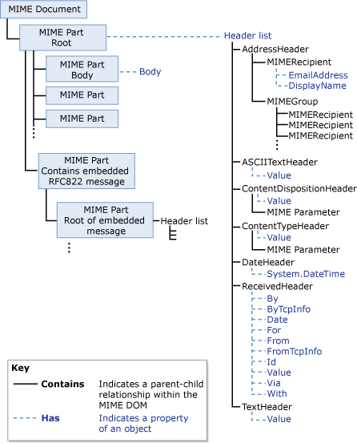
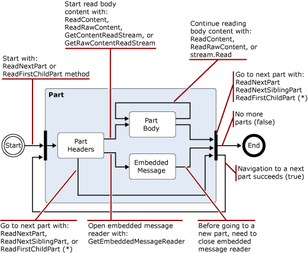
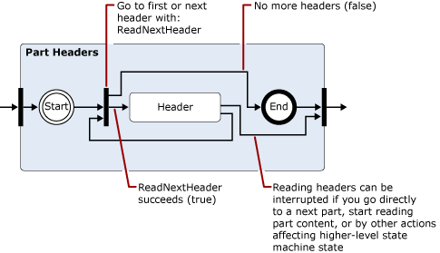
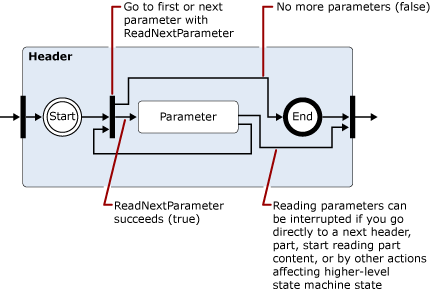
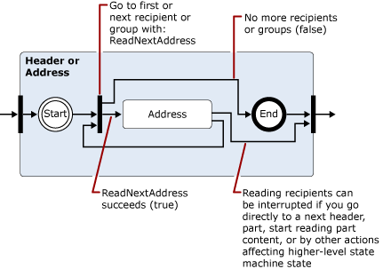
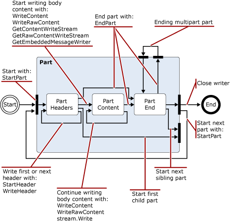
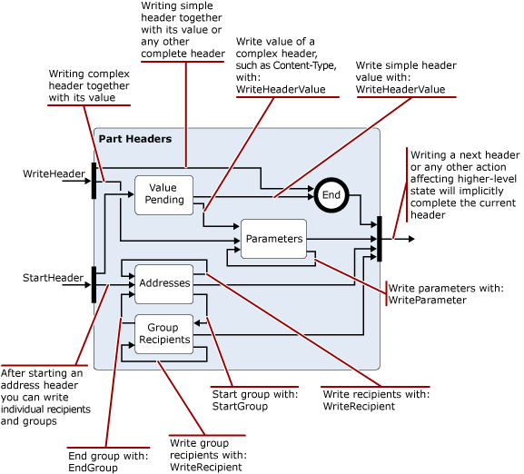

# Reading and modifying messages in the Exchange 2013 transport pipeline

Learn about the .NET Framework classes you can use in your Exchange 2013 transport agents to read, write, and modify messages.
  
**Applies to:** Exchange Server 2013
  
- Classes used to read, write, or modify messages
- Encoders namespace
- iCalendar namespace
- MIME namespace
- TextConverters namespace
- Tnef namespace
- vCard namespace
  
As messages pass through the transport pipeline, your transport agent can read, write, and convert message content between different data formats. For example, you can read and write MIME data, identify incoming messages that are in Uuencoded or Quoted-printable (qp) format, and then convert them to a standard used by your organization, or read and then save calendar or contact information associated with incoming messages. 
  
You can also identify content that poses a security threat and move or delete the content or the messages that contain them; for example, by removing links in an HTML message.
  
This article provides information about the .NET Framework classes that you can use to read, write, and modify messages.
  
> [!CAUTION]
> Many of the properties and parameters in the content conversion APIs allow values large enough to cause performance problems, including denial of service. When you use the content conversion APIs in a transport agent, you should implement limits on the property and parameter value sizes you support when reading or writing in order to limit resource consumption by your agent. 

## Classes used to read, write, or modify messages

The following table lists the .NET Framework classes that you can use to read, write, and modify email messages.
  
**.NET Framework message processing namespaces**

|**.NET Framework namespace**|**Classes**|
|:-----|:-----|
|[Microsoft.Exchange.Data.Mime.Encoders](https://msdn.microsoft.com/library/Microsoft.Exchange.Data.Mime.Encoders.aspx)   |Contains classes for in-memory encoding and decoding, an encoder stream class that accepts one of the encoder or decoder classes contained in an associated enumeration, and the [ByteEncoder](https://msdn.microsoft.com/library/Microsoft.Exchange.Data.Mime.Encoders.ByteEncoder.aspx) base class and [ByteEncoderException](https://msdn.microsoft.com/library/Microsoft.Exchange.Data.Mime.Encoders.ByteEncoderException.aspx) exception class for the encoders and decoders.    |
|[Microsoft.Exchange.Data.ContentTypes.iCalendar](https://msdn.microsoft.com/library/Microsoft.Exchange.Data.ContentTypes.iCalendar.aspx)   |Contains types that enable you to read and write data streams that contain calendar information. Includes a calendar reader and writer, an exception object, a recurrence object, and structures and enumerations that help you return property information about calendar items.    |
|[Microsoft.Exchange.Data.Mime](https://msdn.microsoft.com/library/Microsoft.Exchange.Data.Mime.aspx)   |Contains classes, structures, enumerations, and delegates that you can use to create, read, write, traverse, encode, and decode MIME data. Includes a stream-based reader and writer that gives you forward-only read and write access to MIME data streams, as well as DOM-based methods and classes you can use on MIME documents.    |
|[Microsoft.Exchange.Data.TextConverters](https://msdn.microsoft.com/library/Microsoft.Exchange.Data.TextConverters.aspx)   |Contains classes, structures, enumerations, and delegates that allow you to read and write a data stream and perform conversions between specific data types; for example, HTML to Rich Text Format (RTF). Text converters enable you to change the format of a document stream from one form to another as well as selectively remove elements of a document that might pose a security risk.    |
|[Microsoft.Exchange.Data.ContentTypes.Tnef](https://msdn.microsoft.com/library/Microsoft.Exchange.Data.ContentTypes.Tnef.aspx)   |Contains a forward-only stream reader and writer, an exception class, and structures and enumerations that facilitate reading and writing Transport Neutral Encapsulation Format (TNEF) data.    |
|[Microsoft.Exchange.Data.ContentTypes.vCard](https://msdn.microsoft.com/library/Microsoft.Exchange.Data.ContentTypes.vCard.aspx)   |Contains a forward-only stream reader and writer, an exception class, and structures and enumerations that facilitate reading and writing vCard-formatted contact data.    |
   
## Encoders namespace

The Encoders namespace contains classes for in-memory encoding and decoding. These inherit from the [ByteEncoder](https://msdn.microsoft.com/library/Microsoft.Exchange.Data.Mime.Encoders.ByteEncoder.aspx) base class. Classes encode and decode for Base64, BinHex, Quoted-printable (qp), and Unix-to-Unix (Uu). The following classes are used for in-memory encoding and decoding: 
  
- [Base64Encoder](https://msdn.microsoft.com/library/Microsoft.Exchange.Data.Mime.Encoders.Base64Encoder.aspx)
    
- [Base64Decoder](https://msdn.microsoft.com/library/Microsoft.Exchange.Data.Mime.Encoders.Base64Decoder.aspx)
    
- [BinHexEncoder](https://msdn.microsoft.com/library/Microsoft.Exchange.Data.Mime.Encoders.BinHexEncoder.aspx)
    
- [BinHexDecoder](https://msdn.microsoft.com/library/Microsoft.Exchange.Data.Mime.Encoders.BinHexDecoder.aspx)
    
- [QPEncoder](https://msdn.microsoft.com/library/Microsoft.Exchange.Data.Mime.Encoders.QPEncoder.aspx)
    
- [QPDecoder](https://msdn.microsoft.com/library/Microsoft.Exchange.Data.Mime.Encoders.QPDecoder.aspx)
    
- [UUEncoder](https://msdn.microsoft.com/library/Microsoft.Exchange.Data.Mime.Encoders.UUEncoder.aspx)
    
- [UUDecoder](https://msdn.microsoft.com/library/Microsoft.Exchange.Data.Mime.Encoders.UUDecoder.aspx)
    
The encoders and decoders inherit from the [ByteEncoder](https://msdn.microsoft.com/library/Microsoft.Exchange.Data.Mime.Encoders.ByteEncoder.aspx) base class and use the [ByteEncoderException](https://msdn.microsoft.com/library/Microsoft.Exchange.Data.Mime.Encoders.ByteEncoderException.aspx) exception class for error handling. 
  
Additionally, the namespace contains the [MacBinaryHeader](https://msdn.microsoft.com/library/Microsoft.Exchange.Data.Mime.Encoders.MacBinaryHeader.aspx) class, which identifies MacBinary encoded files and reads their associated file header. 
  
Finally, the [EncoderStream](https://msdn.microsoft.com/library/Microsoft.Exchange.Data.Mime.Encoders.EncoderStream.aspx) class performs a conversion on a data stream instead of an in-memory object. This class accepts one of the encoder or decoder classes and either reads or writes according to the associated [EncoderStreamAccess](https://msdn.microsoft.com/library/Microsoft.Exchange.Data.Mime.Encoders.EncoderStreamAccess.aspx) enumeration. 
  
## iCalendar namespace

The iCalendar namespace provides a forward-only reader and writer for iCalendar data, in addition to supporting structures and classes for creating, accessing, and modifying iCalendar streams.
  
The [CalendarReader](https://msdn.microsoft.com/library/Microsoft.Exchange.Data.ContentTypes.iCalendar.CalendarReader.aspx) and [CalendarWriter](https://msdn.microsoft.com/library/Microsoft.Exchange.Data.ContentTypes.iCalendar.CalendarWriter.aspx) classes are used to read and write iCalendar stream data. 
  
The CalendarReader takes a readable [Stream](https://msdn.microsoft.com/library/System.IO.Stream.aspx) as an argument to its constructors. You can then use the [ReadFirstChildComponent](https://msdn.microsoft.com/library/Microsoft.Exchange.Data.ContentTypes.iCalendar.CalendarReader.ReadFirstChildComponent.aspx), [ReadNextSiblingComponent](https://msdn.microsoft.com/library/Microsoft.Exchange.Data.ContentTypes.iCalendar.CalendarReader.ReadNextSiblingComponent.aspx), and [ReadNextComponent](https://msdn.microsoft.com/library/Microsoft.Exchange.Data.ContentTypes.iCalendar.CalendarReader.ReadNextComponent.aspx) methods to sequentially access the iCalendar components in the data stream. Based on the value that you have set for the [ComplianceMode](https://msdn.microsoft.com/library/Microsoft.Exchange.Data.ContentTypes.iCalendar.CalendarReader.ComplianceMode.aspx) property, errors in the iCalendar stream will cause an exception to be thrown or will cause the [ComplianceStatus](https://msdn.microsoft.com/library/Microsoft.Exchange.Data.ContentTypes.iCalendar.CalendarReader.ComplianceStatus.aspx) property to be set to a value other than [Compliant](https://msdn.microsoft.com/library/microsoft.exchange.data.contenttypes.icalendar.calendarcompliancestatus.aspx). You can check this property to discover any issues with incoming iCalendar data. 
  
The [CalendarWriter](https://msdn.microsoft.com/library/Microsoft.Exchange.Data.ContentTypes.iCalendar.CalendarWriter.aspx) class takes a writable [Stream](https://msdn.microsoft.com/library/System.IO.Stream.aspx) as an argument to its constructors. 
  
## MIME namespace

The MIME namespace provides classes that enable you to create, access, and modify MIME documents. You can work with MIME documents by using either a stream-based or DOM-based method.
  
### MimeDocument class and the MIME DOM

The [MimeDocument](https://msdn.microsoft.com/library/Microsoft.Exchange.Data.Mime.MimeDocument.aspx) class enables DOM access to a MIME document. Use objects of this type when you have the available memory to load a whole DOM and you must have random access to the headers and content of the message. 
  
You load data into a [MimeDocument](https://msdn.microsoft.com/library/Microsoft.Exchange.Data.Mime.MimeDocument.aspx) object by using the [GetLoadStream](https://msdn.microsoft.com/library/Microsoft.Exchange.Data.Mime.MimeDocument.GetLoadStream.aspx) or [Load](https://msdn.microsoft.com/library/Microsoft.Exchange.Data.Mime.MimeDocument.Load.aspx) methods. You can then walk the DOM hierarchy and create, modify, or remove MIME data. After you have modified the MIME data, you can write it to a stream by using one of the [WriteTo](https://msdn.microsoft.com/library/Microsoft.Exchange.Data.Mime.MimeNode.WriteTo.aspx) methods. 
  
The following figure shows the structure of data within a [MimeDocument](https://msdn.microsoft.com/library/Microsoft.Exchange.Data.Mime.MimeDocument.aspx) object. 
  
**Figure 1. Structure of MimeDocument objects**

  
### MimeReader and MimeWriter classes and stream-based MIME parsing

The [MimeReader](https://msdn.microsoft.com/library/Microsoft.Exchange.Data.Mime.MimeReader.aspx) and [MimeWriter](https://msdn.microsoft.com/library/Microsoft.Exchange.Data.Mime.MimeWriter.aspx) classes enable forward-only access to MIME streams. Use these classes when you do not have to change the MIME data that requires data that has already been read or written. For example, if you want to print messages that fit a predefined format, the [MimeWriter](https://msdn.microsoft.com/library/Microsoft.Exchange.Data.Mime.MimeWriter.aspx) class might be ideal. 
  
The [MimeDocument](https://msdn.microsoft.com/library/Microsoft.Exchange.Data.Mime.MimeDocument.aspx) class encapsulates a DOM. The [MimeReader](https://msdn.microsoft.com/library/Microsoft.Exchange.Data.Mime.MimeReader.aspx) and [MimeWriter](https://msdn.microsoft.com/library/Microsoft.Exchange.Data.Mime.MimeWriter.aspx) classes represent state computers. Their states change based on the input received and the methods called. Figures 2 through 5 are simplified state transition diagrams that show, for the [MimeReader](https://msdn.microsoft.com/library/Microsoft.Exchange.Data.Mime.MimeReader.aspx) object, which methods are valid to call from each state and the state that will result. 
  
To use these diagrams, follow the arrows from one state to the next, noting the method calls or return values that cause the state to change. For example, in the first diagram, assume that you are at the start of the stream that belongs to the MimeReader that you have created. To get to the Part Headers state, call one of [ReadNextPart](https://msdn.microsoft.com/library/Microsoft.Exchange.Data.Mime.MimeReader.ReadNextPart.aspx) or [ReadFirstChildPart](https://msdn.microsoft.com/library/Microsoft.Exchange.Data.Mime.MimeReader.ReadFirstChildPart.aspx), in that order. If there are headers (that is, if the MIME is well-formed), you will enter into the Part Headers state. Otherwise, an exception will be thrown. 
  
**Figure 2. Simplified state transition diagram for MimeReader objects**

  
> [!NOTE]
> Figures 3, 4, and 5 expand on states shown in each of the previous diagrams. 
  
**Figure 3. Expansion of Part Headers state from Figure 2**

  
**Figure 4. Expansion of Header state from Figure 3 when a parameter has been encountered in a header**

  
> [!NOTE]
> The state represented by Figure 5 is recursive in that, if an address group is encountered, you can use the [GroupRecipientReader](https://msdn.microsoft.com/library/Microsoft.Exchange.Data.Mime.MimeAddressReader.GroupRecipientReader.aspx) property to read the addresses in the group. 
  
**Figure 5. Expansion of Header state from Figure 3 when an address or address group is encountered**

  
Figures 6 and 7 show simplified state transition diagrams for the [MimeWriter](https://msdn.microsoft.com/library/Microsoft.Exchange.Data.Mime.MimeWriter.aspx) object. 
  
> [!NOTE]
> Figure 7 expands on the Part Headers state shown in Figure 6. 
  
**Figure 6. Simplified state transition diagram for MimeWriter objects**

  
**Figure 7. Expansion of Part Headers state from Figure 6**

  
## TextConverters namespace

The TextConverters namespace contains types that support the conversion of the contents of email messages. These types can perform code page conversion, remove HTML that is not secure, and perform other transformations on email message bodies. The [Microsoft.Exchange.Data.TextConverters](https://msdn.microsoft.com/library/Microsoft.Exchange.Data.TextConverters.aspx) namespace includes the following classes that derive from the [TextConverter](https://msdn.microsoft.com/library/Microsoft.Exchange.Data.TextConverters.TextConverter.aspx) abstract class: 
  
- [EnrichedToHtml](https://msdn.microsoft.com/library/Microsoft.Exchange.Data.TextConverters.EnrichedToHtml.aspx)
    
- [EnrichedToText](https://msdn.microsoft.com/library/Microsoft.Exchange.Data.TextConverters.EnrichedToText.aspx)
    
- [HtmlToEnriched](https://msdn.microsoft.com/library/Microsoft.Exchange.Data.TextConverters.HtmlToEnriched.aspx)
    
- [HtmlToHtml](https://msdn.microsoft.com/library/Microsoft.Exchange.Data.TextConverters.HtmlToHtml.aspx)
    
- [HtmlToRtf](https://msdn.microsoft.com/library/Microsoft.Exchange.Data.TextConverters.HtmlToRtf.aspx)
    
- [HtmlToText](https://msdn.microsoft.com/library/Microsoft.Exchange.Data.TextConverters.HtmlToText.aspx)
    
- [RtfCompressedToRtf](https://msdn.microsoft.com/library/Microsoft.Exchange.Data.TextConverters.RtfCompressedToRtf.aspx)
    
- [RtfToHtml](https://msdn.microsoft.com/library/Microsoft.Exchange.Data.TextConverters.RtfToHtml.aspx)
    
- [RtfToRtf](https://msdn.microsoft.com/library/Microsoft.Exchange.Data.TextConverters.RtfToRtf.aspx)
    
- [RtfToRtfCompressed](https://msdn.microsoft.com/library/Microsoft.Exchange.Data.TextConverters.RtfToRtfCompressed.aspx)
    
- [RtfToText](https://msdn.microsoft.com/library/Microsoft.Exchange.Data.TextConverters.RtfToText.aspx)
    
- [TextToHtml](https://msdn.microsoft.com/library/Microsoft.Exchange.Data.TextConverters.TextToHtml.aspx)
    
- [TextToRtf](https://msdn.microsoft.com/library/Microsoft.Exchange.Data.TextConverters.TextToRtf.aspx)
    
- [TextToText](https://msdn.microsoft.com/library/Microsoft.Exchange.Data.TextConverters.TextToText.aspx)
    
These text converters enable you to change the format of a document stream or to remove elements that are not secure from an HTML document. These classes can be used by themselves to perform a conversion by using a single call to one of the Convert methods in the [TextConverter](https://msdn.microsoft.com/library/Microsoft.Exchange.Data.TextConverters.TextConverter.aspx) base class, or they can be passed to a constructor of the converter, which uses it to perform converted reads or writes. 
  
The functionality inherited from the base class is useful for performing conversions when you have sufficient space to store the original document and its converted output, or when you want to store the results of the conversion. The **Convert** method takes input and output streams, text readers, or text writers, and converts the content of the input to the associated output. 
  
Also included in the namespace are the following text reader, writer, and stream classes:
  
- [ConverterReader](https://msdn.microsoft.com/library/Microsoft.Exchange.Data.TextConverters.ConverterReader.aspx) — Derived from **System.IO.TextReader**. 
    
- [ConverterWriter](https://msdn.microsoft.com/library/Microsoft.Exchange.Data.TextConverters.ConverterWriter.aspx) — Derived from **System.IO.TextWriter**. 
    
- [ConverterStream](https://msdn.microsoft.com/library/Microsoft.Exchange.Data.TextConverters.ConverterStream.aspx) — Derived from **System.IO.Stream**. 
    
These are used to perform conversions when you do not have room to store the original or its converted output, when you receive the input from or send the output to a stream, or when you want the output only for indexing or search purposes and therefore do not want to store the result of a conversion.
  
## Tnef namespace

The Tnef namespace contains classes and types that enable forward-only stream-based reading and writing of TNEF data. TNEF is a data format that is used to encapsulate MAPI properties for clients that cannot interpret MAPI.
  
The [TnefReader](https://msdn.microsoft.com/library/Microsoft.Exchange.Data.ContentTypes.Tnef.TnefReader.aspx) and [TnefWriter](https://msdn.microsoft.com/library/Microsoft.Exchange.Data.ContentTypes.Tnef.TnefWriter.aspx) classes provide the core functionality in the [Microsoft.Exchange.Data.ContentTypes.Tnef](https://msdn.microsoft.com/library/Microsoft.Exchange.Data.ContentTypes.Tnef.aspx) namespace. 
  
The [TnefReader](https://msdn.microsoft.com/library/Microsoft.Exchange.Data.ContentTypes.Tnef.TnefReader.aspx) class takes a readable stream as an argument to its constructors. You then use the [ReadNextAttribute](https://msdn.microsoft.com/library/Microsoft.Exchange.Data.ContentTypes.Tnef.TnefReader.ReadNextAttribute.aspx) method to sequentially read the attributes in the TNEF stream. After you have read an attribute, you can access information about the attribute by using any of the read-only properties on the [TnefReader](https://msdn.microsoft.com/library/Microsoft.Exchange.Data.ContentTypes.Tnef.TnefReader.aspx) object, in addition to getting a [TnefPropertyReader](https://msdn.microsoft.com/library/Microsoft.Exchange.Data.ContentTypes.Tnef.TnefPropertyReader.aspx) to read the current property. You can also directly access the current attribute by using the [ReadAttributeRawValue](https://msdn.microsoft.com/library/Microsoft.Exchange.Data.ContentTypes.Tnef.TnefReader.ReadAttributeRawValue.aspx) method. 
  
The [TnefWriter](https://msdn.microsoft.com/library/Microsoft.Exchange.Data.ContentTypes.Tnef.TnefWriter.aspx) class takes a writable [Stream](https://msdn.microsoft.com/library/System.IO.Stream.aspx) as an argument to its constructors. The [TnefWriter](https://msdn.microsoft.com/library/Microsoft.Exchange.Data.ContentTypes.Tnef.TnefWriter.aspx) class provides multiple ways in which to write data to this stream. 
  
## vCard namespace

The vCard namespace contains classes, structures, and enumerations used to read and write contact information contained in an email message that is in the vCard data format. The namespace contains a contact reader and writer, an exception class, a property reader, a parameter reader, and supporting enumerations that allow you to read vCard data associated with an email message.
  
## See also

- [Transport agents in Exchange](transport-agents-in-exchange-2013.md)  
- [Transport agent concepts in Exchange 2013](transport-agent-concepts-in-exchange-2013.md) 
- [Transport agent reference for Exchange 2013](transport-agent-reference-for-exchange-2013.md)
- [MIME Media Types](http://www.iana.org/assignments/media-types)
    

