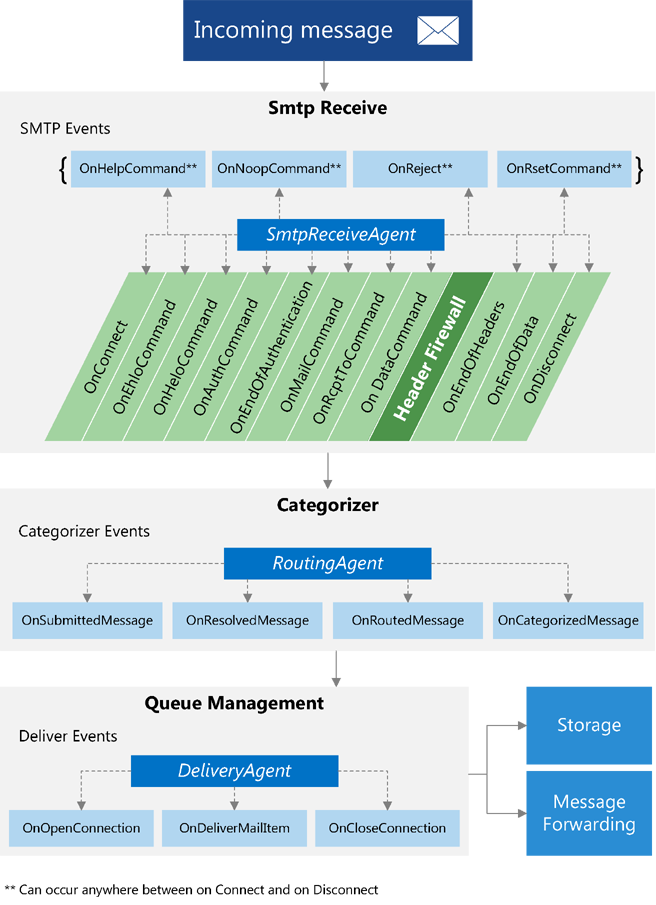
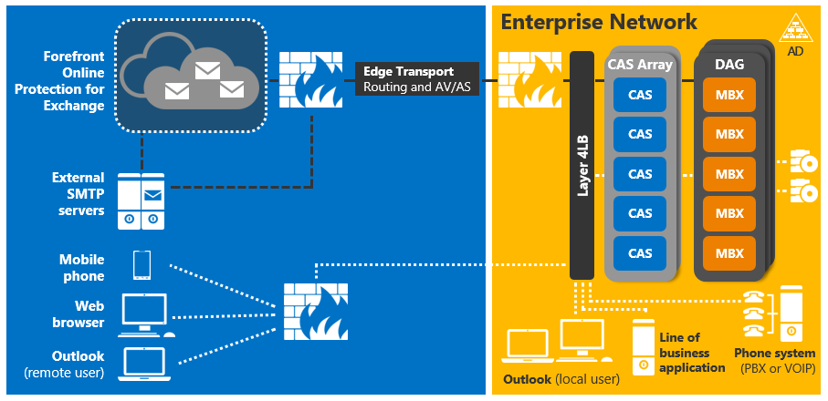
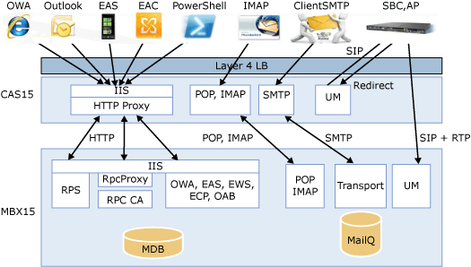

# Transport agent concepts in Exchange 2013

Find information about how the transport agent pipeline and server role architecture in Exchange 2013 affect transport agent development, and the classes that you can use to develop transport agents.
  
**Applies to:** Exchange Server 2013
  
You can use the class library provided in Exchange Server 2013 to implement transport agents that register for events and take actions on messages as they pass through the transport pipeline. You can also use transport agents to modify messages and convert content.
  
This article provides information about transport agents and the transport pipeline architecture. It is important to understand the architecture of the transport pipeline so that you can modify transport behavior to meet your organization's needs. This article also provides information about changes in the Exchange 2013 architecture that affect transport agents and the classes that you can use to develop transport agents.
  
## Transport agents in the transport pipeline

Transport agents are derived from one of the following three classes:
  
- [SmtpReceiveAgent](https://msdn.microsoft.com/library/Microsoft.Exchange.Data.Transport.Smtp.SmtpReceiveAgent.aspx)
- [RoutingAgent](https://msdn.microsoft.com/library/Microsoft.Exchange.Data.Transport.Routing.RoutingAgent.aspx)
- [DeliveryAgent](https://msdn.microsoft.com/library/Microsoft.Exchange.Data.Transport.Delivery.DeliveryAgent.aspx)

The transport pipeline refers to the flow of message data within the boundaries of an Exchange 2013 organization. The pipeline consists of the services listed in the following table.
  
**Table 1. Transport pipeline services**

|**Service**|**Description**|**Classes supported**|
|:-----|:-----|:-----|
|Front End Transport    |Runs on all [Client Access servers](https://technet.microsoft.com/library/dd298114%28v=exchg.150%29.aspx) and acts as a stateless proxy for all inbound and outbound external SMTP traffic for the Exchange 2013 organization. The Front End Transport service doesn't inspect message content or queue any messages locally. It communicates with the Transport service on a [Mailbox server](https://technet.microsoft.com/library/jj150491%28v=exchg.150%29.aspx).    |[SmtpReceiveAgent](https://msdn.microsoft.com/library/Microsoft.Exchange.Data.Transport.Smtp.SmtpReceiveAgent.aspx)   |
|Transport    |Runs on all Mailbox servers and is similar to the [Hub Transport server](https://technet.microsoft.com/library/bb123494%28v=exchg.141%29.aspx) role in Exchange Server 2010. The Transport service routes messages between itself and the Mailbox Transport and Front End Transport services. This service does not communicate directly with mailbox databases.    |[SmtpReceiveAgent](https://msdn.microsoft.com/library/Microsoft.Exchange.Data.Transport.Smtp.SmtpReceiveAgent.aspx)   [RoutingAgent](https://msdn.microsoft.com/library/Microsoft.Exchange.Data.Transport.Routing.RoutingAgent.aspx)   [DeliveryAgent](https://msdn.microsoft.com/library/Microsoft.Exchange.Data.Transport.Delivery.DeliveryAgent.aspx)   |
|Mailbox Transport    |Runs on all Mailbox servers and consists of two separate services: Mailbox Transport Submission and Mailbox Transport Delivery. Mailbox Transport Delivery receives SMTP messages from the Transport service, and connects to the mailbox database by using an Exchange remote procedure call (RPC) to deliver the message. Mailbox Transport Submission connects to the mailbox database using RPC to retrieve messages, and submits the messages via SMTP to the Transport service.    |None.    |

### Transport events

You implement transport agents by first registering for an event, and then taking an action when that event fires. Each of the three agent types can register for a different set of events.
  
The following figure shows where in the transport pipeline transport agents can register for events.
  
**Figure 1. Transport events**

  
When a message enters the transport pipeline, a transport agent derived from the [SmtpReceiveAgent](https://msdn.microsoft.com/library/Microsoft.Exchange.Data.Transport.Smtp.SmtpReceiveAgent.aspx) class can act on the message during any of the SMTP events that the agent registered for. An agent derived from the [RoutingAgent](https://msdn.microsoft.com/library/Microsoft.Exchange.Data.Transport.Routing.RoutingAgent.aspx) class can act on any of the four categorizer events that it has registered for. An agent derived from the [DeliveryAgent](https://msdn.microsoft.com/library/Microsoft.Exchange.Data.Transport.Delivery.DeliveryAgent.aspx) class can act on a message during any of the delivery events that it has registered for.
  
## Transport agents and server roles

Changes to the server role architecture in Exchange 2013 affect transport agents and what your transport agents can do. Exchange 2013 includes the following server roles:
  
- Mailbox server — Includes Client Access protocols, the Transport service, mailbox databases, and Unified Messaging components. The Mailbox server communicates directly with Active Directory Domain Services (AD DS), Client Access servers, and mail clients such as Outlook.

- Client Access server — Provides authentication, limited redirection, proxy services, and client access protocols such as HTTP, POP, IMAP, and SMTP.

- Edge Transport server — Routes email into and out of an organization. Edge Transport servers typically sit at the perimeter of an Exchange topology.

This consolidated structure reduces the number of servers that need to be deployed in an Exchange 2013 environment. Administrators no longer have to deploy Hub Transport and Client Access servers in every Active Directory site that includes a Mailbox server, and they no longer need to update all server roles in order to take advantage of new functionality.
  
These changes to the server role architecture can potentially affect where in the pipeline your agent can respond to events. If you have created transport agents for versions of Exchange earlier than Exchange 2013, be sure to review the architectural changes to determine whether you need to make any changes to your agents.
  
The following figure shows how the architectural changes in Exchange 2013 result in a streamlined, consolidated transport pipeline. In this figure, Client Access servers are labeled CAS. And Mailbox servers are labeled MBX.
  
**Figure 2. Exchange 2013 server role architecture**

  
The following figure shows the interactions between the Exchange 2013 server roles.
  
**Figure 3. Mailbox and Client Access server interactions**

  
For more information about changes in the Exchange 2013 server role architecture, see [Exchange 2013 architecture](https://technet.microsoft.com/library/jj150540%28v=exchg.150%29.aspx#BKMK_Arch) in [What's New in Exchange 2013](https://technet.microsoft.com/library/jj150540%28v=exchg.150%29.aspx).
  
## Transport agent classes

The class your transport agent derives from determines the events for which your agent can register. Your agent will typically contain an agent class, an agent factory, one or more event handlers, and the code that performs the actions that you want your agent to take.
  
The following table lists the classes from which to derive for each agent type.
  
**Table 2. Agent classes**

|**Agent type**|**Factory base class**|**Agent base class**|
|:-----|:-----|:-----|
|SMTP receive    |[SmtpReceiveAgentFactory](https://msdn.microsoft.com/library/Microsoft.Exchange.Data.Transport.Smtp.SmtpReceiveAgentFactory.aspx)   |[SmtpReceiveAgent](https://msdn.microsoft.com/library/Microsoft.Exchange.Data.Transport.Smtp.SmtpReceiveAgent.aspx)   |
|Routing    |[RoutingAgentFactory](https://msdn.microsoft.com/library/Microsoft.Exchange.Data.Transport.Routing.RoutingAgentFactory.aspx)   |[RoutingAgent](https://msdn.microsoft.com/library/Microsoft.Exchange.Data.Transport.Routing.RoutingAgent.aspx)   |
|Delivery    |[DeliveryAgentFactory\<Manager\>](https://msdn.microsoft.com/library/dd877550(v=exchg.150).aspx)   |[DeliveryAgent](https://msdn.microsoft.com/library/microsoft.exchange.data.transport.delivery.deliveryagent(v=exchg.150).aspx)   |

These factory and agent base classes provide properties and methods that you can use to access transport events and messages. Implement classes in your agent that inherit from these classes. In the agent factory derived class, override the **CreateAgent** method so that it returns a new instance of your agent class.
  
Arguments passed to the events can contain an instance of the [EmailMessage](https://msdn.microsoft.com/library/Microsoft.Exchange.Data.Transport.Email.EmailMessage.aspx) class, which you can use to change the properties and contents of the underlying message. Not all message information is available in each event. You must determine which agent and which event is best for the task you want to accomplish.
  
The following namespaces contain types that you can use to read, write, and modify messages in the transport pipeline:
  
- [Microsoft.Exchange.Data.Mime.Encoders](https://msdn.microsoft.com/library/Microsoft.Exchange.Data.Mime.Encoders.aspx)

- [Microsoft.Exchange.Data.ContentTypes.iCalendar](https://msdn.microsoft.com/library/Microsoft.Exchange.Data.ContentTypes.iCalendar.aspx)

- [Microsoft.Exchange.Data.Mime](https://msdn.microsoft.com/library/Microsoft.Exchange.Data.Mime.aspx)

- [Microsoft.Exchange.Data.ContentTypes.Tnef](https://msdn.microsoft.com/library/Microsoft.Exchange.Data.ContentTypes.Tnef.aspx)

- [Microsoft.Exchange.Data.ContentTypes.vCard](https://msdn.microsoft.com/library/Microsoft.Exchange.Data.ContentTypes.vCard.aspx)

After you write your transport agent, you [install and manage your agent](https://technet.microsoft.com/library/bb125175%28v=exchg.150%29.aspx) by using the Exchange Management Shell. For more information, see [Creating transport agents for Exchange 2013](creating-transport-agents-for-exchange-2013.md).
  
## See also

- [Transport agents in Exchange](transport-agents-in-exchange-2013.md)
- [Transport agent reference for Exchange 2013](transport-agent-reference-for-exchange-2013.md)
- [Reading and modifying messages in the Exchange 2013 transport pipeline](reading-and-modifying-messages-in-the-exchange-2013-transport-pipeline.md)
- [What's New in Exchange 2013](https://technet.microsoft.com/library/jj150540%28v=exchg.150%29.aspx)
- [Exchange 2013 Server Role Architecture](https://blogs.technet.com/b/exchange/archive/2013/01/23/exchange-2013-server-role-architecture.aspx)
- [Mailbox and Client Access Servers](https://technet.microsoft.com/library/jj150519%28v=exchg.150%29.aspx)
- [Exchange Server 2013 Mail Flow](https://technet.microsoft.com/library/aa996349.aspx)
- [Exchange Server 2013 Mail Routing](https://technet.microsoft.com/library/aa998825%28v=exchg.150%29.aspx)
- [Exchange Server PowerShell (Exchange Management Shell)](/powershell/exchange/exchange-management-shell?view=exchange-ps&preserve-view=true)
